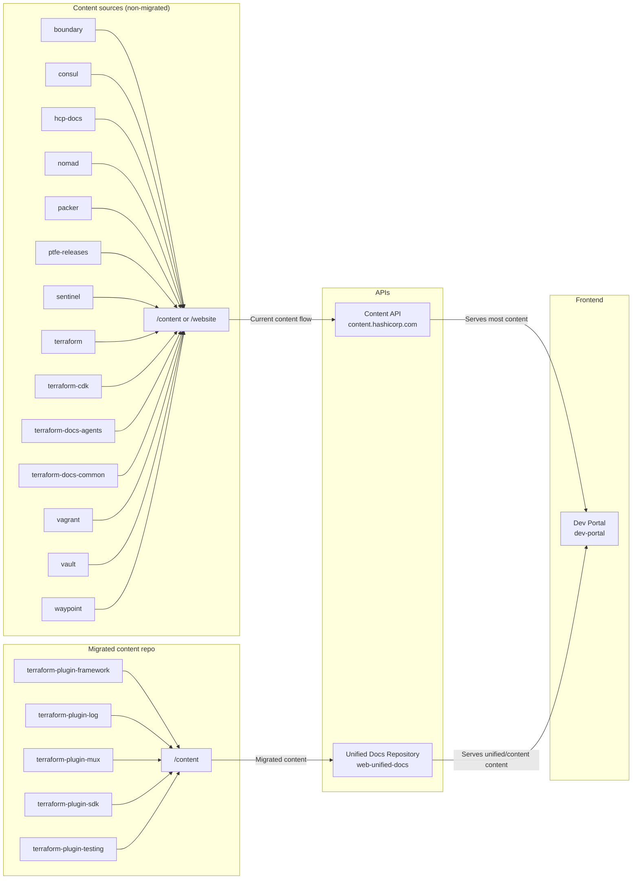

# Web Unified Docs

> **Please note**: 🚨 The `public` folder in this repository is served on the public internet, as this project is now [deployed through Vercel](https://vercel.com/hashicorp/web-unified-docs/deployments). Please exercise caution when testing content migration scripts, _especially_ when pushing your work up. For the majority of content source repositories, this presents very little risk, as the content source repositories themselves are already public.
>
> However, some content source repositories are _not_ public. Specifically:
>
> - [hcp-docs](https://github.com/hashicorp/hcp-docs)
> - [ptfe-releases](https://github.com/hashicorp/ptfe-releases)
> - [sentinel](https://github.com/hashicorp/sentinel)
>
> For these repositories in particular, please take care to ensure that only the content that is already published through our `content.hashicorp.com` API is migrated into this repository.

The project in this repository, `hashicorp/web-unified-docs`, aims to implement [[DEVDOT-023] Unified Product Documentation Repository](https://docs.google.com/document/d/1p8kOqySttvWUVfn7qiC4wGBR73LMBGMelwLt69pM3FQ/edit). The RFC for this project was intentionally light on implementation details, in order to foster consensus on the broad direction.

The existing API (`content.hashicorp.com`) has endpoints that serve documentation content. You can find the source code in [hashicorp/mktg-content-workflows](https://github.com/hashicorp/mktg-content-workflows/blob/main/api/content.ts). 

The goal of the unified docs API is to host all of HashiCorp's product documentation. The unified docs API will eventually replace the existing content API.

## Architecture

The following diagram illustrates the relationships between the unified docs API (this repo), `dev-portal`, and the existing content API:



The diagram shows:

- The content API — the existing system that sources product documentation content from product repositories
- The unified docs API — the new system that sources product documentation from this repo's `/content` directory. The migrated repos will use a directory approach to versioning (rather than the historic branch and tag strategy)
- The Dev Portal — the frontend that serves the main DevDot interface. Dev Portal sources its content from both the existing content API and unified docs API.

## Local development

### Requirements

- [Node.js](https://nodejs.org/en) (version 20 or higher)
- [Docker](https://www.docker.com/) and [Docker Compose](https://docs.docker.com/compose/) (for managing containers)

### Set up environment variables

There are a few things you need to set up before you can begin developing in this repository.

1. [Install the Vercel CLI](https://vercel.com/cli)

   The CLI is needed for the next 2 steps.

2. Run `vercel link`

   This command will prompt you to connect your local copy of repo to [the Vercel `web-unified-docs` project](<[https://vercel.com/hashicorp/dev-portal](https://vercel.com/hashicorp/web-unified-docs)>). The command creates a `.vercel` directory with a JSON file that contains the information that links to the Vercel project.

3. Run `vercel env pull .env`

   This command will pull the development environment variables from the linked Vercel project and write them to a new `.env` file.

### Quick start

To get a migration preview running, run `make` from the root of this repo. The `make` command starts the `unified-docs` Docker profile that spins up a local instance of `experimental-docs-api` and `dev-portal`.

Once this command completes, you can access the following endpoints:

- http://localhost:3000 - An instance of the `dev-portal` container configured to pull from the experimental docs API (this repo). This image depends on the unified docs API (`experimental-docs-api`).

- http://localhost:8080 - An instance of the unified docs API container (this repo - `experimental-docs-api`) that serves content from the `content` directory. On startup, this container processes the content and assets in `/content` into `public/assets` and `public/content`. In addition, the container also generates `app/api/docsPaths.json` and `app/api/versionMetadata.json` from the contents within `/content`. 
   
   Use the following example to test this endpoint: http://localhost:8080/api/content/terraform-plugin-framework/doc/latest/plugin/framework

> [!NOTE]  
> The unified docs API container takes time to process the content and assets. You must wait for both the `experimental-docs-api` and `dev-portal` containers to complete before you can successfully test content in the `dev-portal` preview environment (`localhost:3000`). Visit http://localhost:8080/api/all-docs-paths to verify the `experimental-docs-api` container is complete.

To spin this down gracefully, run `make clean` in a separate terminal. 

If you wish to remove the local Docker images as well, run `make clean CLEAN_OPTION=full`.

### More commands

The `makefile` serves as a convenience tool start the local preview. If you need more granular control, the `package.json` file contains a full list of available commands.

To use these, you will need to intentionally run `npm install` and `npm run prebuild` before anything else.

Use `npm run coverage` to run coverage tests.

### Preview environments for unified-docs and dev-portal

Unified docs API serves as one of the content APIs for `dev-portal` (frontend application for DevDot). As a result, when implementing new features, you may need to modify both the backend (this repo) and the frontend (`dev-portal`).

If you are working on a ticket that requires changes to both the unified docs API and `dev-portal`, please set [custom environment variables for your branch](https://vercel.com/hashicorp/dev-portal/settings/environment-variables) in Vercel to simplify testing instructions.

For example, in Vercel, for your `dev-portal` branch, you can set the following environment variables:

| Environment variable | Value                  |
| -------------------- | ---------------------- |
| `HASHI_ENV`          | `unified-docs-sandbox` |
| `UNIFIED_DOCS_API`   | `<UDR-Preview-URL>`    |

Vercel will use these values to create deploy previews.


## Background

### Project Rationale

- Storing documentation in one branch of one repo dramatically simplifies the workflow for contributing documentation.
- Publishing changes to multiple versions can be done in a single PR, as opposed to multiple PRs which is required by the current setup.
- Finding and making the same change across multiple versions is as simple as doing a find-and-replace since all the versioned docs are on the filesystem at the same time.
- Adding a new product is as easy as making a new folder, as opposed to the current process which requires code-changes on the API side and the installation of a GitHub App to monitor for events.
- Sourcing from one branch in one repo eliminates the situation where a missed GitHub event can result in out-of-date documentation. If something goes wrong in the publishing process, simply run it again instead of relying on incoming commit/release events from the GitHub API.
- Since we can make edits to all docs for all products and versions from a single PR, making platform-level changes is dramatically simplified (such as updating to MDX v2, or rewriting URLs).
- Adding new features like content conformance (basically linting for docs) can be done for the entire codebase at once.
- Removes the ability for docs to break the release workflow in product repos.
- Enables us to support fully versioned deployment previews, whereas current previews are limited to the branch being modified.

### Clone Time

As of writing, cloning this repo takes about the same amount of time as cloning a single one of our larger repos.

```
$ time git clone https://github.com/hashicorp/web-presence-experimental-docs
Cloning into 'web-presence-experimental-docs'...
remote: Enumerating objects: 31111, done.
remote: Counting objects: 100% (2598/2598), done.
remote: Compressing objects: 100% (2448/2448), done.
remote: Total 31111 (delta 112), reused 2431 (delta 86), pack-reused 28513
Receiving objects: 100% (31111/31111), 248.19 MiB | 5.93 MiB/s, done.
Resolving deltas: 100% (16052/16052), done.
Updating files: 100% (43670/43670), done.
git clone https://github.com/hashicorp/web-presence-experimental-docs  4.41s user 2.36s system 15% cpu 44.755 total
```

For comparison:

| Repo                           | Time to clone (seconds) |
| ------------------------------ | ----------------------- |
| web-presence-experimental-docs | 44                      |
| consul                         | 80                      |
| terraform                      | 49                      |
| vault                          | 46                      |

### [Architectural Decision Records](https://github.com/hashicorp/web-unified-docs/tree/main/docs/decisions)
