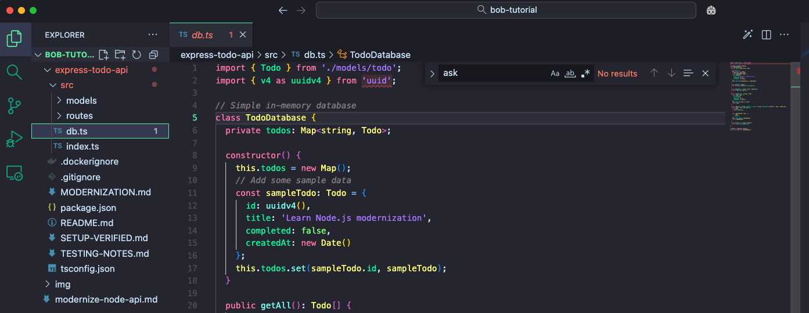
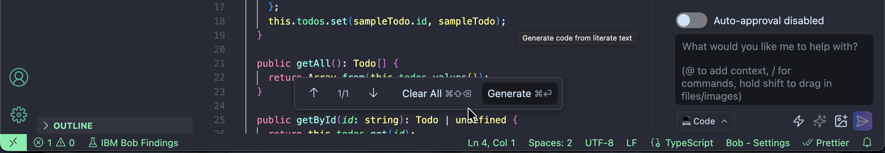

# Modernize a Node.js API with Bob

IBM Bob is an AI-powered IDE (Integrated Development Environment) and SDLC (Software Development Lifecycle) partner for developers. Bob is a standalone application that you install on your computer.

Bob helps you write code by separating intent (your goal), evidence (what exists), and judgment (your decision). Bob works in two phases: planning and execution—ensuring you stay in control while upgrading Node.js applications, refactoring TypeScript, and managing dependencies.

In this tutorial, you learn Bob's core features by modernizing a TypeScript Express API from Node.js 16 to Node.js 22. You learn how Bob analyzes dependencies and modernizes code patterns. 

Bob provides the following five key capabilities that you learn by modernizing a working API:

1. **Modes** - Bob has different modes which differ in permissions and workflows. The primary modes are Plan, Code, Ask, and Advanced.
1. **Context mentions** let you reference specific elements of your project in your conversations with Bob, such as specific file, folder, or Git commits.
1. **Approval workflow** lets you review every file edit and command before Bob executes it.
1. **Code actions** provide quick fixes, refactorings, and AI-powered suggestions in your editor.
1. **Literate coding** lets you write code with AI assistance in your editor. You type instructions in plain language right where the code should go.

## Prerequisites

This tutorial uses a TypeScript Express REST API as the example project. However, you do not need experience in Node.js or TypeScript.

To complete this tutorial, you need:

- **[IBM Bob IDE](https://bob.ibm.com/docs/ide/install)** - Download and install the IBM Bob application on your computer. Bob is a standalone IDE application and not an extension.
- **[Docker](https://docs.docker.com/get-docker/)** - To run containerized builds. You won't need to install Node.js or dependencies locally.
- **[Git](https://git-scm.com/downloads)** - To download the tutorial repository.

## Understanding Bob's AI development modes

Bob has different modes for different tasks. Each mode has a different set of tools and features. The following are Bob's default modes and when you should use them:

- **Plan mode** - When you want to analyze requirements, research and design implementation steps
- **Code mode** - When you want Bob to make changes or run commands 
- **Ask mode** - When you want to explore and understand code without making changes
- **Advanced mode** - When you need all of Bob's tools for complex workflows 
- **Orchestrator** - Coordinates complex tasks across multiple modes

## Open Bob and clone the repository

1. Launch the IBM Bob application on your computer. Look for "IBM Bob" in your Applications folder (macOS), Start menu (Windows), or applications menu (Linux).

1. Open the Bob chat panel by clicking the Bob icon beside the navigation bar or use the shortcut `Cmd+L` (Mac) or `Ctrl+L` (Windows/Linux)

   

   The Bob chat panel has three main components:
   - **Chat history** - Displays your conversation with Bob at the top
   - **Input field** - At the bottom of the panel, type your requests to Bob using natural language
   - **Send button** - Click the paper plane icon to the right of the input field, or press **Enter** to send your message

   You interact with Bob by typing natural language requests in the input field, just like chatting with a colleague.

1. Clone the tutorial repository by clicking on the files icon located on the top left of the Bob IDE panel. Then click **Clone Repository**, and paste the following GitHub repository into the search bar:

   ```text
   PLACEHOLDER FOR GITHUB URL
   ```

   

1. After Bob clones the repository, open the project folder: Select **File > Open Folder** and navigate to the `bob-tutorial/express-todo-api` directory located on your desktop.

   You see the project files in the Explorer and the Bob chat panel on the side.

   

## Create a Dockerfile

You create a `Dockerfile` in the project root to run the application in a containerized environment. With Docker, you don't need to install Node.js or dependencies on your machine.

1. Switch Bob to code mode by clicking the mode selector dropdown to the left of the chat input field and selecting **Code**.

   

1. Ask Bob to create the Dockerfile in the Bob chat panel:

   ```text
   Create a Dockerfile for this Node.js TypeScript application. It should use Node 16 to match the current application version, build the TypeScript code, and run the app on port 3000.
   ```

   

   Bob determines the appropriate Dockerfile structure and shows you the proposed file. Action buttons appear above the chat input field—click **Save** to create the file. Later in this tutorial, Bob updates the Dockerfile to use Node 22.

## Verify the legacy application builds

Before you have Bob modernize the legacy application, verify the legacy code works. Ask Bob to build and test the legacy application using Docker.

In the Bob chat panel, tell Bob what you want it to do:

```text
Build and test the legacy application using Docker to verify it works correctly before modernization. The application should respond to API requests at /api/todos with sample data

After testing, clean up the container.
```

Bob understands your intent and determines the right Docker commands to use. Bob shows you the commands and asks for approval. Click **Run** to execute them.

Bob gives you something similar to following output to confirm the legacy application builds:

```
Successfully created, tested, and verified the Dockerfile for the Node.js TypeScript application:

**Dockerfile Features:**
- Uses Node 16 Alpine image (matching package.json requirement)
- Installs all dependencies including dev dependencies for build
- Builds TypeScript code using `npm run build`
- Prunes dev dependencies for smaller production image
- Exposes port 3000
- Runs application with `npm start`

**Testing Results:**
✅ Docker image built successfully
✅ Container ran on port 3000
✅ API endpoint /api/todos responded correctly with sample data:
```json
[{"id":"667aa608-e9ed-4ac7-b413-8ea8e6a6e255","title":"Learn Node.js modernization","completed":false,"createdAt":"2026-02-15T17:55:33.423Z"}]
✅ Container and image cleaned up

```

The legacy application is working correctly in Docker and ready for modernization.

## Explore Node.js codebase with Bob's Ask mode

Before modernizing, switch to Bob's **Ask mode** in the same dropdown that you used to change Bob to Code mode. Ask mode can only read files, so you can safely explore code without accidentally making changes.

Click the mode selector dropdown to the left of the chat input field and select **Ask** or type `/ask` in Bob chat.

### Use @ context mentions to review the project

Bob supports **@ context mentions** that let you reference specific files, folders, or problems directly in your prompts. Context mentions give Bob precise information about what you want to discuss.

In the Bob chat panel, run the following prompt:

```text
@package.json What Node.js version is this project using? What dependencies would need updating for Node.js 22? Give me a short summary.
```

The `@` symbol before `package.json` tells Bob to include that file's contents as context.

Bob doesn't start answering immediately. Bob explores your codebase first—reading files, following patterns, and analyzing code. Don't interrupt this phase.

Bob reads the `package.json` file and responds with a list of components that you need to update for Node.js 22.

In summary, Bob tells you that the application needs the following updates:

```text
**Current Version:** Node.js 16.x

**Required Updates for Node.js 22:**
- [`@types/node`](express-todo-api/package.json:21): `^16.18.0` → `^22.x.x` (critical)
- [`typescript`](express-todo-api/package.json:24): `^4.9.5` → `^5.x.x` (recommended)
- [`express`](express-todo-api/package.json:16): `^4.18.2` → `^4.21.x` (optional, for security patches)

The main requirement is updating @types/node to match Node.js 22. TypeScript 5.x is recommended for full compatibility with modern Node.js features.
```

### Analyze the TypeScript configuration

Ask Bob to analyze the project's TypeScript configuration:

```text
@tsconfig.json What module system and compiler settings is this TypeScript project using? What dependencies would need updating for Node.js 22? Give me a short summary.
```

Bob reads the `tsconfig.json` file and responds with a list of components that you need to update for Node.js 22.

In summary, Bob tells you that the application needs the following updates:

```text
**Module System & Compiler Settings:**
- **Module**: CommonJS (legacy format)
- **Target**: ES2020
- **Module Resolution**: Node
- **Key Settings**: Strict mode enabled, ESM interop enabled

**For Node.js 22 Modernization:**
1. **Module system**: Update from `"commonjs"` to `"ES2022"` or `"NodeNext"`
2. **Target**: Update from `"ES2020"` to `"ES2022"` or higher
3. **Module Resolution**: Change from `"node"` to `"node16"` or `"nodenext"`
4. **package.json**: Add `"type": "module"` for native ESM support

Node.js 22 fully supports native ES modules, so the project should migrate from CommonJS to ESM for better performance and modern JavaScript features.
```

### Analyze the Dockerfile

Ask Bob to analyze the project's Dockerfile:

```text
@Dockerfile What Node.js version does this Dockerfile use? What would need to change for Node.js 22? Give me a short summary.
```

Bob reads the `Dockerfile` and responds with what needs to be updated for Node.js 22.

In summary, Bob tells you:

```text
**Current Version:** Node.js 16 Alpine ([`FROM node:16-alpine`](express-todo-api/Dockerfile:2))

**Required Change for Node.js 22:**
- Update base image: `FROM node:16-alpine` → `FROM node:22-alpine`

That's the only change needed in the Dockerfile. The rest of the build process (npm install, TypeScript compilation, etc.) remains the same.
```

## Modernize the API with Bob's Code mode

You and Bob know the modernization requirements for `@package.json`, `@tsconfig.json`, and `@Dockerfile`.
- Node.js 16 → 22 in package.json and Dockerfile
- TypeScript compiler target and module settings
- Outdated dependency versions

To start modernizing the application, switch back to **Code mode** so Bob can make code changes. Click the mode selector and select **Code**, or type `/code` in the chat.

In the Bob chat panel, run the following modernization prompt. Notice the `@` references that point Bob to specific files that Bob will work on:

```text
@package.json @tsconfig.json @Dockerfile

Modernize this Express API from Node.js 16 to Node.js 22. Keep the API functionality identical - this is a platform upgrade, not a feature change. Give me a short summary.
```

Bob gives you a summary of all components it updated in the modernization.

```text
**Modernization Complete: Node.js 16 → 22**

**Changes Made:**
- [`package.json`](express-todo-api/package.json): Updated Node.js to 22.x, TypeScript to 5.7.3, @types/node to 22.10.5, Express to 4.21.2
- [`tsconfig.json`](express-todo-api/tsconfig.json): Updated target and lib from ES2020 to ES2022
- [`Dockerfile`](express-todo-api/Dockerfile): Changed base image from node:16-alpine to node:22-alpine

**Verification:**
✅ Built and tested successfully
✅ API functionality identical (GET/POST /api/todos working)
✅ No breaking changes to application behavior

Platform upgrade complete with zero functional changes.
```

You and Bob have modernized the application.

## Update TypeScript API with literate coding

Bob's **literate coding** feature lets you write code with AI assistance in your editor. Instead of using the chat panel, you write instructions in plain language right where the code should go.

Use literate coding to mark the app as modernized by updating the sample todo title:

1. In the Explorer tab on the left side of the screen, navigate to the `express-todo-api` folder and click on `src/db.ts` to open it in the editor

   

2. Toggle literate coding mode by clicking the magic wand icon in the editor toolbar (or press `Cmd+M` on Mac / `Ctrl+M` on Windows/Linux)

   

3. In the `src/db.ts` file that's now open in your editor, paste the following instruction at the top of the file, before any code:

   ```text
   // Find the sample todo object's title property and change it to "Welcome to the Modernized Node.js 22 API"
   ```

   Bob understands this comment is an instruction (not regular code) because you're in literate coding mode. Your instruction appears highlighted in the editor.

   

4. Click **Generate** at the bottom of the document

   Bob locates the `sampleTodo` object in the constructor (around line 11-16) and shows you the change. You'll see the title change from:

   **Before:**
   ```typescript
   title: "Learn Node.js modernization"
   ```

   **After:**
   ```typescript
   title: "Welcome to the Modernized Node.js 22 API"
   ```

   

5. Click **Accept all** to apply the change to the file

6. Click **Exit** to exit literate coding mode

You've updated the API using literate coding. When you test the API in the following section, you see this new title in the API response.

## Verify the modernized application with Docker

Now that Bob has modernized the code, verify everything works by rebuilding and testing the Docker container.

In Code mode, describe what you want Bob to verify:

```text
Verify the modernized Node.js 22 application works by building and testing it with Docker. Check that the API responds at /api/todos and shows the updated todo title. Clean up when done. Give me a short summary. I also want to see the validation of the new title.
```

Once Bob verifies the application has been modernized, it gives you the following summary.

```text
**Verification Complete ✅**

Built and tested Node.js 22 application with Docker:
- ✅ Image built successfully
- ✅ API responding at /api/todos
- ✅ **New title validated:** `"Welcome to the Modernized Node.js 22 API"`
- ✅ Cleanup complete

**API Response:**

[
  {
    "id": "4af8bfab-1205-4fe6-a9be-d49d5804a7e9",
    "title": "Welcome to the Modernized Node.js 22 API",
    "completed": false,
    "createdAt": "2026-02-15T18:30:02.295Z"
  }
]


Modernization from Node.js 16 to 22 verified and working.

```

The API works correctly, and the title is updated to "Welcome to the Modernized Node.js 22 API", confirming that Bob preserved existing behavior while modernizing the Node.js version and dependencies.


## Next steps

In this tutorial you learned how to modernize an Express API from Node.js 16 to Node.js 22 using Bob. Bob analyzed your dependencies, updated configuration files, and modernized the Docker setup while preserving all functionality.

Learn about Bob's [Code review feature](https://qa.bob.ibm.com/docs/ide/features/code-reviews) `/review` to catch potential issues before you commit your work.


