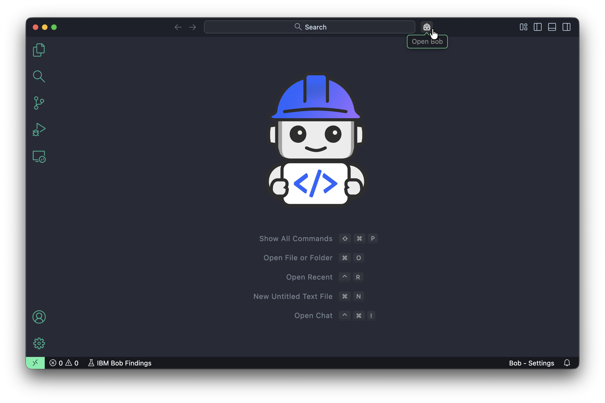
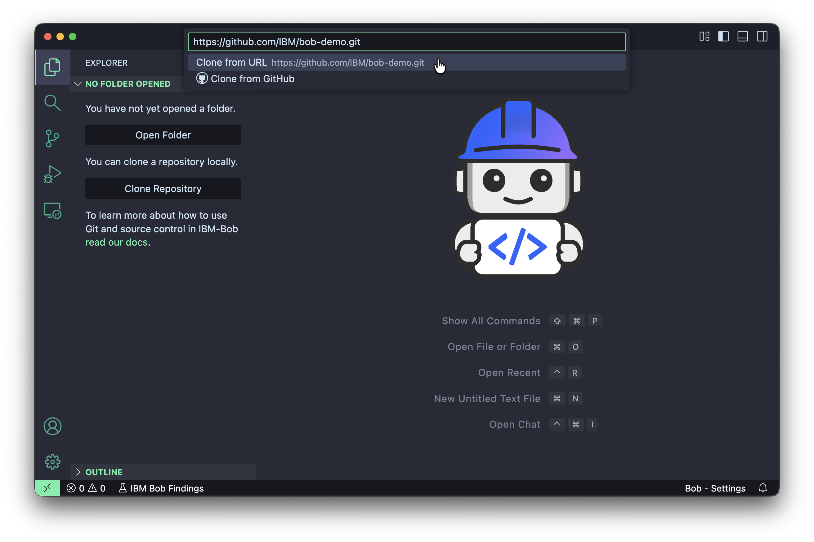
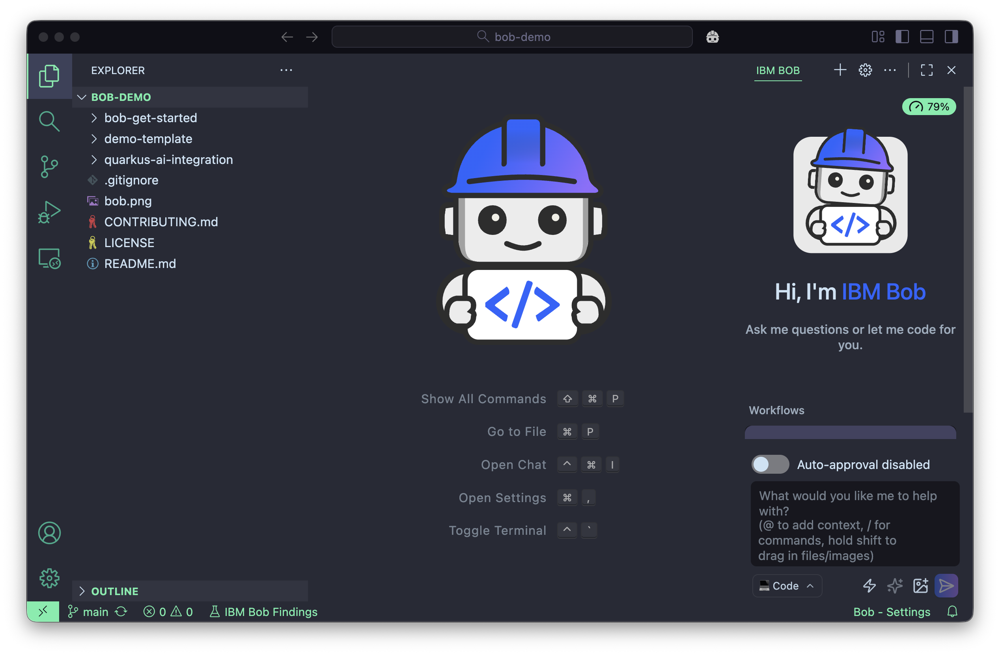
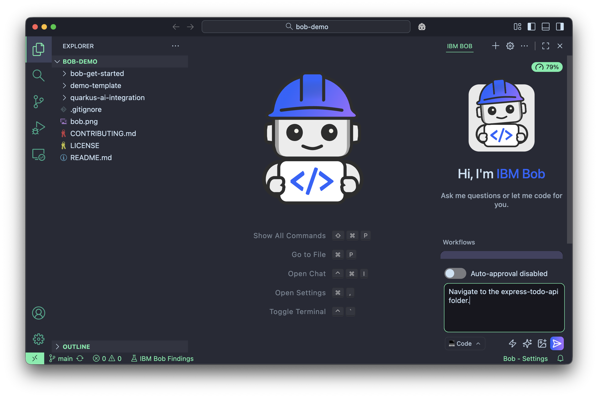
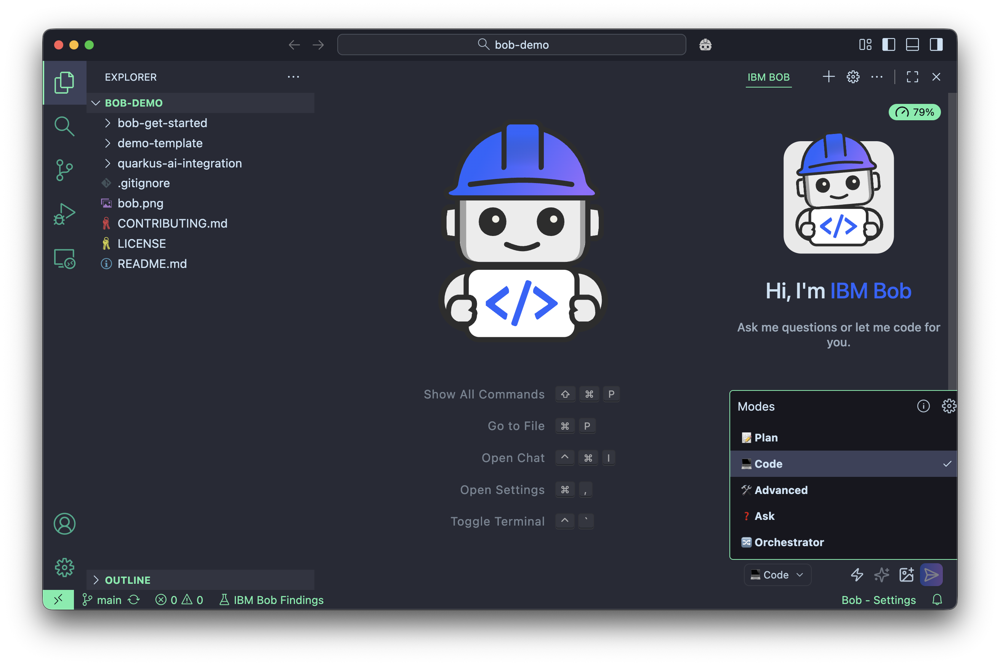
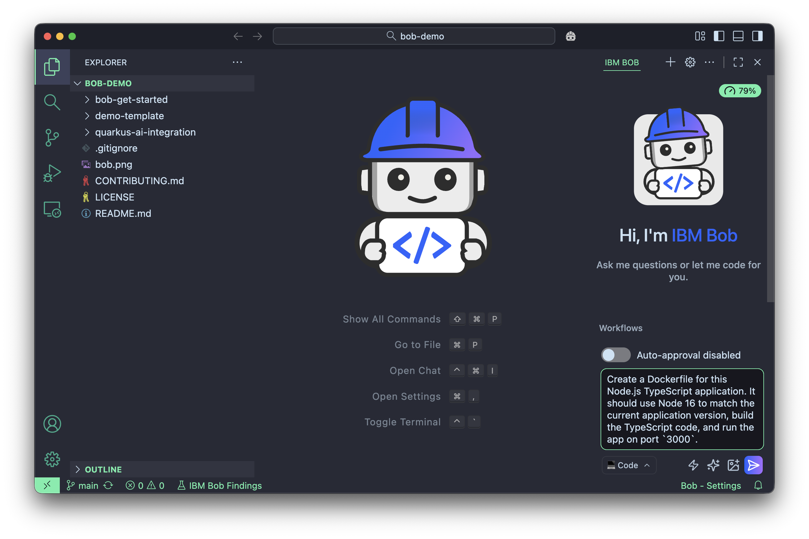
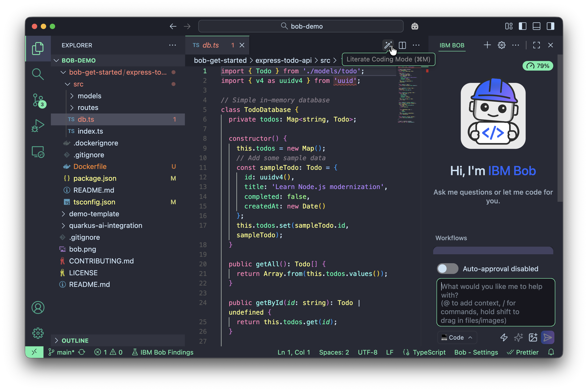
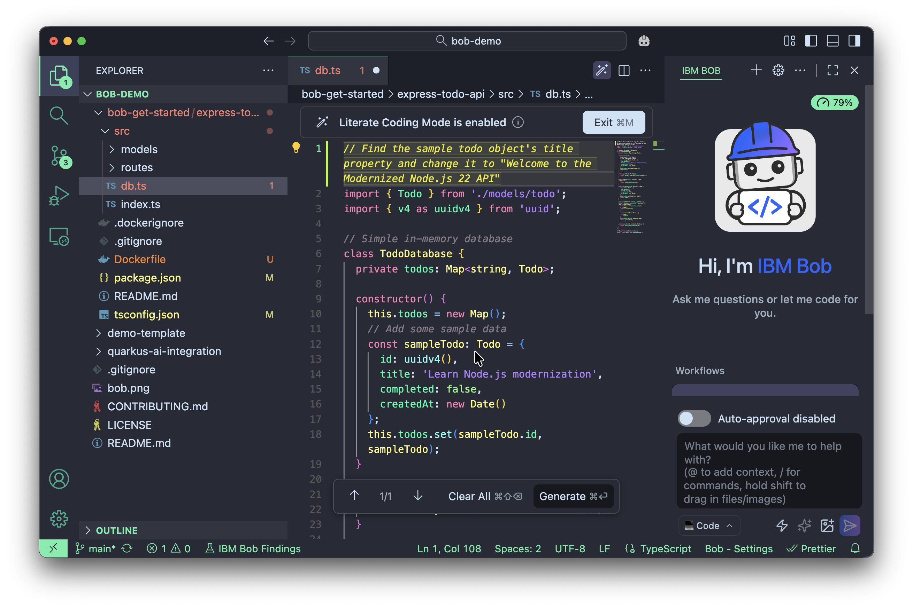

# Modernize a Node.js API with Bob

IBM Bob is an AI-powered Integrated Development Environment (IDE) and Software Development Lifecycle (SDLC) partner for developers. Bob is a standalone application that you install on your computer.

Bob helps you write code by separating intent (your goal), evidence (what exists), and judgment (your decision). Bob works in two phases: planning and execution, ensuring you stay in control while upgrading applications, refactoring APIs, and managing dependencies.

In this tutorial, you will learn Bob's core features by modernizing a TypeScript Express API from Node.js 16 to Node.js 22. You will learn how Bob analyzes dependencies and modernizes code patterns. 

Bob provides the following five key capabilities that you will learn by modernizing a working API:

1. **[Modes](https://bob.ibm.com/docs/ide/features/using-modes)** differ in permissions and workflows. The primary modes are Plan, Code, Ask, Advanced, and Orchestrator.
1. **[Context mentions](https://bob.ibm.com/docs/ide/features/context-mentions)** let you reference specific elements of your project in your conversations with Bob, such as specific file, folder, or Git commits.
1. **[Approval workflow](https://bob.ibm.com/docs/ide/core-concepts/bob-tools#tool-workflow)** lets you review every tool Bob plans to use before it executes.
1. **[Code actions](https://bob.ibm.com/docs/ide/features/code-actions)** provide quick fixes, refactorings, and AI-powered suggestions in your editor.
1. **[Literate coding](https://bob.ibm.com/docs/ide/features/literate-coding)** lets you write code with AI assistance in your editor. You type instructions in plain language right where the code should go.

## Prerequisites

This tutorial uses a TypeScript Express REST API as the example project. However, you do not need experience in Node.js or TypeScript.

To complete this tutorial, you need the following:

- **[IBM Bob IDE](https://bob.ibm.com/docs/ide/install):** Download and install the IBM Bob application on your computer. Bob is a standalone IDE application and not an extension.
- **[Docker](https://docs.docker.com/get-docker/):** Use Docker to run containerized builds. You won't need to install Node.js or dependencies locally.

## Understanding Bob's workflow and modes

Throughout this tutorial, Bob will ask for your approval before taking actions:
- **Approve:** Grant permission to read files or access resources
- **Run:** Execute commands or scripts
- **Save:** Write or modify files

This approval workflow ensures you stay in control. When you see these prompts in the following sections, review Bob's request to understand what it wants to do, and then click the **Approve**, **Run**, or **Save** button to allow Bob to proceed.

Bob has different [modes](https://bob.ibm.com/docs/ide/features/using-modes) for different tasks. Each mode has a different set of tools and features. The following are Bob's default modes and when you should use them:

- **Plan:** When you want to analyze requirements, research and design implementation steps
- **Code:** When you want Bob to make changes or run commands
- **Ask:** When you want to explore and understand code without making changes
- **Advanced:** When you need all of Bob's tools for complex workflows 
- **Orchestrator:** When you work on complex projects requiring coordination across different specialties, multi-domain workflows, and task management

## Open Bob and clone the repository

To begin the tutorial, you need to launch IBM Bob and clone the example repository containing the Node.js application you will modernize.

1. Launch the IBM Bob application on your computer. Look for IBM Bob in your Applications folder (macOS), Start menu (Windows), or applications menu (Linux). 

1. If Bob is not already opened, open the Bob chat panel by clicking the Bob icon beside the navigation bar or use the shortcut `Cmd+L` (Mac) or `Ctrl+L` (Windows/Linux).

   

   The Bob chat panel has three main components:
   - **Chat history:** This displays your conversation with Bob at the top.
   - **Input field:** At the bottom of the panel, type your requests to Bob using natural language.
   - **Send button:** Click the paper plane icon to the right of the input field, or press **Enter** to send your message.

   You interact with Bob by typing natural language requests in the input field, just like chatting with a colleague.

1. Clone the tutorial repository by clicking on the files icon located on the top left of the Bob IDE panel. Then click **Clone Repository**, and paste the following GitHub repository into the search bar. Bob asks you where you want to save the repository. You can save it wherever you like:

   ```text
   https://github.com/IBM/bob-demo.git
   ```

   

1. Click **Open** when Bob asks you if you want to open the cloned repository. If Bob asks, "Do you trust the authors of the files in the folder?" click "Yes, I trust the authors".

   You see the project files in the Explorer and the Bob chat panel on the side.

   

1. Make sure auto-approval is disabled. Above the Bob chat at the bottom right of the window is a slider. If auto-approve is disabled, you will see "Auto-approval disabled" as shown in the previous image. If auto-approval is on you will  see two small white checkmarks and a circle. Click the circle to disable auto-approve.

## Working with Bob Chat

Interact with Bob in the Bob chat at the bottom right of the window to tell Bob to navigate to the `express-todo-api` folder. Bob verifies that you want to navigate to the `express-todo-api` folder:

   ```text
   Navigate to the express-todo-api folder.
   ```

   

   Bob changes to the `express-todo-api` folder, and responds with something similar to the following:

   ```text
   Successfully navigated to the express-todo-api folder at:

   The directory contains a TypeScript Express.js TODO API project with the following structure:
   - Source code in `src/` directory
   - Database configuration (`db.ts`)
   - Main entry point (`index.ts`)
   - Todo model and routes
   - Configuration files (package.json, tsconfig.json, .gitignore, .dockerignore)
   ``` 

## Create a Dockerfile

Create a Dockerfile in the `express-todo-api` folder to run the application in a containerized environment. With Docker, you don't need to install Node.js or dependencies on your machine.

1. Switch Bob to code mode by clicking the mode selector dropdown to the left of the chat input field and selecting **Code**.

   

1. Enter the following prompt in the Bob chat panel to ask Bob to create the Dockerfile. Bob will request read access to several files in order to understand the requirements for the Dockerfile:

   ```text
   Create a Dockerfile for this Node.js TypeScript application. It should use Node 16 to match the current application version, build the TypeScript code, and run the app on port `3000`.
   ```

   

   Bob determines the appropriate Dockerfile structure and shows you the proposed file. Action buttons appear above the chat input field. Click **Save** to create the file. Later in this tutorial, Bob updates the Dockerfile to use Node 22.

## Verify the legacy application builds

Before you have Bob modernize the legacy application, verify the legacy code works. Establishing this baseline lets you know the legacy application works before you make changes during the modernization process.

In the Bob chat panel, tell Bob to build and test the application:

```text
Build and test the legacy application using Docker to verify it works correctly before modernization. The application should respond to API requests at /api/todos with sample data

After testing, clean up the container.
```

Bob understands your intent and determines the right Docker commands to use. It knows to build, test, and display verification information for you to review. 

Bob gives you the following output, or something similar, to confirm the legacy application builds:

```
Successfully built, tested, and cleaned up the legacy Express TODO API application using Docker:

**Build Results:**
- Created Dockerfile using Node 16 Alpine with multi-stage build
- Successfully built Docker image with TypeScript compilation
- Image size optimized with production-only dependencies

**Test Results:**
- Container ran successfully on port `3000`
- API endpoint `/api/todos` responded correctly with sample data:
  ```json
  [{
    "id": "0133de51-d9ba-490a-93c9-e9af8bb58a33",
    "title": "Learn Node.js modernization",
    "completed": false,
    "createdAt": "2026-02-16T16:15:56.627Z"
  }]
  

**Cleanup:**
- Stopped and removed container `express-todo-api-test`
- Removed Docker image `express-todo-api`

The legacy application is verified to work correctly and is ready for modernization. The Dockerfile remains in the project for future use.

```

You and Bob verified the legacy application is working correctly.

## Explore Node.js codebase with Bob's Ask mode

Before modernizing, click the mode selector drop down and switch to Bob's **Ask mode**. Ask mode can only read files, so you can safely explore code without accidentally making changes. You can also type `/ask` in Bob chat to change to Ask mode.

### Use @ context mentions to review the project

Bob supports **@ context mentions** that let you reference specific files, folders, or problems directly in your prompts. Context mentions give Bob precise information about what you want to discuss.

Explore the `package.json`, `tsconfig.json`, and `Dockerfile` files by explicitly telling Bob which files to analyze using @ mentions. Learning about these files helps you understand the modernization requirements before you make any changes.

In the Bob chat panel, run the following prompt:

```text
@package.json What Node.js version is this project using? What dependencies would need updating for Node.js 22? Give me a short summary.
```

The `@` symbol tells Bob to include `package.json` as context. Bob doesn't start answering immediately; it explores your codebase first, reading files, following patterns, and analyzing code. Don't interrupt this exploration phase.

Bob identifies the following updates, or something similar, needed for Node.js 22:

```text
**Current Node.js Version:** 16.x

**Dependencies Needing Updates for Node.js 22:**

1. **@types/node**: ^16.18.0 → ^22.x.x (TypeScript types for Node.js 22)
2. **typescript**: ^4.9.5 → ^5.x.x (TypeScript 5+ for better Node.js 22 support)
3. **ts-node**: ^10.9.1 → ^10.9.2+ (ensure compatibility with TS 5 and Node 22)

**Dependencies Already Compatible:**
- **express**: ^4.18.2 ✓ (works with Node.js 22)
- **uuid**: ^9.0.0 ✓ (works with Node.js 22)
- **@types/express**: ^4.17.17 ✓ (compatible)
- **@types/uuid**: ^9.0.0 ✓ (compatible)

**Summary:** Only the Node.js-specific dev dependencies need updating. The runtime dependencies (Express, UUID) are already compatible with Node.js 22.
```

### Analyze the TypeScript configuration

Ask Bob to analyze the project's TypeScript configuration:

```text
@tsconfig.json What module system and compiler settings is this TypeScript project using? What dependencies would need updating for Node.js 22? Give me a short summary.
```

Bob reads the `tsconfig.json` file and responds with the following list, or something similar, of components that you need to update for Node.js 22:

```text
**Current TypeScript Configuration:**

**Module System:** CommonJS (`"module": "commonjs"`)
- Traditional Node.js module system using `require()` and `module.exports`
- Output: `.js` files with CommonJS syntax

**Compiler Settings:**
- **Target:** ES2020 (compiles to ES2020 JavaScript)
- **Lib:** ES2020 (uses ES2020 standard library features)
- **Module Resolution:** Node (standard Node.js resolution algorithm)
- **Strict Mode:** Enabled (full type checking)

**Recommended Updates for Node.js 22:**

1. **target**: ES2020 → **ES2022** or **ESNext** (leverage newer JS features)
2. **lib**: ES2020 → **ES2022** (access newer APIs)
3. **module**: Consider migrating to **"node16"** or **"nodenext"** for native ESM support
4. **moduleResolution**: "node" → **"node16"** or **"bundler"** (better modern resolution)

**Summary:** The project uses legacy CommonJS with ES2020 target. For Node.js 22, you should update the target/lib to ES2022+ and consider migrating to native ESM modules (though CommonJS still works fine).
```

### Analyze the Dockerfile

Ask Bob to analyze the project's Dockerfile:

```text
@Dockerfile What Node.js version does this Dockerfile use? What would need to change for Node.js 22? Give me a short summary.
```

Bob reads the `Dockerfile` and responds with the following, or something similar, that needs to be updated for Node.js 22.

```text
**Current Dockerfile Node.js Version:** Node 16 Alpine (`node:16-alpine`)

**Changes Needed for Node.js 22:**

1. **Base Image (Line 2):** `FROM node:16-alpine` → `FROM node:22-alpine`

**Summary:** Only one line change required: update base image from node:16-alpine to node:22-alpine. The rest of the Dockerfile is compatible with Node.js 22, though npm flag syntax could be modernized
```

## Modernize the API with Bob's Code mode

Bob determined the following modernization requirements for `package.json`, `tsconfig.json`, and `Dockerfile`:

- Change Node.js 16 to Node.js 22 in package.json and Dockerfile
- Update the TypeScript compiler target and module settings
- Fix outdated dependency versions

To start modernizing the application, switch back to **Code mode** so Bob can make code changes. Click the mode selector and select **Code**, or type `/code` in the chat.

In the Bob chat panel, run the following modernization prompt. Notice the `@` references that point Bob to specific files that Bob will work on:

```text
@package.json @tsconfig.json @Dockerfile

Modernize this Express API from Node.js 16 to Node.js 22. Keep the API functionality identical - this is a platform upgrade, not a feature change. Give me a short summary.
```

Bob gives you the following summary, or something similar, of all components it updated in the modernization.

```text
Successfully modernized the Express TODO API from Node.js 16 to Node.js 22:

**Changes Made:**

1. **package.json**
   - Node.js engine: 16.x → 22.x
   - @types/node: ^16.18.0 → ^22.0.0
   - TypeScript: ^4.9.5 → ^5.3.3
   - ts-node: ^10.9.1 → ^10.9.2

2. **tsconfig.json**
   - Target: ES2020 → ES2022
   - Lib: ES2020 → ES2022

3. **Dockerfile**
   - Base images: node:16-alpine → node:22-alpine (both stages)

**Verification:**
- ✅ Docker build successful with Node.js 22
- ✅ API functionality identical - /api/todos returns sample data correctly
- ✅ No breaking changes - pure platform upgrade

**Summary:** Platform upgrade complete. The application now runs on Node.js 22 with modern TypeScript 5.x while maintaining 100% API compatibility. All dependencies updated to support Node.js 22.
```

You and Bob have modernized the application.

## Update TypeScript API with literate coding

Bob's **literate coding** feature lets you write code with AI assistance in your editor. Instead of using the chat panel, you write instructions in plain language right where the code should go.

Use literate coding to mark the app as modernized by updating the sample todo title:

1. In the Explorer tab on the left side of the screen, navigate to the `express-todo-api` folder and click on `src/db.ts` to open it in the editor. Once you have `src/db.ts` open, toggle literate coding mode by clicking the magic wand icon in the editor toolbar. Alternatively, you can press Cmd+M on Mac, or Ctrl+M on Windows and Linux.

   
   

1. In the `src/db.ts` file that's open in your editor, paste the following instruction at the top of the file, before any code:

   ```text
   // Find the sample todo object's title property and change it to "Welcome to the Modernized Node.js 22 API"
   ```

   Bob understands this comment is an instruction, rather than regular code, because you're in literate coding mode. Your instruction appears highlighted in the editor.

   

1. Click **Generate** at the bottom of the document.

   Bob locates the `sampleTodo` object in the constructor and shows you the change. You'll see the title change from:

   **Before:**
   ```typescript
   title: "Learn Node.js modernization"
   ```

   **After:**
   ```typescript
   title: "Welcome to the Modernized Node.js 22 API"
   ```

1. Click **Accept all** at the bottom of the document where you clicked **Generate** to apply the change to the file.

1. Click **Exit** below the literate magic wand at the top of the file to exit literate coding mode.

You've updated the API using literate coding. When you test the API in the following section, you see this new title in the API response.

## Verify the modernized application with Docker

Verify the code modernization and your literate code change by rebuilding and testing the Docker container.

In Code mode, describe what you want Bob to verify:

```text
Verify the modernized Node.js 22 application works by building and testing it with Docker. Check that the API responds at /api/todos and shows the updated todo title. Clean up when done. Give me a short summary. I also want to see the validation of the new title.
```

Once Bob verifies the application has been modernized, it gives you the following, or something similar, summary.

```text
✅ **Verification Complete - Node.js 22 Modernization Successful**

**Build & Test Results:**
- Docker image built successfully with Node.js 22
- TypeScript compilation completed without errors
- Application started and responded correctly

**API Validation:**
{
  "id": "72459851-7953-4a9c-94d3-4f8f1c656d21",
  "title": "Welcome to the Modernized Node.js 22 API",
  "completed": false,
  "createdAt": "2026-02-16T16:35:49.132Z"
}

**Confirmed:**
- ✅ Updated todo title displays correctly: "Welcome to the Modernized Node.js 22 API"
- ✅ API endpoint /api/todos responds successfully
- ✅ All functionality working on Node.js 22
- ✅ Cleanup completed (container and image removed)

**Summary:** The modernized Express TODO API is fully functional on Node.js 22 with the updated sample data showing the new title confirming the modernization is complete.

```

The API works correctly, and the title is updated to "Welcome to the Modernized Node.js 22 API", confirming that Bob preserved existing behavior while modernizing the Node.js version and dependencies.


## Next steps

In this tutorial you learned how to modernize an Express API from Node.js 16 to Node.js 22 using Bob. Bob analyzed your dependencies, updated configuration files, and modernized the Docker setup while preserving all functionality.

Learn about Bob's [Code review feature](https://bob.ibm.com/docs/ide/features/code-reviews) `/review` to catch potential issues before you commit your work.


