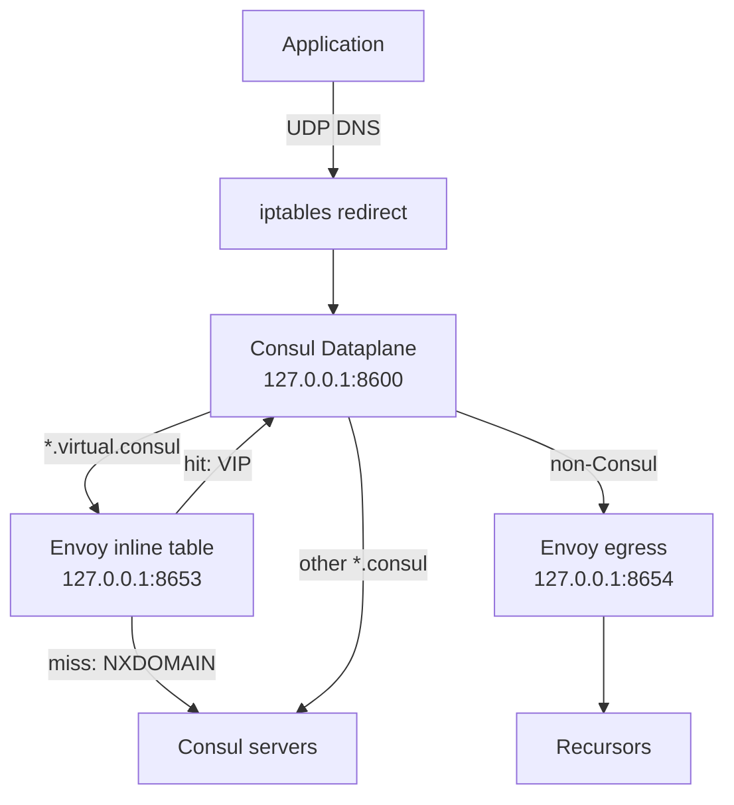

# Localized virtual DNS resolution

This page describes how Consul Dataplane and the Envoy sidecar resolve `*.virtual.consul` domains locally, without a round trip to the Consul servers. It covers the motivation, the resolution flow, how to enable and disable the behavior, and the current limitations.

!> **Localized DNS is disabled by default.** Localized DNS is an experimental feature. Consul does not push the DNS listeners to your sidecar proxies until you enable the `localized-dns` feature gate. Until then, all DNS queries resolve through Consul as they did before. Refer to [Enable localized DNS](#enable-localized-dns).

## Introduction

In an agentless service mesh, Consul servers resolve all DNS queries. If the servers are unavailable, workloads cannot resolve the virtual IP (VIP) of the services they call, even though the data plane is otherwise able to keep routing traffic. To avoid this dependency, you can run a mesh architecture with servers across many datacenters or with a dedicated control plane per cluster, but both options increase infrastructure and maintenance costs.

Localized DNS resolution moves virtual domain lookups into the data plane. The Envoy sidecar holds a table that maps the virtual domain of each configured upstream to its VIP. Consul Dataplane answers virtual domain queries from that table, and only contacts the Consul servers when it cannot.

Localized DNS provides the following benefits:

- **Resilience:** Virtual domains of configured upstreams keep resolving if the Consul servers are unreachable. Envoy continues to use its last known configuration until the control plane returns.
- **Lower latency and server load:** Queries are answered on the loopback interface instead of by the servers. Dataplane instances also avoid the brief resolution gap that occurs when they reconnect to a different server.
- **Small footprint:** The table only contains the proxy's own upstreams. Consul builds it from existing proxy configuration snapshots, so it does not add watches or daemons.
- **Debuggability:** You can inspect the table in the Envoy configuration to confirm whether an upstream is configured and what its virtual domain is.

~> **Localized DNS is not a DNS cache.** The sidecar acts as an authoritative resolver for the virtual domains of configured upstreams. It does not cache responses for other names.

## How it works

Localized DNS uses two UDP listeners that Consul servers push to the Envoy sidecar over xDS. Both listeners bind to `127.0.0.1` only, use non-privileged ports, and are never reachable from outside the host.

| Listener | Address | Purpose |
| :------- | :------ | :------ |
| Inline virtual DNS (`virtual_dns`) | `127.0.0.1:8653` | Answers virtual domains from an inline table that maps each upstream's fully qualified domain name (FQDN) to its VIP. |
| Egress DNS (`egress_dns`) | `127.0.0.1:8654` | Forwards non-Consul queries to the configured recursors. |

Because the listeners are part of the proxy's listener configuration, Consul recomputes and pushes them when upstreams, virtual IPs, or recursors change. Envoy updates them without a restart.

### Virtual domain format

Consul derives the table entries from each upstream's identity. Envoy only matches the expanded form:

```text
<service>.virtual.<namespace>.ns.<partition>.ap.<datacenter>.dc.consul
```

For example, `service-response.virtual.default.ns.partition-vms.ap.dc1.dc.consul`. Consul Dataplane expands shortened names that applications use, such as `service-response.virtual.consul`, to this form before it queries Envoy, and rewrites the name back in the answer.

Each service has one VIP, so there is no DNS-level load balancing. The VIP maps to a cluster of endpoints, and Envoy load balances across them.

### Query flow

The transparent proxy iptables rules redirect application DNS queries to the Consul Dataplane DNS server at `127.0.0.1:8600`. Consul Dataplane then routes each query based on its domain:

| Query | Path |
| :---- | :--- |
| `*.virtual.consul` | Consul Dataplane forwards the expanded name to Envoy on `8653`. If Envoy has an entry, it returns the VIP. If Envoy returns `NXDOMAIN` or is unavailable, Consul Dataplane queries the Consul servers with the original query. |
| Other `*.consul` | Consul Dataplane queries the Consul servers over gRPC. |
| Non-Consul domains | Consul Dataplane forwards the query to Envoy on `8654`, which resolves it through the configured recursors. If the egress listener is not present or fails, Consul Dataplane queries the Consul servers. |



Consul domains never reach public recursors. Consul Dataplane only sends non-Consul names to the egress listener, and the inline table is authoritative for the `consul` suffix.

### Failure handling

- If the inline or egress listener does not respond within 300 ms, Consul Dataplane falls back to the Consul servers and stops trying that listener for a backoff period, so a missing or unhealthy listener does not add latency to every query.
- Envoy limits recursor lookups with a 2 second resolver timeout and a maximum of 256 pending lookups, which prevents unresponsive recursors from exhausting sockets.

## Requirements

- Consul servers version 2.1.0 or later with the `localized-dns` feature gate enabled. Older servers do not push the listeners, and virtual domains continue to resolve through the servers.
- Consul Dataplane with the DNS server enabled. In Kubernetes, enable `dns.enabled` and `connectInject.consulDNS.enabled`, and enable transparent proxy redirection.
- Transparent proxy for workloads whose upstreams you resolve by virtual domain.
- If you upgrade, upgrade the Consul servers before the dataplanes. Because the iptables rules do not change, you can then roll out workloads with a standard rolling update.

## Enable localized DNS

Localized DNS is disabled by default. It is an experimental feature that requires Consul 2.1.0 or later. Before the minimum version, the feature stays disabled even if you enable it. Applications do not need to change.

### Enable the feature gate

Use the operator feature API to enable the `localized-dns` feature gate. The request requires a token with operator write permissions.

```shell-session
$ curl --silent --insecure --request PUT \
    --header "X-Consul-Token: $CONSUL_HTTP_TOKEN" \
    --data '{"Enabled": true}' \
    https://localhost:8501/v1/operator/feature/localized-dns
```

Consul returns the state of the feature:

```json
{
  "Applied": true,
  "Feature": {
    "Name": "localized-dns",
    "Stage": "experimental",
    "MinVersion": "2.1.0",
    "DefaultEnabled": false,
    "BeforeMinimumVersion": "disabled",
    "Description": "Add inline virtual DNS and egress recursor DNS listeners to connect-proxy sidecars",
    "Owner": "proxycfg",
    "DesiredEnabled": true,
    "EffectiveEnabled": true,
    "Eligible": true,
    "Source": "operator",
    "Reason": "operator-enabled",
    "PolicyIndex": 249,
    "StatusIndex": 249
  }
}
```

Confirm that `EffectiveEnabled` and `Eligible` are `true`. If `EffectiveEnabled` is `false`, `Reason` explains why, for example because the servers do not meet `MinVersion`.

After you enable the feature gate, complete the following steps.

### Virtual domain resolution

1. Upgrade the Consul servers to a version that supports localized DNS.
1. [Enable the `localized-dns` feature gate](#enable-the-feature-gate). Without it, the servers do not push the `8653` listener.
1. Upgrade the Consul Dataplane image and restart your workloads. With the feature gate on, the servers push the `8653` listener to every transparent proxy that has at least one upstream with a virtual IP.
1. Verify that the listener exists on a workload. Envoy exposes the listener on its admin interface:

   ```shell-session
   $ kubectl exec <pod> -c consul-dataplane -- \
       wget -qO- http://127.0.0.1:19000/listeners | grep virtual_dns
   virtual_dns:127.0.0.1:8653::127.0.0.1:8653
   ```

1. Resolve a virtual domain from the application container:

   ```shell-session
   $ kubectl exec <pod> -c app -- nslookup service-response.virtual.consul
   ```

   The address in the answer is a VIP, such as `240.0.0.1`.

### Non-Consul domain resolution through the sidecar

The egress listener on `8654` exists only when the Consul servers have at least one recursor configured. Set the [`recursors`](/consul/docs/reference/agent/configuration-file/dns#recursors) option in the server configuration:

```hcl
recursors = ["8.8.8.8", "8.8.4.4"]
```

Recursors must be IP addresses, with an optional port such as `10.0.0.2:5353`. Port `53` is used if you omit the port. Entries that are not valid IP addresses are ignored.

## Disable localized DNS

You can turn off each part of the behavior separately:

- **Disable the feature gate:** Set `Enabled` to `false` for the `localized-dns` feature. Consul stops pushing both listeners, and all DNS queries resolve through the Consul servers.

  ```shell-session
  $ curl --silent --insecure --request PUT \
      --header "X-Consul-Token: $CONSUL_HTTP_TOKEN" \
      --data '{"Enabled": false}' \
      https://localhost:8501/v1/operator/feature/localized-dns
  ```
- **Disable the egress listener:** Remove all entries from `recursors`. Consul stops pushing the `8654` listener, and Consul Dataplane resolves non-Consul names through the Consul servers instead.
- **Fall back to server resolution for virtual domains:** Resolution through the servers is always the fallback. If a workload has no `8653` listener, or the listener has no entry for the name, Consul Dataplane queries the servers. To return a workload to server-based resolution, deploy a dataplane and server version that does not support localized DNS, or remove the upstream so that the table has no entry for it.
- **Roll back:** Roll back the dataplanes first and then the servers. Keep the servers on the newer version until all dataplanes are rolled back, because rolling back the servers first removes the listeners that the newer dataplanes route to. Dataplanes automatically fall back to the servers when a listener is absent.

## Observability

Envoy reports separate statistics for each listener, so you can tell a missing upstream apart from a failed external lookup:

| Stat prefix | Listener |
| :---------- | :------- |
| `consul_virtual_dns` | Inline virtual domain table (`8653`) |
| `consul_egress_dns` | Egress recursor forwarding (`8654`) |

To list the table entries, dump the Envoy configuration and look for the `virtual_dns` listener:

```shell-session
$ kubectl exec <pod> -c consul-dataplane -- wget -qO- http://127.0.0.1:19000/config_dump
```

## Limitations

Localized DNS has the following limitations:

- **Virtual domains only.** Envoy only answers `*.virtual.consul` names. Standard service discovery queries such as `web.service.consul` and node queries still go to the Consul servers.
- **Configured upstreams only.** The table only has entries for the upstreams of that proxy. During a control plane outage, a virtual domain for an upstream that was not configured before the outage cannot be resolved, because the only fallback is the unavailable servers.
- **No new configuration during an outage.** Envoy keeps its last known configuration. New services, changed VIPs, and recursor changes take effect after the control plane returns.
- **Named-port virtual domains are resolved by the servers.** Queries such as `<port>.<service>.virtual.consul` are not in the table, because the table is keyed by service name. Consul Dataplane sends these directly to the servers.
- **Peered upstreams are resolved by the servers.** The table cannot distinguish a local service from a peered service with the same name. If a service name has a peered identity, Consul Dataplane skips the inline listener and queries the servers.
- **UDP only.** The Envoy DNS filter and the egress resolver only support UDP. TCP queries and responses that require truncation to TCP use the Consul servers.
- **One VIP per service, no DNS load balancing.** Envoy load balances across endpoints behind the VIP.
- **No caching.** Localized DNS does not cache responses and does not replace the DNS caching and TTL options on the [Scale Consul DNS](/consul/docs/discover/dns/scale) page.
- **Fixed ports.** The listeners use `8653` and `8654` on `127.0.0.1`. You cannot change them, and no other process in the pod can use them.
- **Recursor changes are global.** Recursors come from the Consul server configuration, not from per-proxy settings.
- **Requires transparent proxy.** Workloads that do not use transparent proxy redirection are not covered.

## Troubleshooting

| Symptom | Cause and resolution |
| :------ | :------------------- |
| `virtual_dns` listener is missing | The servers are on an older version, the proxy has no upstream with a VIP, or the dataplane has not restarted since the upgrade. |
| Virtual domain returns `NXDOMAIN` | The upstream is not configured on the proxy and the servers cannot find it. Check the service defaults, intentions, and upstream configuration. |
| Virtual domain resolves slowly after an outage | Consul Dataplane is waiting for the server fallback. Check whether the upstream appears in the table. |
| Public names do not resolve through the sidecar | No `recursors` are configured, so Consul Dataplane uses the servers. Add `recursors` to the server configuration. |
| Port conflict on startup | Another process listens on `8653` or `8654`. Change the application. The ports cannot be changed. |

## Next steps

- [Configure Consul DNS behavior](/consul/docs/discover/dns/configure)
- [Scale Consul DNS](/consul/docs/discover/dns/scale)
- [Resolve Consul DNS in Kubernetes](/consul/docs/discover/dns/k8s)
