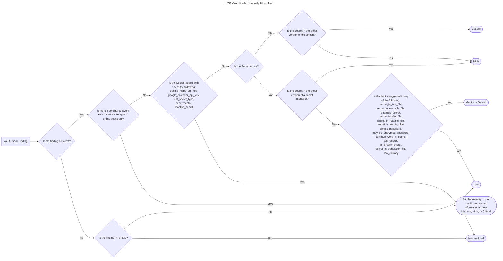

# Risk severity

When Vault Radar finds a risk, it attempts to assign a severity to the risk to
help users prioritize which risks to remediate first.

## Risk severity definitions

### Critical

This means the risk category is a some type of secret. The secret is active and
the secret is in the latest version of content within a resource or
a secret manager.

### High

This means the risk category is a some type of secret. The secret is active but
the secret is NOT in the latest version of content within a resource.

It can also mean the risk category is a some type of secret. The activeness
is unknown but it is in the latest version of a secret manager.

### Medium

If the item meets no other conditions, Vault Radar sets the severity to medium by
default.

### Low

Vault Radar sets risks to low if it meets one of the following conditions:

- The risk category is Personally Identifiable Information (PII)
- The risk has certain tags (for example, TagSecretInTestFile, TagSecretInExampleFile)

### Info

Vault Radar sets risks to info if it meets one of the following conditions:

- Risk category is non-inclusive language (NIL)
- The risk has certain tags (for example, TagIgnoreRule, TagGoogleMapsApiKey, TagInactiveSecret).
- The risk category is AwsAccessKeyId and the risk is not active.