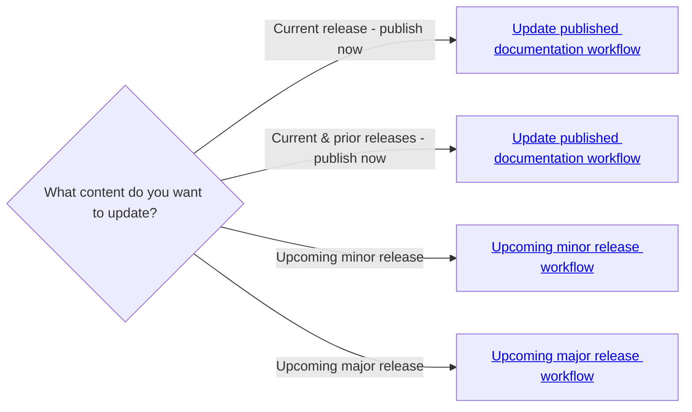

# Contribute to HashiCorp documentation

> [!NOTE]
> Click the GitHub UI's **Outline** button, which is next to the **Edit this file** button,
> to toggle this page's outline.

This repository contains HashiCorp [product documentation and best
practices](https://developer.hashicorp.com).

The information in this file is generic and applies to documentation
for products that use versioned docs and create all content in the
`web-unified-docs` public repository.

Refer to individual product content README files for product-specific
conventions and processes.

@TODO list out which products this file applies to. Should HCP have its own
contributing file? What about Terraform (or point to internal wiki pages)?

## Repository structure

Documentation content is written in Markdown. You can find product folders
in the `content` directory. We publish content from the `main`
branch.

### Versioned content

Documentation for specific product versions is in folders within the
`content/<product>` directory.

Note that HCP documentation does not have versions.

### Branch naming conventions

Tech writers create upcoming release branches using these conventions:

- Upcoming major release branch: `<product>/<exact_release_number>`
- Upcoming minor release branch:  Most products use the
  `<product>/<exact_release_number>` format, but Vault uses `vault/<YYYYMM>`

Individual contributors should create working branches using one of the following:

- Community contributors:
  `<github_username>-<product_name>-<github_issue_number>`, such as
  `aimeeu-nomad-12345`.
- HashiCorp employees: `<name, initials, or GitHub username>-<ticket_number>`,
    such as `aimeeu-ce1001`.

## HashiCorp employee contributor guide

> [!IMPORTANT]
> You must create documentation for embargoed content, including product or
> conference announcements, in the `web-unified-docs-internal` repository. Contact
> your team's technical writer for guidance.

### Workflows



### Before you begin

- Your Github username must be a member of the HashiCorp GitHub [core
  team](https://github.com/orgs/hashicorp/teams/core). You can open a request to
  join `hashicorp/core` in
  [Doormat](https://doormat.hashicorp.services/applications/access/github/role/doormat-github-access-core/options).
- Use Doormat to request `write` access to the `web-unified-docs` repository.
- You must have a valid [SSH key for your Github account](https://docs.github.com/en/authentication/connecting-to-github-with-ssh/generating-a-new-ssh-key-and-adding-it-to-the-ssh-agent#adding-your-ssh-key-to-the-ssh-agent).

If you want to preview your changes locally, install
[Docker](https://www.docker.com/) and [Docker Compose](https://docs.docker.com/compose/).

### Update published documentation

Use this workflow when you want to update published documentation.

1. Clone the repo. We recommend cloning only `main` branch and not downloading the history of other branches. This means that you cannot locally check out other branches.

   ```shell-session
   git clone --single-branch git@github.com:hashicorp/web-unified-docs.git
   ```

1. Create your local working branch.

   ```shell-session
   git checkout -b <working_branch_name>
   ```

   Be sure to follow the [individual contributor branch naming convention](#branch-naming-conventions).

1. Make your changes. If the product uses version folders, make your updates in
   the current release folder. Update content in prior release folders as
   needed.

   Content should adhere to the [Education style guide][edu-style-guide].

   If you need to create a new page, refer to the [How to create a new page][new-page-guide] guide for instructions.

1. Preview your changes locally (optional).

   From the `web-unified-docs` directory, run `make`. This command uses Docker
   to create the documentation website locally. The creation process takes time
   to gather the required elements. You must wait for both the
   `unified-devdot-api` and `dev-portal` containers to complete before you can
   successfully test content in the preview environment. Once the website
   creation process has finished, access the local preview at
   `http://localhost:3000`.

   Run `make clean` in a separate terminal window to gracefully shut down the
   preview environment. Alternately, run `make clean CLEAN_OPTION=full` to
   shutdown the environment and remove the local Docker images.

1. Commit your changes.

   ```shell-session
   git commit -a -m "<short description about the changes>"
   ```

1. When you are happy with your updates, push your local changes to the repo.

   ```shell-session
   git push origin <working_branch_name>
   ```

1. Create a pull request against `main`. Refer to GitHub's [Creating a pull
   request](https://docs.github.com/en/pull-requests/collaborating-with-pull-requests/proposing-changes-to-your-work-with-pull-requests/creating-a-pull-request)
   guide for instructions.

   Pull requests are automatically labeled and assigned to the product's
   documentation team for review.

1. Incorporate reviewer feedback.

1. Merge your pull request after it has been approved.

Your content appears in published documentation about 10 minutes after your pull
request is merged.

### Upcoming minor release documentation

Use this workflow when you want to create or update content for an upcoming
minor or patch release. You want to publish this content when the release is cut.

Each product's tech writer team creates a branch for the upcoming minor or patch release.
Check with your team for name of the branch.

1. Clone the repo. We recommend cloning only the upcoming minor release branch and not downloading the history of other branches. This means that you cannot locally check out other branches.

   ```shell-session
   git clone --single-branch <minor_branch_name> git@github.com:hashicorp/web-unified-docs.git
   ```

   For example, if the upcoming Vault minor release branch is `vault/202511`,
   you would run `git clone --single-branch vault/202511 git@github.com:hashicorp/web-unified-docs.git`.

1. Create your local working branch.

   ```shell-session
   git checkout -b <working_branch_name>
   ```

   Be sure to follow the [individual contributor branch naming convention](#branch-naming-conventions).

1. Make your changes in current release folder.

   Content should adhere to the [Education style guide][edu-style-guide].

   If you need to create a new page, refer to the [How to create a new page][new-page-guide] guide for instructions.

1. Preview your changes locally (optional).

   From the `web-unified-docs` directory, run `make`. This command uses Docker
   to create the documentation website locally. The creation process takes time
   to gather the required elements. You must wait for both the
   `unified-devdot-api` and `dev-portal` containers to complete before you can
   successfully test content in the preview environment. Once the website
   creation process has finished, access the local preview at
   `http://localhost:3000`.

   Run `make clean` in a separate terminal window to gracefully shut down the
   preview environment. Alternately, run `make clean CLEAN_OPTION=full` to
   shutdown the environment and remove the local Docker images.

1. Commit your changes.

   ```shell-session
   git commit -a -m "<short description about the changes>"
   ```

1. When you are happy with your updates, push your local changes to the repo.

   ```shell-session
   git push origin <working_branch_name>
   ```

1. Create a pull request against the upcoming minor release branch, which is the
   branch you cloned in step one.

   Make sure you choose the upcoming minor release branch in the GitHub web UI's **base:**
   drop down list. Refer to GitHub's [Creating a pull
   request](https://docs.github.com/en/pull-requests/collaborating-with-pull-requests/proposing-changes-to-your-work-with-pull-requests/creating-a-pull-request)
   guide for instructions.

   Pull requests are automatically labeled and assigned to the product's
   documentation team for review.

1. Incorporate reviewer feedback.

1. Merge your pull request after it has been approved.

The product tech writer team is responsible for merging the upcoming minor or patch
release branch as part of the minor/patch version release process.

### Upcoming major release documentation

Use this workflow when you want to create or update content for an upcoming
major release. You want to publish this content when the release is cut.

Each product's tech writer team creates a branch for the upcoming major release
and also creates the upcoming release version folder. Check with your team for
the name of the branch and folder.

1. Clone the repo. We recommend cloning only the upcoming major release branch and not downloading the history of other branches. This means that you cannot locally check out other branches.

   ```shell-session
   git clone --single-branch <major_branch_name> git@github.com:hashicorp/web-unified-docs.git
   ```

   For example, if the upcoming Nomad major release branch is `nomad/2.0.0`,
   you would run `git clone --single-branch nomad/2.0.0 git@github.com:hashicorp/web-unified-docs.git`.

1. Create your local working branch.

   ```shell-session
   git checkout -b <working_branch_name>
   ```

   Be sure to follow the [individual contributor branch naming convention](#branch-naming-conventions).

1. Make your changes in upcoming release folder.

   Content should adhere to the [Education style guide][edu-style-guide].

   If you need to create a new page, refer to the [How to create a new page][new-page-guide] guide for instructions.

1. Preview your changes locally (optional).

   From the `web-unified-docs` directory, run `make`. This command uses Docker
   to create the documentation website locally. The creation process takes time
   to gather the required elements. You must wait for both the
   `unified-devdot-api` and `dev-portal` containers to complete before you can
   successfully test content in the preview environment. Once the website
   creation process has finished, access the local preview at
   `http://localhost:3000`.

   Run `make clean` in a separate terminal window to gracefully shut down the
   preview environment. Alternately, run `make clean CLEAN_OPTION=full` to
   shutdown the environment and remove the local Docker images.

1. Commit your changes.

   ```shell-session
   git commit -a -m "<short description about the changes>"
   ```

1. When you are happy with your updates, push your local changes to the repo.

   ```shell-session
   git push origin <working_branch_name>
   ```

1. Create a pull request against the upcoming minor release branch, which is the
   branch you cloned in step one.

   Make sure you choose the upcoming minor release branch in the GitHub web UI's **base:**
   drop down list. Refer to GitHub's [Creating a pull
   request](https://docs.github.com/en/pull-requests/collaborating-with-pull-requests/proposing-changes-to-your-work-with-pull-requests/creating-a-pull-request)
   guide for instructions.

   Pull requests are automatically labeled and assigned to the product's
   documentation team for review.

1. Incorporate reviewer feedback.

1. Merge your pull request after it has been approved.

The product tech writer team is responsible for merging the upcoming major
release branch as part of the major version release process.

---

## Publication

Changes to `main` show up approximately ten minutes after the PR merges.  

---

## Troubleshooting

### I cannot see my local changes

If you use Docker to preview docs locally and cannot see local changes or
preview specific doc versions, you may be using an older/cached Docker image of
`web-unified-docs` or `dev-portal` with an unfixed build error. To force a
refresh of the Docker images, run `make clean CLEAN_OPTION=full` to purge the
local images and then rebuild with `make`.

---

## FAQs

- Once I created a PR, how do I preview the docs?

  Find the **Vercel Previews Deployed** comment and click on the **Visit Preview** to see the preview.

- Where can I get assistance? (For example, my PR was reviewed and approved, but
  I don’t have permission to merge the PR.)

  Reach out to one of the approvers on your pull request or contact your
  product's tech writing team.


[edu-style-guide]: ./style-guide/index.md
[new-page-guide]: ./content-guide/create-new-page.md
