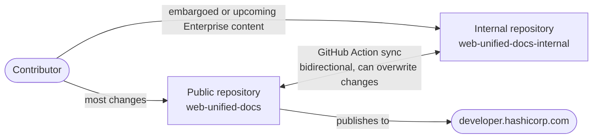
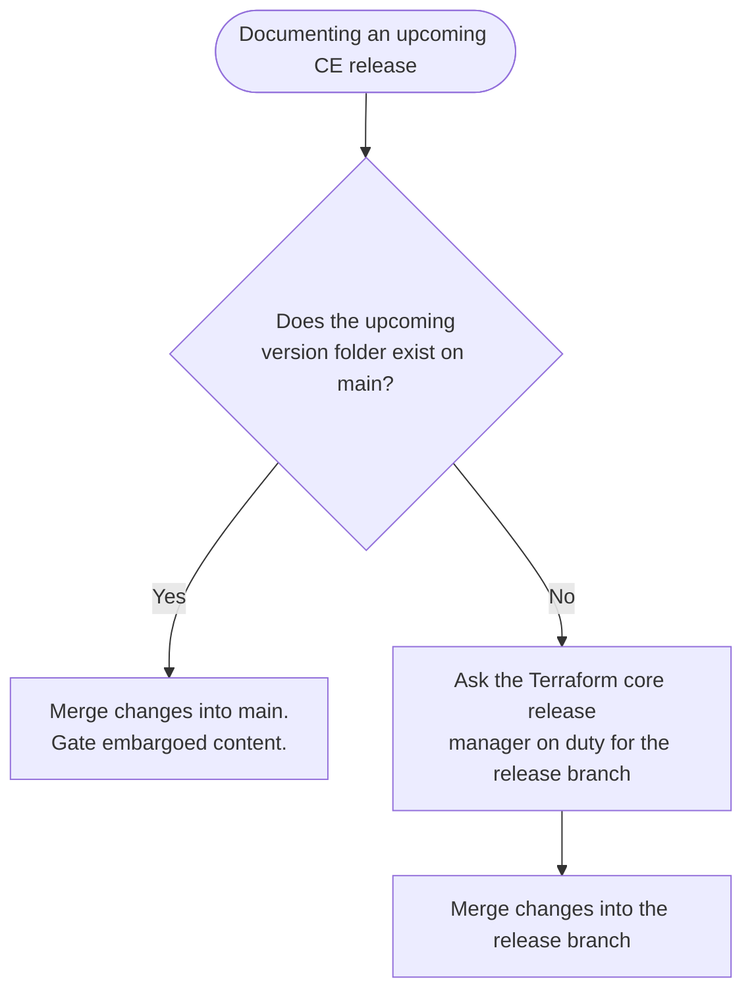
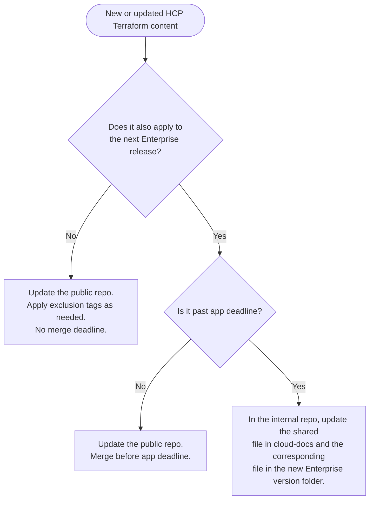
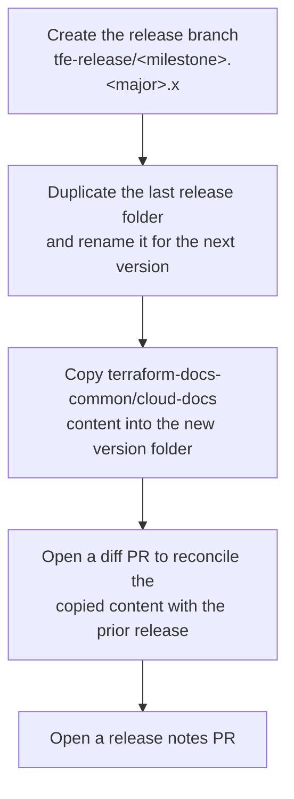
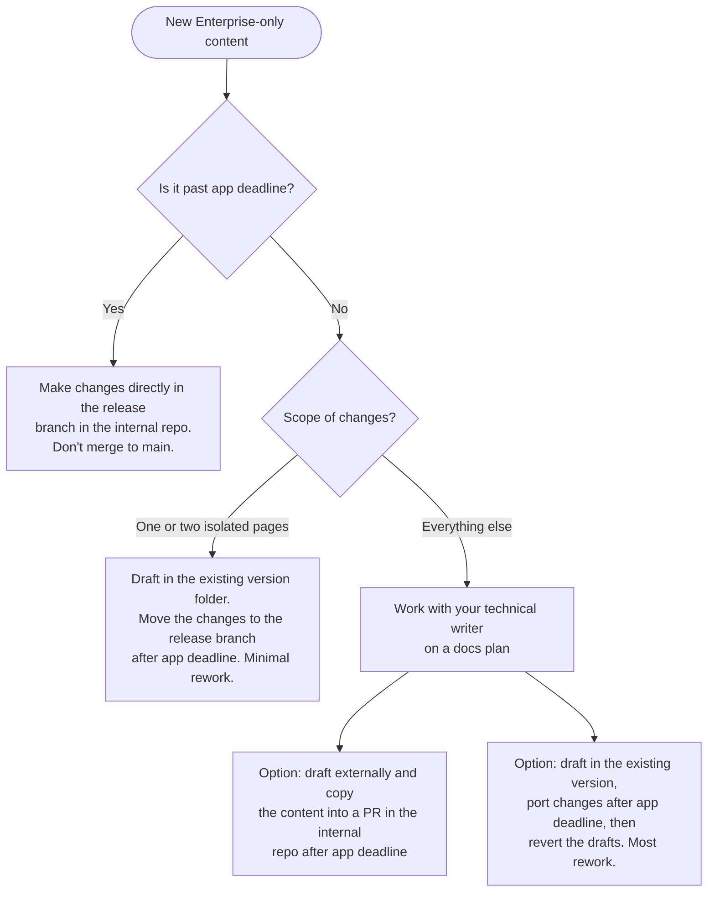
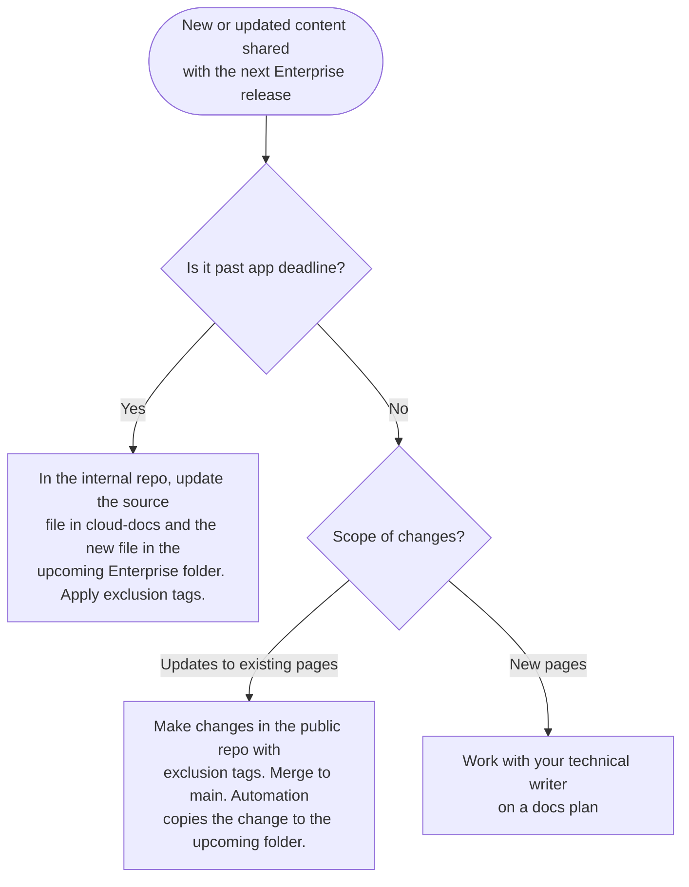

# Contribute to Terraform documentation

This guide explains how to contribute to Terraform documentation on
`developer.hashicorp.com`. It covers the repository structure, the workflow
differences between Terraform CE, HCP Terraform, and Terraform Enterprise, and
the decision points that determine which repository, branch, and folder you
should use for a given change.

This guide only covers documentation on `developer.hashicorp.com`. For provider
documentation on the public Terraform Registry, contact the Registry team in
`#support-terraform-registry`.

If you are an external contributor, refer to [Contribute to HashiCorp
documentation](../../../CONTRIBUTING.md) to get started. The workflows in this
guide assume write access to HashiCorp's internal repositories.

## The documentation repository

All Terraform product documentation source files live in the web unified docs
repository. There are two copies of this repository:

- **`web-unified-docs`**: The public repository. This repository serves content
  to the website. Make changes here unless the content is embargoed or documents
  an upcoming Terraform Enterprise release.
- **`web-unified-docs-internal`**: The internal repository. Use this repository
  only to document embargoed features or an upcoming version of Terraform
  Enterprise.

A GitHub Action regularly syncs the `main` branches of both repositories. The
sync is bidirectional, so a change merged to `main` in either repository can
overwrite content in the other. This is why you should avoid opening PRs against
`main` in the internal repository unless the content is under embargo or
documents an upcoming Enterprise release.



### Versioning

`web-unified-docs` doesn't use version control system features such as backports
or tags to version documentation. Instead, each version of a page is a distinct
`.mdx` file that lives in a folder named for that version. Each version folder
also contains its own navigation file. If a change applies to multiple versions
of a page, update the corresponding file in each affected version folder.

Refer to [Terraform docs directory to published location
mapping](terraform-docs-mapping.md) for the full list of content directories and
how they map to published URLs.

### Redirects

If a change affects a page's URL path, such as moving or renaming a file or
folder, add a redirect.

- **Terraform Enterprise**: Add redirects to the `redirects.jsonc` fle in the latest
version folder. Each Terraform Enterprise version folder has its own redirects
file, but the platform only reads the file in the latest version.
- **Terraform CE and HCP Terraform**: Add redirects to the `redirects.jsonc` fle in
the `terraform-docs-common` folder, which is unversioned and contains a running
list of redirects.

Name files and folders with scalability and maintainability in mind so that
future reorganizations need fewer redirects. Refer to
[Redirects](../../content-guide/redirects.md) for details.

## Decide which edition your change applies to

Terraform documentation spans three editions, and each has a different workflow.

- **Terraform CE**: The open-source command-line product. Versioned content with
  no cross-edition sharing. Refer to [Terraform CE workflows](#terraform-ce-workflows).
- **HCP Terraform**: The SaaS offering. Unversioned content, most of which is
  also published to Terraform Enterprise. Refer to [HCP Terraform workflows](#hcp-terraform-workflows).
- **Terraform Enterprise**: The self-hosted offering. Versioned content, much of
  it shared with HCP Terraform through the `terraform-docs-common` folder. Refer
  to [Terraform Enterprise workflows](#terraform-enterprise-workflows).

Because HCP Terraform and Terraform Enterprise share most of their content, a
change to shared information usually needs to happen in two places to keep both
editions in sync. The workflows in the following sections walk through each scenario.

## Terraform CE workflows

### Update existing content

1. Make the change in the public `web-unified-docs` repository.
1. If the change applies to multiple versions, update the corresponding file in
   each affected version folder.
1. Merge to `main` to publish the change to the website.

### Update content for an upcoming release

If the alpha or beta version is already published to `main`, follow the workflow
for updating existing content. The updates become visible when a user
switches to the upcoming version in the version selector.

If the upcoming version folder doesn't exist on `main` yet, you need the release
branch that contains it.



The Terraform core release manager on duty creates the release branch, which involves
duplicating the most recent version folder and renaming it for the next version.

## HCP Terraform workflows

### Overview

HCP Terraform documentation has no versions. Unless the information is under
embargo, make all changes in the public repository. Automation copies almost all
HCP Terraform content to the next Terraform Enterprise release unless you
exclude it with [an exclusion tag](#exclusion-tags).

If you are not sure whether a change is under embargo, check with your product
manager.

### Decide how to handle Enterprise sharing

Because most HCP Terraform content flows into Terraform Enterprise, verify
whether your change also applies to the next Enterprise release and whether the
**app deadline** milestone has already passed. App deadline is when the
release engineer runs the job that generates documentation artifacts for the
upcoming Enterprise release. Refer to [The Terraform Enterprise release
cycle](#the-terraform-enterprise-release-cycle) for more detail.



### Exclusion tags

Use exclusion tags to gate HCP Terraform-only or Terraform Enterprise-only
content within a shared file, or the `tfc_only` frontmatter attribute to
exclude an entire page from Terraform Enterprise. Use exclusion tags as much as
possible instead of stating that a difference is Enterprise-only, since inline
exclusions produce a smoother reading experience for both audiences.

## Terraform Enterprise workflows

### Release versions

Terraform Enterprise increments releases using a semantic-like scheme.

`VERSION.RELEASE.FIXES`

Documentation only increments on `VERSION` and `RELEASE` changes. A `FIXES`
change publishes directly against the current version's docs, with no new
version folder.

### Update existing Enterprise-only content

Use this workflow for changes that aren't tied to a specific release, such as
documentation for the deployment or application administration areas that only
apply to Terraform Enterprise.

1. Verify that the content you're changing is Enterprise-only. If the front
   matter shows `source: terraform-docs-common`, the page is shared with HCP
   Terraform. Make the change in the source file under `terraform-docs-common`
   instead so the edit survives the next sync.
1. Make the change in the public repository.
1. Update any older Enterprise versions that the change applies to.
1. Merge to `main`.

Enterprise-only documentation includes the deployment and application
administration content.

### The Terraform Enterprise release cycle

Each release cycle, the release engineer runs a job in the internal repository
that prepares the artifacts for the upcoming Enterprise release.



Refer to [The complete guide to releasing TFE docs](publish-tfe-docs.md) for the
full release process, including exact branch and PR names.

### App deadline and content drift

App deadline is the point in the cycle when the release engineer's job copies a
snapshot of `terraform-docs-common` into the new Enterprise version folder.
Merging your HCP Terraform changes before app deadline ensures they land in the
new Terraform Enterprise version folder automatically.

The copied content is a snapshot, not a live link. **If you update a page in the
new Terraform Enterprise version folder after app deadline and its frontmatter
shows `source: terraform-docs-common`, you must also update the file in
`terraform-docs-common`. Otherwise, the next sync overwrites your change.**

Check the `#proj-tfe-releases` channel for the Terraform Enterprise upcoming
release app deadline.

### Document features for an upcoming Enterprise-only release

Use this workflow when you already know a change only applies to Terraform
Enterprise, such as a new deployment configuration option.



None of the before-app-deadline options is ideal, since the artifacts that host
the new content don't exist yet. Engage an Education team technical writer early so you can
plan around this constraint.

### Document features for an upcoming release shared with HCP Terraform

Use this workflow for content that applies to both HCP Terraform and the next
Terraform Enterprise release, such as most topics related to projects,
organizations, or workspaces.



When the change only touches existing pages, the public repo workflow is
identical to the general HCP Terraform workflow described previously and requires
no extra coordination.

## Document features under embargo

Some features stay private until a launch event, such as TechXchange, to protect
the announcement and any strategic investment behind it.

When a feature is under embargo, the Education team creates a rollup branch in
`web-unified-docs-internal`.

Follow these steps to document embargoed Terraform CE features:

1. Use the rollup branch as your base branch.
1. Make your changes in `terraform-docs-common` and apply any exclusion tags
   needed to gate the content from Enterprise.
1. Open PRs against the rollup branch and merge them as you normally would.
1. When the embargo lifts, the Education team finishes publishing the content.

If no rollup branch exists yet, opening PRs against `main` in the internal
repository is fine as long as you don't merge until you're ready to release.
Coordinate with colleagues to check whether any linked content has also changed.

**Don't merge to `main` in the internal repository while a feature is under
embargo.** The sync action publishes the change to the public site during the
next run.

## Quick reference

- Consider which edition, or editions, your change applies to.
- Consider which version, or versions, your change applies to.
- A release branch might not exist yet. Reach out to the Terraform core or Enterprise release team.
- Don't open PRs in `web-unified-docs-internal` unless the change documents an upcoming Enterprise release or embargoed content.
- When in doubt, ask in `#proj-docs-packer-and-terraform`.

## Get help

- Post questions or requests for a PR review in `#proj-docs-packer-and-terraform`.
- File a ticket on the Education team's board as early as possible, and include a target date and release phase, such as GA, beta docs, or a private beta guide.
- Refer to [Working with IPL Education](https://hashicorp.atlassian.net/wiki/spaces/ED/pages/2827124769/Working+with+IPL+Education) on Confluence for more background on how the education team supports docs work.
- Refer to the [style guide](../../style-guide/index.md) and its [Top 12 guidelines](../../style-guide/top-12.md) for writing conventions.

## Appendix: Use exclusion tags

### Exclude content on a page

Use HTML comment tags with the `BEGIN: TFC:only` and `END: TFC:only`
directives to exclude content from the Terraform Enterprise docs.

```mdx
<!-- BEGIN: TFC:only name:<feature-name> -->

Content to exclude from Terraform Enterprise.

<!-- END:   TFC:only name:<feature-name>  -->
```

Use `BEGIN: TFEnterprise:only` and `END: TFEnterprise:only` to exclude content
from the HCP Terraform docs instead:.

```mdx
<!-- BEGIN: TFEnterprise:only name:<feature-name> -->

Content to exclude from HCP Terraform.

<!-- END:   TFEnterprise:only name:<feature-name>  -->
```

Except for the `BEGIN:` and `END:` directives, the content of each tag must be
identical, or the platform treats them as different directives and returns an
error. The `name` attribute is optional, but it helps you stay organized on a
page with several exclusions.

You can exclude MDX components, such as callouts, as long as there's a line
break between the component and the exclusion directives.

```mdx
<!-- BEGIN: TFC:only name:<feature-name> -->

<Note>

Message here.

</Note>

<!-- END: TFC:only name:<feature-name> -->
```

You can also exclude content mid-sentence. Pay close attention to spacing and
punctuation.

```mdx
Project-level permissions apply to all workspaces<!-- BEGIN: TFC:only name:stacks-tfe --> and Stacks<!-- END: TFC:only name:stacks-tfe --> within a specific project.
```

### Exclude an entire MDX file

To exclude an entire file from Terraform Enterprise, add `tfc_only: true` to
the page's frontmatter.

```mdx
---
page_title: HCP Terraform in Europe
description: >-
  HCP Terraform is available in HCP Europe, letting you manage Terraform resources in Europe with familiar workflows while adhering to additional data and privacy regulations
tfc_only: true
---
```

When you exclude an entire page from TFE with the `tfc_only: true` frontmatter
key, the file is not copied to the TFE directory during the documentation
release process.
