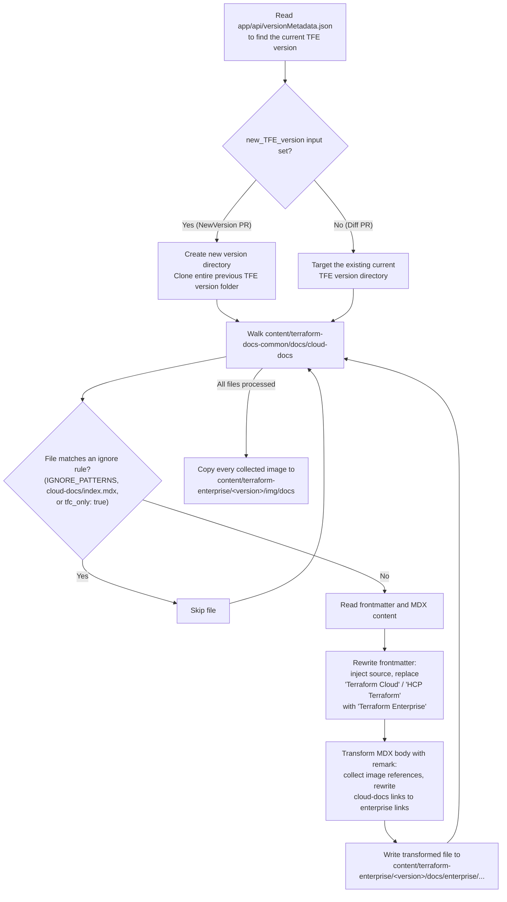
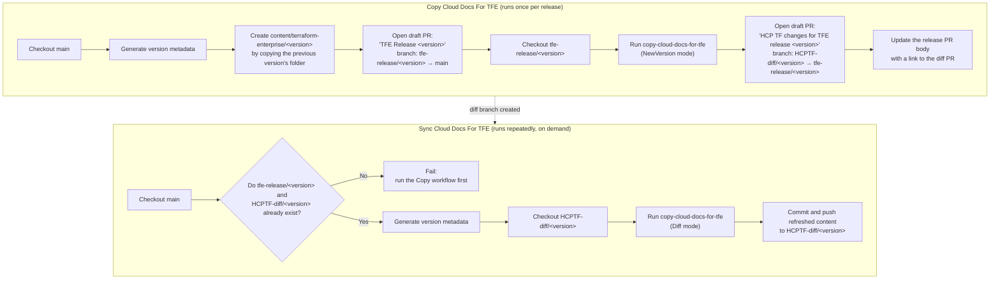
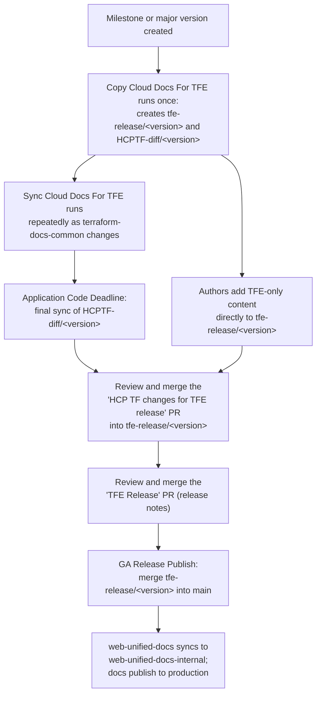

# Copy cloud docs for TFE action

This article describes the `copy-cloud-docs-for-tfe` GitHub composite action,
the automation that generates a new Terraform Enterprise (TFE) documentation
version from the shared HCP Terraform content. It is intended for software
engineers who maintain the action and technical writers who need to understand
what the action changes, skips, or rewrites during a release cycle.

Refer to [Terraform Enterprise releases](publish-tfe-docs.md) for the human
process this action supports, and to [Terraform docs directory to published
location mapping](terraform-docs-mapping.md) for how the resulting
`content/terraform-enterprise/` directory is published.

## Overview

`copy-cloud-docs-for-tfe` lives at
[`.github/actions/copy-cloud-docs-for-tfe`](../../../.github/actions/copy-cloud-docs-for-tfe)
and compiles to a Node 24 action
([`out/index.js`](../../../.github/actions/copy-cloud-docs-for-tfe/out/index.js))
from TypeScript sources. Two repository workflows call it:

| Workflow | File | Purpose |
| --- | --- | --- |
| Copy Cloud Docs For TFE | [`copy-cloud-docs-for-tfe.yml`](../../../.github/workflows/copy-cloud-docs-for-tfe.yml) | Runs once per release to create the `tfe-release/<version>` and `HCPTF-diff/<version>` branches and their PRs. |
| Sync Cloud Docs For TFE | [`sync-docs-for-tfe.yml`](../../../.github/workflows/sync-docs-for-tfe.yml) | Re-runs the copy against existing branches to pull in the latest HCP Terraform changes before the app deadline. |

In both cases, the action copies `.mdx` files, their images, and nav data from
`content/terraform-docs-common/docs/cloud-docs` (the HCP Terraform source) into
`content/terraform-enterprise/<version>/docs/enterprise` (the TFE target),
rewriting frontmatter and links as it goes.

## Inputs

| Input | Required | Description |
| --- | --- | --- |
| `source_path` | Yes | Path to the checkout containing the HCP Terraform source content. |
| `target_path` | Yes | Path to the checkout the action writes the transformed TFE content into. |
| `new_TFE_version` | No | The new TFE version folder to create. When set, the action first clones the previous TFE version's entire folder before copying updated content over it. |

Whether `new_TFE_version` is set determines the action's mode:

- **NewVersion mode** (`new_TFE_version` set): used by the Copy workflow to scaffold a brand-new version folder.
- **Diff mode** (`new_TFE_version` omitted): used by the Sync workflow to refresh content already inside an existing version folder.

## How the action works

The action's logic lives in
[`main.ts`](../../../.github/actions/copy-cloud-docs-for-tfe/main.ts). For each
`.mdx` file under `cloud-docs`, it decides whether to copy the file, then
transforms its frontmatter and body before writing it to the TFE target.



### File filtering

Three independent checks decide whether a source file reaches the TFE target,
applied in
[`main.ts`](../../../.github/actions/copy-cloud-docs-for-tfe/main.ts)'s
`filterFunc` and `IGNORE_LIST`:

| Check | Mechanism | Example |
| --- | --- | --- |
| Path pattern | Regular expression against the file path | `cloud-docs/agents` and `cloud-docs/architectural-details` are always excluded. |
| Explicit ignore list | Exact path match | `cloud-docs/index.mdx` is always excluded. |
| Frontmatter flag | `tfc_only: true` in the file's frontmatter | Any file an author marks HCP Terraform-only is skipped entirely. |

The action does **not** evaluate the `<!-- BEGIN: TFC:only -->` / `<!-- END:
TFC:only -->` HTML comment tags described in [Terraform Enterprise
releases](publish-tfe-docs.md#exclusion-tag-syntax). Those tags exclude content
at render time, not copy time, so an author who wants a whole file left out of
TFE still needs the `tfc_only: true` frontmatter property, and an author who
wants only part of a page excluded relies on the comment tags being honored
downstream.

### Content transforms

Files that pass the filters go through two transform passes before they're written:

1. **Frontmatter** —
   [`main.ts`](../../../.github/actions/copy-cloud-docs-for-tfe/main.ts) adds a
   `source` property and replaces "Terraform Cloud" and "HCP Terraform" with
   "Terraform Enterprise" in `page_title` and `description`.
1. **Body** — a `remark`/`remark-mdx` pipeline applies two custom plugins:
   - [`remark-get-images-plugin.ts`](../../../.github/actions/copy-cloud-docs-for-tfe/remark-get-images-plugin.ts)
     walks the MDX AST for `image` nodes, asserts the referenced file exists in
     the source, and records its path for the later image copy step.
   - [`remark-transfrom-cloud-docs-links.ts`](../../../.github/actions/copy-cloud-docs-for-tfe/remark-transfrom-cloud-docs-links.ts)
     walks `link` and `definition` nodes and rewrites any URL beginning with
     `/cloud-docs` or `/terraform/cloud-docs` to use `enterprise` instead, so
     internal links keep working in the copied version.

For example, a source link and frontmatter pair like this:

```mdx
---
page_title: Assessments - API Docs - HCP Terraform
description: >-
  Assessment results contain information about continuous validation.
---

Refer to [Workspaces](/terraform/cloud-docs/workspaces) for more information.
```

becomes:

```mdx
---
page_title: Assessments - API Docs - Terraform Enterprise
description: >-
  Assessment results contain information about continuous validation.
source: terraform-docs-common
---

Refer to [Workspaces](/terraform/enterprise/workspaces) for more information.
```

## Where the action runs in the release process

The Copy workflow runs once, near the start of a release cycle, to scaffold the
version. The Sync workflow then runs as many times as needed to keep the diff
branch current until the application code deadline.



## Relationship to the TFE release process

[Terraform Enterprise releases](publish-tfe-docs.md) documents the human side of
the workflow shown above. This action produces the exact artifacts that article
names:

- The article states that after a milestone or major version is created, the
  release engineer "runs a job to create" the
  `tfe-release/<version>.<release>.x` branch, the
  `HCPTF-diff/<version>.<release>.x` branch, and their two PRs. That job is the
  **Copy Cloud Docs For TFE** workflow, and the branch/PR creation happens
  because it invokes this action in NewVersion mode.
- The article's caution that running the job "too early" causes later `main`
  changes to be missed, while running it "too late" creates a content
  bottleneck, describes the one-time nature of the Copy workflow's snapshot.
  Content merged into `content/terraform-docs-common` after that run only
  reaches the TFE version once the **Sync Cloud Docs For TFE** workflow runs
  again.
- The article's **Application Code Deadline** milestone, when "the release
  engineer runs the job that creates the release notes and updates the
  `HCPTF-diff/<milestone>.<major>.x` branch with latest changes from
  `terraform-common-docs`," is the last scheduled run of the Sync workflow
  before the diff PR is reviewed.
- The article's **Exclusion tag syntax** section documents both mechanisms
  authors use to keep content out of the wrong edition. Only the `tfc_only:
  true` frontmatter flag is enforced by this action; the `<!-- BEGIN/END:
  TFC:only -->` and `<!-- BEGIN/END: TFEnterprise:only -->` comment tags are
  resolved elsewhere in the publishing pipeline, not by this copy step.
- The article's **Before GA release** guidance to update `terraform-docs-common`
  alongside any fix made directly in the `tfe-release` branch exists precisely
  because this action is one-directional: it copies from `terraform-docs-common`
  to `terraform-enterprise/<version>`, never the reverse. A fix applied only to
  the TFE branch is lost the next time the action runs.



## Related documentation

- [Terraform Enterprise releases](publish-tfe-docs.md): The release process
  this action automates, including exclusion tag syntax and release notes
  guidance.
- [Terraform docs directory to published location
  mapping](terraform-docs-mapping.md): How `content/terraform-enterprise/` and
  `content/terraform-docs-common/` map to published URLs.
- [`.github/actions/copy-cloud-docs-for-tfe/README.md`](../../../.github/actions/copy-cloud-docs-for-tfe/README.md):
  The action's own reference documentation for the frontmatter and HTML comment
  exclusion mechanisms.
