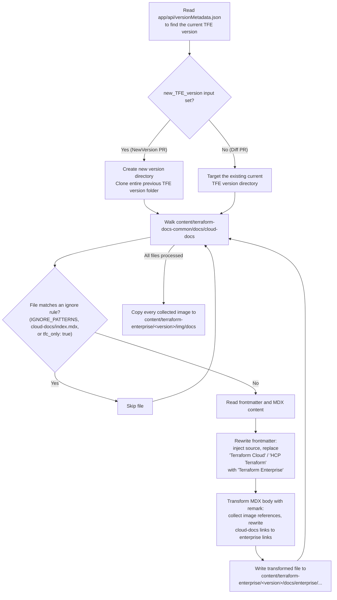
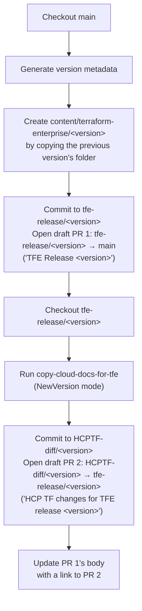
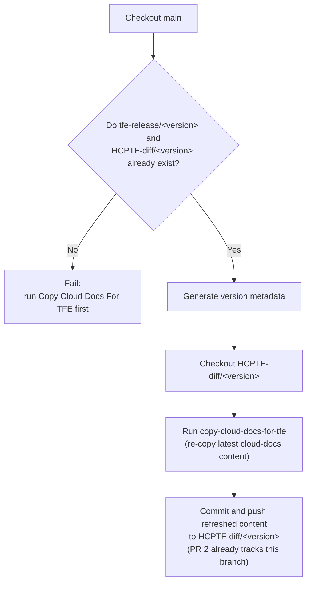
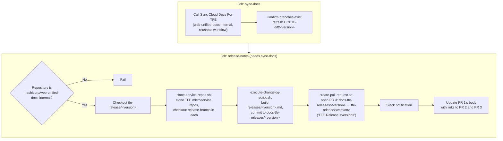
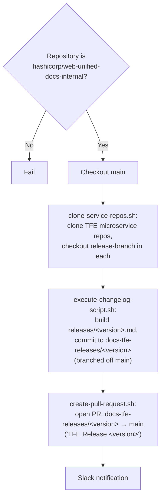
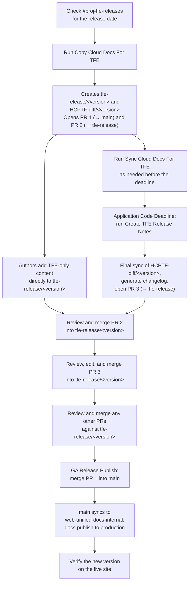
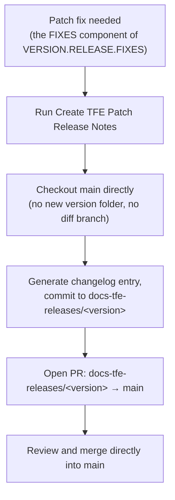

# Copy cloud docs for TFE action

This article describes the `copy-cloud-docs-for-tfe` GitHub composite action,
the automation that generates a new Terraform Enterprise (TFE) documentation
version from the shared HCP Terraform content, and the four GitHub Actions
workflows that drive it through a release cycle. It is intended for software
engineers who maintain the action and workflows, and technical writers who need
to understand what each automated step changes, skips, or rewrites during a
release.

Refer to [Terraform Enterprise releases](publish-tfe-docs.md) for the human
process these workflows support, and to [Terraform docs directory to published
location mapping](terraform-docs-mapping.md) for how the resulting
`content/terraform-enterprise/` directory is published.

## Overview

`copy-cloud-docs-for-tfe` lives at
[`.github/actions/copy-cloud-docs-for-tfe`](../../../.github/actions/copy-cloud-docs-for-tfe)
and compiles to a Node 24 action
([`out/index.js`](../../../.github/actions/copy-cloud-docs-for-tfe/out/index.js))
from TypeScript sources. Four workflows in
[`.github/workflows`](../../../.github/workflows) coordinate it and the
release-notes changelog scripts in
[`scripts/tfe-releases/ci`](../../../scripts/tfe-releases/ci) across a release:

| Workflow | File | Purpose |
| --- | --- | --- |
| Copy Cloud Docs For TFE | [`copy-cloud-docs-for-tfe.yml`](../../../.github/workflows/copy-cloud-docs-for-tfe.yml) | Runs once per release to scaffold the version folder and open the release and diff branches and PRs. |
| Sync Cloud Docs For TFE | [`sync-docs-for-tfe.yml`](../../../.github/workflows/sync-docs-for-tfe.yml) | Re-runs the copy against the existing diff branch to pull in the latest HCP Terraform changes before the app deadline. |
| Create TFE Release Notes | [`create-tfe-release-notes.yml`](../../../.github/workflows/create-tfe-release-notes.yml) | Runs a final sync, then generates the release-notes changelog and opens the release-notes PR. |
| Create TFE Patch Release Notes | [`create-tfe-release-notes-patch.yml`](../../../.github/workflows/create-tfe-release-notes-patch.yml) | Generates a changelog PR directly against `main` for a patch (fix-only) release, without a new version folder. |

All four workflow files are mirrored byte-for-byte into
`hashicorp/web-unified-docs-internal`, and the two release-notes workflows only
function when run from that internal repository. Refer to [Workflows that use
this action](#workflows-that-use-this-action) for the trigger and repository
requirements of each.

In every case where the action itself runs, it copies `.mdx` files, their
images, and nav data from `content/terraform-docs-common/docs/cloud-docs` (the
HCP Terraform source) into `content/terraform-enterprise/<version>/docs/enterprise`
(the TFE target), rewriting frontmatter and links as it goes.

## Inputs

| Input | Required | Description |
| --- | --- | --- |
| `source_path` | Yes | Path to the checkout containing the HCP Terraform source content. |
| `target_path` | Yes | Path to the checkout the action writes the transformed TFE content into. |
| `new_TFE_version` | No | The new TFE version folder to create. When set, the action first clones the previous TFE version's entire folder before copying updated content over it. |

Whether `new_TFE_version` is set determines the action's mode:

- **NewVersion mode** (`new_TFE_version` set): used by the Copy workflow to scaffold a brand-new version folder.
- **Diff mode** (`new_TFE_version` omitted): used by the Sync workflow, and by the sync step inside Create TFE Release Notes, to refresh content already inside an existing version folder.

## How the action works

The action's logic lives in
[`main.ts`](../../../.github/actions/copy-cloud-docs-for-tfe/main.ts). For each
`.mdx` file under `cloud-docs`, it decides whether to copy the file, then
transforms its frontmatter and body before writing it to the TFE target.



### File filtering

Three independent checks decide whether a source file reaches the TFE target,
applied in
[`main.ts`](../../../.github/actions/copy-cloud-docs-for-tfe/main.ts)'s
`filterFunc` and `IGNORE_LIST`:

| Check | Mechanism | Example |
| --- | --- | --- |
| Path pattern | Regular expression against the file path | `cloud-docs/agents` and `cloud-docs/architectural-details` are always excluded. |
| Explicit ignore list | Exact path match | `cloud-docs/index.mdx` is always excluded. |
| Frontmatter flag | `tfc_only: true` in the file's frontmatter | Any file an author marks HCP Terraform-only is skipped entirely. |

The action does **not** evaluate the `<!-- BEGIN: TFC:only -->` / `<!-- END:
TFC:only -->` HTML comment tags described in [Terraform Enterprise
releases](publish-tfe-docs.md#exclusion-tag-syntax). Those tags exclude content
at render time, not copy time, so an author who wants a whole file left out of
TFE still needs the `tfc_only: true` frontmatter property, and an author who
wants only part of a page excluded relies on the comment tags being honored
downstream.

### Content transforms

Files that pass the filters go through two transform passes before they're written:

1. **Frontmatter** —
   [`main.ts`](../../../.github/actions/copy-cloud-docs-for-tfe/main.ts) adds a
   `source` property and replaces "Terraform Cloud" and "HCP Terraform" with
   "Terraform Enterprise" in `page_title` and `description`.
1. **Body** — a `remark`/`remark-mdx` pipeline applies two custom plugins:
   - [`remark-get-images-plugin.ts`](../../../.github/actions/copy-cloud-docs-for-tfe/remark-get-images-plugin.ts)
     walks the MDX AST for `image` nodes, asserts the referenced file exists in
     the source, and records its path for the later image copy step.
   - [`remark-transfrom-cloud-docs-links.ts`](../../../.github/actions/copy-cloud-docs-for-tfe/remark-transfrom-cloud-docs-links.ts)
     walks `link` and `definition` nodes and rewrites any URL beginning with
     `/cloud-docs` or `/terraform/cloud-docs` to use `enterprise` instead, so
     internal links keep working in the copied version.

For example, a source link and frontmatter pair like this:

```mdx
---
page_title: Assessments - API Docs - HCP Terraform
description: >-
  Assessment results contain information about continuous validation.
---

Refer to [Workspaces](/terraform/cloud-docs/workspaces) for more information.
```

becomes:

```mdx
---
page_title: Assessments - API Docs - Terraform Enterprise
description: >-
  Assessment results contain information about continuous validation.
source: terraform-docs-common
---

Refer to [Workspaces](/terraform/enterprise/workspaces) for more information.
```

## Workflows that use this action

### Copy Cloud Docs For TFE

[`copy-cloud-docs-for-tfe.yml`](../../../.github/workflows/copy-cloud-docs-for-tfe.yml)
triggers on `workflow_dispatch` (a release engineer runs it manually) or
`workflow_call` (another workflow invokes it as a reusable workflow), taking a
single required `version` input. It runs once per release, at the start of the
cycle, and does all of the following in a single job (`copy-docs`):

1. Checks out `main` into `new-docs-pr` and runs `npm run prebuild -- --only-build-version-metadata` to regenerate `app/api/versionMetadata.json`, so the workflow can read the current latest TFE version.
1. Creates `content/terraform-enterprise/<version>` by copying the current latest version's folder in full, so images, nav data, and unrelated content already exist before the action runs.
1. Commits that scaffold to a new `tfe-release/<version>` branch and opens **PR 1**, a draft PR titled `TFE Release <version>`, from `tfe-release/<version>` into `main`. Its body is a placeholder at this point.
1. Checks out `tfe-release/<version>` into a second working directory and runs `copy-cloud-docs-for-tfe` with `new_TFE_version: <version>` set (NewVersion mode), overwriting the scaffold with the transformed HCP Terraform content.
1. Commits that result to a new `HCPTF-diff/<version>` branch and opens **PR 2**, a draft PR titled `HCP TF changes for TFE release <version>`, from `HCPTF-diff/<version>` into `tfe-release/<version>`.
1. Edits PR 1's body to link to PR 2.

Both new branch names fail the run if they already exist remotely, so this
workflow is not safe to re-run for the same version once it has succeeded.



### Sync Cloud Docs For TFE

[`sync-docs-for-tfe.yml`](../../../.github/workflows/sync-docs-for-tfe.yml)
shares the same triggers and `version` input as the Copy workflow, but is meant
to be run repeatedly against branches the Copy workflow already created. Its
single job (`sync-docs`) does the following:

1. Checks out `main` and confirms both `tfe-release/<version>` and `HCPTF-diff/<version>` exist remotely, failing with a step-summary message if either is missing.
1. Regenerates `app/api/versionMetadata.json` the same way the Copy workflow does.
1. Checks out `HCPTF-diff/<version>` into a second working directory.
1. Runs `copy-cloud-docs-for-tfe` with `new_TFE_version: <version>` set again (technically NewVersion mode, but because the target directory already contains the version folder, this pass only refreshes files that changed in `content/terraform-docs-common` since the last run).
1. Commits and pushes any resulting changes directly to `HCPTF-diff/<version>` — no new PR, since PR 2 already exists and tracks this branch. If nothing changed, the commit step is a no-op (`|| echo "No changes to commit"`).



### Create TFE Release Notes

[`create-tfe-release-notes.yml`](../../../.github/workflows/create-tfe-release-notes.yml)
triggers only on `workflow_dispatch`, with required `version`,
`release-branch`, and `last-release-tag` inputs and optional `dev-mode` and
`notify` flags. Every step in its second job is gated behind a check that
`github.repository == hashicorp/web-unified-docs-internal`, so although the
identical file also exists in the public `web-unified-docs` repository, it only
completes successfully when run from the internal one.

The workflow has two jobs:

1. **`sync-docs`** calls `hashicorp/web-unified-docs-internal/.github/workflows/sync-docs-for-tfe.yml@main` as a reusable workflow — explicitly the internal repository's copy of Sync Cloud Docs For TFE, regardless of which repository this workflow itself runs from. This performs one last refresh of `HCPTF-diff/<version>` and confirms the release branches exist.
1. **`release-notes`** (needs `sync-docs`) checks out `tfe-release/<version>` and runs the changelog scripts in
   [`scripts/tfe-releases/ci`](../../../scripts/tfe-releases/ci):
   - `clone-service-repos.sh` reads the TFE microservice repositories listed in
     [`scripts/tfe-releases/tfe-releases-repos.yaml`](../../../scripts/tfe-releases/tfe-releases-repos.yaml)
     (`terraform-enterprise`, `archivist`, `atlas`, `tfe-agent`, and others),
     clones each one, and checks each out to the `release-branch` input.
   - `execute-changelog-script.sh` creates
     `content/terraform-enterprise/releases/<version>.md` from a template, runs
     `changelog.rb` to append the aggregated changelog entries from those
     cloned repos (comparing `last-release-tag` to `release-branch`), and
     commits the result to a new `docs-tfe-releases/<version>` branch created
     off `tfe-release/<version>`.
   - `create-pull-request.sh` gathers contributors with `contributors.rb`,
     fills in the PR body template, and opens **PR 3**, a draft PR also titled
     `TFE Release <version>`, from `docs-tfe-releases/<version>` into
     `tfe-release/<version>`.

   The job then posts a Slack notification (unless `dev-mode` or `notify` is
   false) and edits PR 1's body again, this time adding links to both PR 2 and
   PR 3.

PR 1 and PR 3 share the exact literal title `TFE Release <version>` — tell
them apart by their base branch: PR 1 targets `main`, PR 3 targets
`tfe-release/<version>`.



### Create TFE Patch Release Notes

[`create-tfe-release-notes-patch.yml`](../../../.github/workflows/create-tfe-release-notes-patch.yml)
generates release notes for a patch release — the `FIXES` component of
`VERSION.RELEASE.FIXES` described in [Terraform Enterprise
releases](publish-tfe-docs.md#release-versions), where "we only increment the
documentation on VERSION and RELEASE changes" and represent fixes by updating
the current docs directly. It takes the same inputs as Create TFE Release
Notes, but differs in three ways:

- It has a single job with no `sync-docs` dependency and no call to Sync Cloud
  Docs For TFE — there's no version folder or diff branch to keep current for a
  patch.
- It checks out `main` directly, rather than a `tfe-release/<version>` branch.
- `create-pull-request.sh` opens its PR with base `main` instead of a release
  branch, since there is no assembly branch for a patch release.

Otherwise it runs the same guard check, the same
`clone-service-repos.sh` / `execute-changelog-script.sh` / `create-pull-request.sh`
sequence, and the same Slack notification as Create TFE Release Notes.



## Relationship to the TFE release process

[Terraform Enterprise releases](publish-tfe-docs.md) documents the human side
of the automation described above. Reading the two together:

- The article's **Artifacts for next releases** section describes the branches
  and PRs a release engineer gets after "running a job." That job is **Copy
  Cloud Docs For TFE**, and it produces exactly the two branches and two PRs
  (PR 1 and PR 2, in the terms used above) the action creates in NewVersion
  mode. The article's release-notes PR (PR 3) is a separate artifact, created
  later by **Create TFE Release Notes**, not by the initial job — refer to
  [Step-by-step process for releasing TFE docs](#step-by-step-process-for-releasing-tfe-docs)
  for where each PR fits.
- The article's caution that running the job "too early" causes later `main`
  changes to be missed, while running it "too late" creates a content
  bottleneck, describes the one-time nature of the Copy workflow's snapshot.
  Content merged into `content/terraform-docs-common` after that run only
  reaches the TFE version once **Sync Cloud Docs For TFE** runs again, whether
  triggered directly or as the first job of **Create TFE Release Notes**.
- The article's **Application Code Deadline** milestone, when "the release
  engineer runs the job that creates the release notes and updates the
  `HCPTF-diff/<milestone>.<major>.x` branch with latest changes from
  `terraform-common-docs`," is **Create TFE Release Notes** — its `sync-docs`
  job performs that final update, and its `release-notes` job generates the
  release notes in the same run.
- The article's **Exclusion tag syntax** section documents both mechanisms
  authors use to keep content out of the wrong edition. Only the `tfc_only:
  true` frontmatter flag is enforced by the `copy-cloud-docs-for-tfe` action;
  the `<!-- BEGIN/END: TFC:only -->` and `<!-- BEGIN/END: TFEnterprise:only -->`
  comment tags are resolved elsewhere in the publishing pipeline, not by any of
  these four workflows.
- The article's **Before GA release** guidance to update `terraform-docs-common`
  alongside any fix made directly in the `tfe-release` branch exists precisely
  because the action is one-directional: it copies from `terraform-docs-common`
  to `terraform-enterprise/<version>`, never the reverse. A fix applied only to
  the TFE branch is lost the next time the action runs.
- The article's **Release notes guidance** appendix governs the prose that
  `changelog.rb` assembles into `content/terraform-enterprise/releases/<version>.md`
  inside **Create TFE Release Notes** and **Create TFE Patch Release Notes** —
  the workflows generate the changelog skeleton and gather contributors, but a
  human still edits the entries for tone, grouping, and relevance before PR 3
  merges.

## Step-by-step process for releasing TFE docs

This section combines the milestones in [Terraform Enterprise
releases](publish-tfe-docs.md) with the workflow mechanics above into a single
sequence, for a standard (non-patch) release.

1. The release engineer checks the `#proj-tfe-releases` Slack channel for the release date.
1. The release engineer runs **Copy Cloud Docs For TFE** (`workflow_dispatch`, `version` input). This creates the `tfe-release/<version>` and `HCPTF-diff/<version>` branches, opens PR 1 (`tfe-release/<version>` → `main`) and PR 2 (`HCPTF-diff/<version>` → `tfe-release/<version>`), and links PR 2 from PR 1's body.
1. Content authors add TFE-only content directly to `tfe-release/<version>`, using one of the options in [Prepare for app deadline](publish-tfe-docs.md#prepare-for-app-deadline).
1. As needed before the deadline, the release engineer (or another automated trigger) runs **Sync Cloud Docs For TFE** to refresh `HCPTF-diff/<version>` with the latest `content/terraform-docs-common` changes.
1. On the **Application Code Deadline**, the release engineer runs **Create TFE Release Notes** from `web-unified-docs-internal`. This performs one final sync of `HCPTF-diff/<version>`, generates the release notes, opens PR 3 (`docs-tfe-releases/<version>` → `tfe-release/<version>`), and links PR 2 and PR 3 from PR 1's body.
1. Reviewers review and merge PR 2 into `tfe-release/<version>`, confirming every change is appropriate for Terraform Enterprise.
1. The release engineer reviews and edits the generated release notes, then merges PR 3 into `tfe-release/<version>`.
1. Reviewers review and merge any other PRs opened directly against `tfe-release/<version>`.
1. On the **GA Release Publish** date, the release engineer merges PR 1 (`tfe-release/<version>` into `main`).
1. The merge to `main` triggers the automation that synchronizes `web-unified-docs` with `web-unified-docs-internal`, which publishes the docs to production.
1. The release engineer verifies the new version and its changes appear on the live site.

For a patch release (the `FIXES` component of `VERSION.RELEASE.FIXES`), skip
steps 2 through 10: the release engineer instead runs **Create TFE Patch
Release Notes** directly, which opens a single PR from `docs-tfe-releases/<version>`
straight into `main` for review and merge.





## Related documentation

- [Terraform Enterprise releases](publish-tfe-docs.md): The release process
  these workflows automate, including exclusion tag syntax and release notes
  guidance.
- [Terraform docs directory to published location
  mapping](terraform-docs-mapping.md): How `content/terraform-enterprise/` and
  `content/terraform-docs-common/` map to published URLs.
- [`.github/actions/copy-cloud-docs-for-tfe/README.md`](../../../.github/actions/copy-cloud-docs-for-tfe/README.md):
  The action's own reference documentation for the frontmatter and HTML comment
  exclusion mechanisms.
