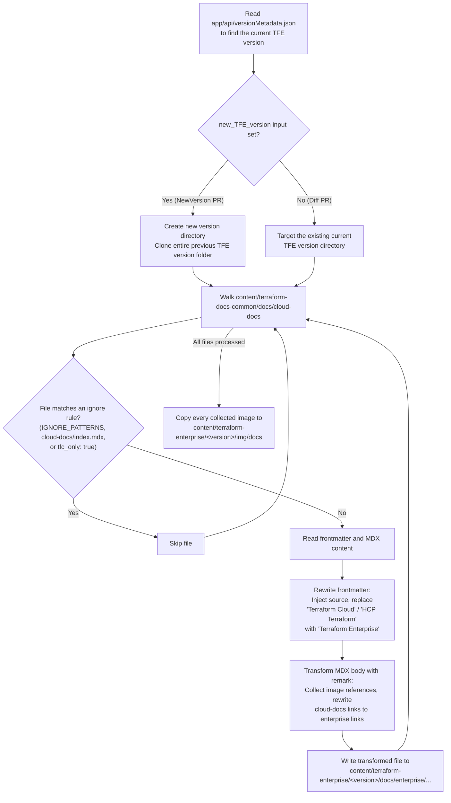
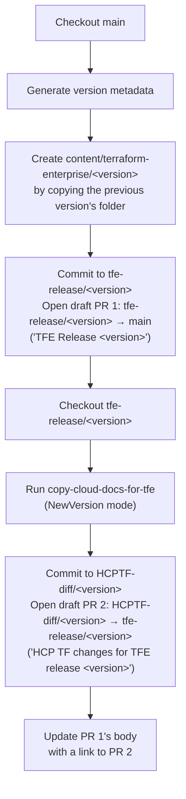
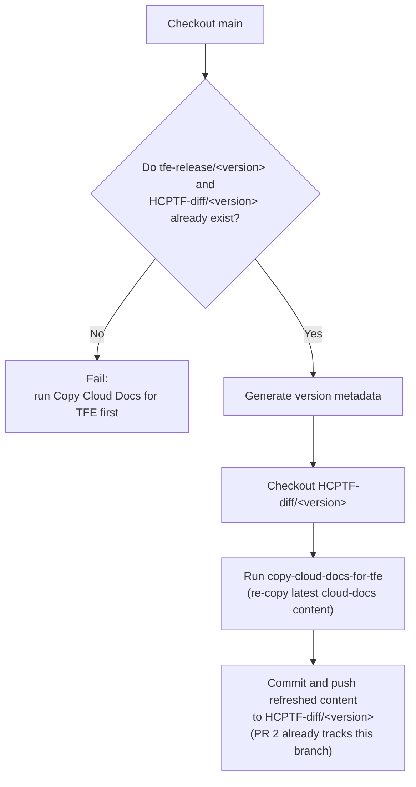
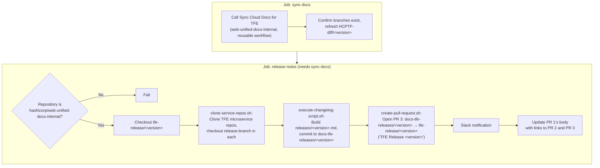
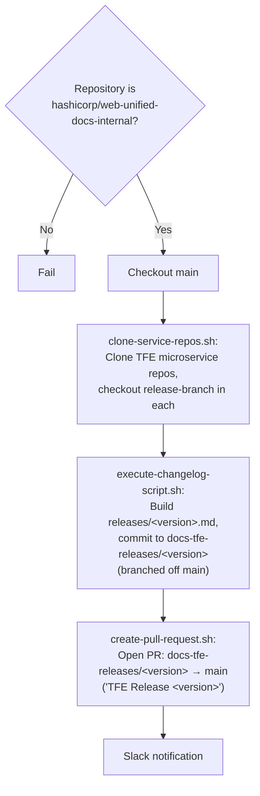
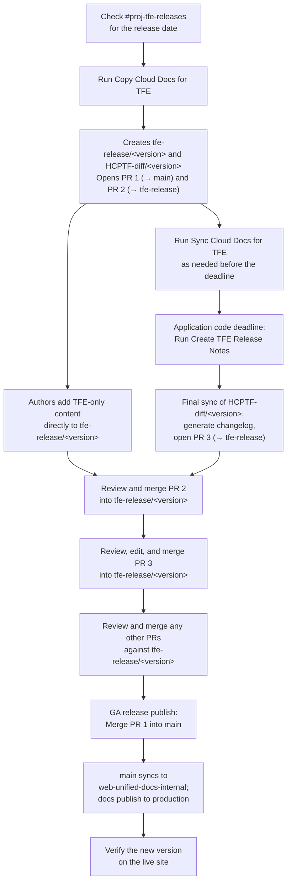
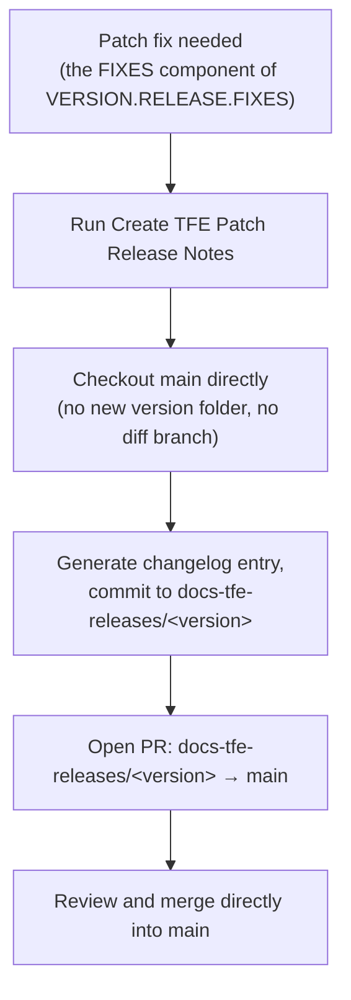

# The complete guide to publishing TFE docs

This guide is the single comprehensive reference for how Terraform Enterprise
(TFE) documentation goes from `content/terraform-docs-common` to a published
TFE release. It combines the "who does what and when" release process with
the engineering detail of the automation that does it:

- The `copy-cloud-docs-for-tfe` action
- The four GitHub Actions workflows that call `copy-cloud-docs-for-tfe`
- The changelog scripts that generate release notes

Guide content is for the release engineer who runs this automation and the
release tech writer who reviews its output.

For the general contributor workflow across Terraform CE, HCP Terraform, and
TFE, not specific to the Enterprise release cycle, refer to
[Contribute to Terraform documentation](contribute-terraform-docs.md).

>[!TIP]
>If you are already familiar with the docs release process terms and workflows,
>review a concise list of workflow steps in the [Step-by-step process for
>releasing TFE docs](#step-by-step-process-for-releasing-tfe-docs) section.

## Release versioning

TFE increments releases using a semantic-like scheme:

`VERSION.RELEASE.FIXES`

Refer to [IBM Software product versioning
explained](https://www.ibm.com/support/pages/ibm-software-product-versioning-explained)
for more information.

The documentation only increments on `VERSION` and `RELEASE` changes. Fixes are
represented as `x`, and the current docs are updated in place to reflect any
changes. This distinction matters for the automation. A `VERSION` or `RELEASE`
change gets a new version folder and a full release cycle, which is covered in
[the release workflows section](#the-release-workflows). A a `FIXES` change is
published directly against `main` through [creating TFE patch release notes](#create-tfe-patch-release-notes),
with no new version folder.

## The docs pipeline

Most TFE documentation is sourced from `content/terraform-docs-common/docs/cloud-docs`,
the same content HCP Terraform renders from. A composite GitHub Action,
`copy-cloud-docs-for-tfe`, copies that content into a versioned TFE folder,
and four workflows coordinate when and how that action runs across a release
cycle.

| Run order | Workflow | File | Purpose | Run relation to app deadline |
| --- | --- | --- | --- | --- |
| 1 | Copy Cloud Docs for TFE | [`copy-cloud-docs-for-tfe.yml`](../../../.github/workflows/copy-cloud-docs-for-tfe.yml) | Runs once per release to scaffold the version folder and open the release and diff branches and PRs. | Before. Runs at the start of the cycle, well ahead of the app deadline. |
| 2 | Sync Cloud Docs for TFE | [`sync-docs-for-tfe.yml`](../../../.github/workflows/sync-docs-for-tfe.yml) | Re-runs the copy against the existing diff branch to pull in the latest HCP Terraform changes. | Before. Runs repeatedly, as needed, until the app deadline. |
| 3 | Create TFE Release Notes | [`create-tfe-release-notes.yml`](../../../.github/workflows/create-tfe-release-notes.yml) | Runs a final sync, then generates the release-notes changelog and opens the release-notes PR. | On. This is the workflow the release engineer runs to mark the app deadline. |
| N/A | Create TFE Patch Release Notes | [`create-tfe-release-notes-patch.yml`](../../../.github/workflows/create-tfe-release-notes-patch.yml) | Generates a changelog PR directly against `main` for a patch (fix-only) release, without a new version folder. | Not applicable. Patch releases don't follow the milestone release cycle or have an app deadline. |

All four workflow files, and the `copy-cloud-docs-for-tfe` action itself, are
mirrored into `hashicorp/web-unified-docs-internal`. The two
release notes workflows only function when run from that internal
repository. Refer to [the release workflows section](#the-release-workflows) for the
trigger and repository requirements of each.

Because a milestone or major release moves through several branches and PRs,
the following artifacts appear over the course of a cycle:

- A branch named `tfe-release/<version>.<release>.x` for assembling the
  release notes and documentation updates. This is the branch that gets
  merged into `main` to publish the docs.
- A branch named `HCPTF-diff/<version>.<release>.x` that contains a diff of
  all of the new content from HCP Terraform slated for the next release. This
  branch is updated with the latest changes before the release.
- Three draft pull requests:

  - **PR 1**: `TFE Release <version>.<release>.x`, from
  `tfe-release/<version>.<release>.x` into `main`. This is the PR merged on
  release day to publish the docs.
  - **PR 2**: `HCP TF changes for TFE release <version>.<release>.x`, from
  `HCPTF-diff/<version>.<release>.x` into `tfe-release/<version>.<release>.x`.
  - **PR 3**: `TFE Release <version>.<release>.x`, from a
  `docs-tfe-releases/<version>.<release>.x` branch into
  `tfe-release/<version>.<release>.x`, for merging the generated release notes
  into the assembly branch. This PR is created later in the cycle, near the
  application code deadline.

PR 1 and PR 3 share the exact literal title `TFE Release <version>.<release>.x`.
Tell them apart by their base branch, not their title. PR 1 targets `main`,
and PR 3 targets `tfe-release/<version>.<release>.x`.

## How the copy action works

The `copy-cloud-docs-for-tfe` GitHub Action (GHA) lives at
[`.github/actions/copy-cloud-docs-for-tfe`](../../../.github/actions/copy-cloud-docs-for-tfe)
and compiles to a Node 24 action
([`out/index.js`](../../../.github/actions/copy-cloud-docs-for-tfe/out/index.js))
from TypeScript sources. Its logic lives in
[`main.ts`](../../../.github/actions/copy-cloud-docs-for-tfe/main.ts), which
takes three inputs:

| Input | Required | Description |
| --- | --- | --- |
| `source_path` | Yes | Path to the checkout containing the HCP Terraform source content. |
| `target_path` | Yes | Path to the checkout the action writes the transformed TFE content into. |
| `new_TFE_version` | No | The new TFE version folder to create. When set, the action first clones the previous TFE version's entire folder before copying updated content over it. |

Whether `new_TFE_version` is set determines the action's mode:

- **NewVersion mode** (`new_TFE_version` set): Used by Copy Cloud Docs for TFE to scaffold a brand-new version folder.
- **Diff mode** (`new_TFE_version` omitted): Used by Sync Cloud Docs for TFE, and by the sync step inside Create TFE Release Notes, to refresh content already inside an existing version folder.

For each `.mdx` file under `cloud-docs`, the action decides whether to copy
the file. Then the GHA transforms the file's frontmatter and body before writing it to the
TFE target.



### File filtering

Three independent checks decide whether a source file reaches the TFE target,
applied in `main.ts`'s `filterFunc` and `IGNORE_LIST`.

| Check | Mechanism | Example |
| --- | --- | --- |
| Path pattern | Regular expression against the file path | `cloud-docs/agents` and `cloud-docs/architectural-details` are always excluded. |
| Explicit ignore list | Exact path match | `cloud-docs/index.mdx` is always excluded. |
| Frontmatter flag | `tfc_only: true` in the file's frontmatter | Any file an author marks HCP Terraform-only is skipped entirely. |

The GHA does not evaluate the
`<!-- BEGIN: TFC:only -->` / `<!-- END:TFC:only -->` HTML comment tags
described in the contributor guide's [Exclusion tag syntax](#exclusion-tag-syntax) section.
Those tags exclude content at render time, not
copy time, so an author who wants a whole file left out of TFE still needs the
`tfc_only: true` frontmatter property, and an author who wants only part of a
page excluded relies on the comment tags being honored downstream.

### Content transforms

Files that pass the filters go through these transform passes before they are written:

1. **Frontmatter** — `main.ts` adds a `source` property and replaces
   "Terraform Cloud" and "HCP Terraform" with "Terraform Enterprise" in
   `page_title` and `description`.
1. **Body** — a `remark`/`remark-mdx` pipeline applies two custom plugins:
   - [`remark-get-images-plugin.ts`](../../../.github/actions/copy-cloud-docs-for-tfe/remark-get-images-plugin.ts)
     walks the MDX AST for `image` nodes, asserts the referenced file exists
     in the source, and records its path for the later image copy step.
   - [`remark-transfrom-cloud-docs-links.ts`](../../../.github/actions/copy-cloud-docs-for-tfe/remark-transfrom-cloud-docs-links.ts)
     walks `link` and `definition` nodes and rewrites any URL beginning with
     `/cloud-docs` or `/terraform/cloud-docs` to use `enterprise` instead, so
     internal links keep working in the copied version.

For example, a source link and frontmatter pair like this:

```mdx
---
page_title: Assessments - API Docs - HCP Terraform
description: >-
  Assessment results contain information about continuous validation.
---

Refer to [Workspaces](/terraform/cloud-docs/workspaces) for more information.
```

becomes:

```mdx
---
page_title: Assessments - API Docs - Terraform Enterprise
description: >-
  Assessment results contain information about continuous validation.
source: terraform-docs-common
---

Refer to [Workspaces](/terraform/enterprise/workspaces) for more information.
```

## The release workflows

### Copy Cloud Docs for TFE

The Copy Cloud Docs for TFE ([`copy-cloud-docs-for-tfe.yml`](../../../.github/workflows/copy-cloud-docs-for-tfe.yml)) workflow
triggers on `workflow_dispatch`, which a release engineer manually runs, or
`workflow_call`, which means another workflow invokes it as a reusable workflow.
The code takes a single required `version` input.

Copy Cloud Docs for TFE runs once per release, at the start of the
cycle. It does all of the following in a single `copy-docs` job:

1. Checks out `main` into `new-docs-pr` and runs `npm run prebuild --
   --only-build-version-metadata` to regenerate `app/api/versionMetadata.json`,
   so the workflow can read the current latest TFE version.
1. Creates `content/terraform-enterprise/<version>` by copying the current
   latest version's folder in full, so images, nav data, and unrelated content
   already exist before the action runs.
1. Commits that scaffold to a new `tfe-release/<version>` branch and opens PR
   1, a draft PR titled `TFE Release <version>`, from `tfe-release/<version>`
   into `main`. Its body is a placeholder at this point.
1. Checks out `tfe-release/<version>` into a second working directory and runs
   `copy-cloud-docs-for-tfe` with `new_TFE_version: <version>` set (NewVersion
   mode), overwriting the scaffold with the transformed HCP Terraform content.
1. Commits that result to a new `HCPTF-diff/<version>` branch and opens PR
   2, a draft PR titled `HCP TF changes for TFE release <version>`, from
   `HCPTF-diff/<version>` into `tfe-release/<version>`.
1. Edits PR 1's body to link to PR 2.

Both new branch names fail the run if they already exist remotely, so this
workflow is not safe to re-run for the same version once it has succeeded.
This is also why the workflow should not run too early in the cycle. Content
merged into `content/terraform-docs-common` on `main` after this run will not be
copied into the version folder until the Sync Cloud Docs for TFE process runs again.
Running it too late in the cycle, conversely, creates a bottleneck of content
changes waiting to be included.



### Sync Cloud Docs for TFE

The Sync Cloud Docs for TFE ([`sync-docs-for-tfe.yml`](../../../.github/workflows/sync-docs-for-tfe.yml))
workflow shares the same triggers and `version` input as the Copy workflow, but is
meant to be run repeatedly against branches the Copy workflow already
created. Its single `sync-docs` job does the following:

1. Checks out `main` and confirms both `tfe-release/<version>` and
   `HCPTF-diff/<version>` exist remotely, failing with a step-summary message if
   either is missing.
1. Regenerates `app/api/versionMetadata.json` the same way the Copy workflow does.
1. Checks out `HCPTF-diff/<version>` into a second working directory.
1. Runs `copy-cloud-docs-for-tfe` with `new_TFE_version: <version>` set again
   (technically NewVersion mode, but because the target directory already
   contains the version folder, this pass only refreshes files that changed in
   `content/terraform-docs-common` since the last run).
1. Commits and pushes any resulting changes directly to `HCPTF-diff/<version>` —
   no new PR, since PR 2 already exists and tracks this branch. If nothing
   changed, the commit step is a no-op (`|| echo "No changes to commit"`).



### Create TFE Release Notes

The Create TFE Release Notes
([`create-tfe-release-notes.yml`](../../../.github/workflows/create-tfe-release-notes.yml))
workflow triggers only on `workflow_dispatch`, with required `version`,
`release-branch`, and `last-release-tag` inputs and optional `dev-mode` and
`notify` flags. Every step in its second job is gated behind a check that
`github.repository == hashicorp/web-unified-docs-internal`, so although the
identical file also exists in the public `web-unified-docs` repository, it
only completes successfully when run from the internal one. This is the job
that runs on the **application code deadline**. It updates
`HCPTF-diff/<version>` with the latest changes from `terraform-docs-common`
one last time and then generates the release notes.

The workflow has two jobs:

1. **`sync-docs`** calls
   `hashicorp/web-unified-docs-internal/.github/workflows/sync-docs-for-tfe.yml@main`
   as a reusable workflow, explicitly the internal repository's copy of Sync
   Cloud Docs For TFE, regardless of which repository this workflow itself runs
   from. This performs one last refresh of `HCPTF-diff/<version>` and confirms
   the release branches exist.
1. **`release-notes`** (needs `sync-docs`) checks out `tfe-release/<version>` and runs the changelog scripts in
   [`scripts/tfe-releases/ci`](../../../scripts/tfe-releases/ci):
   - `clone-service-repos.sh` reads the TFE microservice repositories listed in
     [`scripts/tfe-releases/tfe-releases-repos.yaml`](../../../scripts/tfe-releases/tfe-releases-repos.yaml)
     (`terraform-enterprise`, `archivist`, `atlas`, `tfe-agent`, and others),
     clones each one, and checks each out to the `release-branch` input.
   - `execute-changelog-script.sh` creates
     `content/terraform-enterprise/releases/<version>.md` from a template,
     runs `changelog.rb` to append the aggregated changelog entries from
     those cloned repos (comparing `last-release-tag` to `release-branch`),
     and commits the result to a new `docs-tfe-releases/<version>` branch
     created off `tfe-release/<version>`.
   - `create-pull-request.sh` gathers contributors with `contributors.rb`,
     fills in the PR body template, and opens **PR 3**, a draft PR also
     titled `TFE Release <version>`, from `docs-tfe-releases/<version>` into
     `tfe-release/<version>`.

   Unless `dev-mode` or `notify` is false, the job then posts a Slack
   notification and edits PR 1's body again, this time adding links to both PR
   2 and PR 3.



### Create TFE Patch Release Notes

The Create TFE Patch Release Notes
([`create-tfe-release-notes-patch.yml`](../../../.github/workflows/create-tfe-release-notes-patch.yml))
workflow generates release notes for a patch release, which is the `FIXES` component of
`VERSION.RELEASE.FIXES` described in the [Release
versioning](#release-versioning) section. Create TFE Patch Release Notes takes the same inputs as Create TFE
Release Notes, but differs in these ways:

- It has a single job with no `sync-docs` dependency and no call to Sync
  Cloud Docs For TFE . There's no version folder or diff branch to keep
  current for a patch.
- It checks out `main` directly, rather than a `tfe-release/<version>`
  branch.
- `create-pull-request.sh` opens its PR with base `main` instead of a
  release branch, since there is no assembly branch for a patch release.

Otherwise Create TFE Patch Release Notes runs the same guard check, the same
`clone-service-repos.sh` / `execute-changelog-script.sh` / `create-pull-request.sh`
sequence, and the same Slack notification as Create TFE Release Notes.



## Authoring during a release cycle

### Get the release date

Check the `#proj-tfe-releases` channel for a message from the team manager
about important dates. Release dates are fluid, so verify the release date
closer to the standing date.

**Application code deadline**: This milestone, also called **app deadline**,
occurs a few weeks before the release date. It is when the release engineer
runs **Create TFE Release Notes**, which creates the release notes and
updates the `HCPTF-diff/<milestone>.<major>.x` branch with the latest changes
from `terraform-docs-common`.

**GA release publish**: On this date, the assembly branch is merged into
`main` to publish the documentation.

### Prepare for app deadline

Merge any PRs against the `terraform-docs-common` folder that should be
included in the upcoming TFE release.

Apply any exclusion tags to prevent HCP Terraform-specific content from
publishing to the enterprise docs, and vice versa. Refer to [Exclusion tag
syntax](#exclusion-tag-syntax) for details.

> [!IMPORTANT]
> Copy Cloud Docs for TFE creates the new version folder so that authors
> can implement new content in the correct place. The workflow also populates the new folder
> with a copy of the HCP Terraform docs on `main` from the public repo.
>
> Do not run Copy Cloud Docs for TFE too early in the cycle. Content merged to `main`
> after Copy Cloud Docs for TFE runs will not be copied to the upcoming Enterprise folder until Sync
> Cloud Docs For TFE runs again.
>
> Running Copy Cloud Docs for TFE too late in the cycle creates a bottleneck of content changes.

There is no optimal workflow for authoring Enterprise-only docs before app
deadline, but the following options are available for content authors:

1. Create an external docs plan. Draft changes in a Word doc to streamline the
   review and approval process, and then copy the content to the appropriate files
   after app deadline.
1. Manually create a folder and copy the nav file and any related files,
   including containing folders in their existing structure, and author changes.
1. Author content under the current version folder. After app deadline, manually
   port changes to the folder for the upcoming version and roll back changes in
   the current folder. This approach works best when all or most content is
   confined to new `.mdx` files.

### Exclusion tag syntax

Most content in the TFE documentation is sourced from the
`terraform-docs-common` folder shared with HCP Terraform, but some features are specific to
the SaaS offering. Sometimes there can be a lag between when a feature
releases in HCP Terraform and lands in TFE. For this reason,
mark content in the `terraform-docs-common` folder as HCP Terraform-only to
exclude it from the TFE documentation. Conversely, apply an
exclusion tag to prevent information that should only appear in Terraform
Enterprise from rendering in HCP Terraform's docs.

For details on exclusion tags, refer to the [Appendix: Use exclusion tags
section](./contribute-terraform-docs.md#appendix-use-exclusion-tags) in the
Contribute to Terraform documentation guide.

## Review and merge before GA

Review and merge PR 2 (`HCP TF changes for TFE release <version>.<release>.x`)
into the `tfe-release/<version>.<release>.x` branch. During review, verify
that all of the changes are appropriate for TFE. If you're
unsure about an item, ask in `#proj-tfe-releases`.

If you need to update any existing documentation or apply exclusion tags, you
must also apply the changes to the corresponding files in
`terraform-docs-common` so that the next synchronization doesn't overwrite
your changes. It's rare, but if you edit a file in `terraform-docs-common` as
part of your review, someone may edit and merge the same file in the public
repository, resulting in collisions when merging to `main`. You may need to
track down the author or reach out to one of the development teams to
resolve merge conflicts that emerge in this scenario. This is a direct
consequence of the action's one-directional copy: it copies from
`terraform-docs-common` to `terraform-enterprise/<version>`, never the
reverse, so a fix applied only to the TFE branch is lost the next time the
action runs.

Review and merge any other PRs opened against the release branch.

Review PR 3, the release notes PR (also titled `TFE Release
<version>.<release>.x`, but based on `tfe-release/<version>.<release>.x`
rather than `main`). The release engineer is responsible for merging this PR
and also prepares the release notes section of the docs. Refer to the [Release
notes guidance section](#appendix-release-notes-guidance) for assistance.

## Release day

The release engineer merges PR 1, the `tfe-release/<milestone>.<major>.x`
release branch, into `main`. The merge triggers an automation that
synchronizes the `web-unified-docs` and `web-unified-docs-internal`
repositories, which publishes the docs to production.

Verify that the new version and related changes appear on the website.

## Step-by-step process for releasing TFE docs

### Standard release

1. The release engineer checks the `#proj-tfe-releases` Slack channel for the
   release date.
1. The release engineer runs **Copy Cloud Docs for TFE** (`workflow_dispatch`,
   `version` input). This creates the `tfe-release/<version>` and
   `HCPTF-diff/<version>` branches, opens PR 1 (`tfe-release/<version>` →
   `main`) and PR 2 (`HCPTF-diff/<version>` → `tfe-release/<version>`), and
   links PR 2 from PR 1's body.
1. Content authors add TFE-only content directly to `tfe-release/<version>`,
   using one of the options in [Prepare for app
   deadline](#prepare-for-app-deadline).
1. As needed before the deadline, the release engineer runs **Sync Cloud Docs
   For TFE** to refresh `HCPTF-diff/<version>` with the latest
   `content/terraform-docs-common` changes.
1. On the **application code deadline**, the release engineer runs **Create TFE
   Release Notes** from `web-unified-docs-internal`. This performs one final
   sync of `HCPTF-diff/<version>`, generates the release notes, opens PR 3
   (`docs-tfe-releases/<version>` → `tfe-release/<version>`), and links PR 2 and
   PR 3 from PR 1's body.
1. Reviewers review and merge PR 2 into `tfe-release/<version>`, confirming
   every change is appropriate for TFE.
1. The release engineer reviews and edits the generated release notes, then
   merges PR 3 into `tfe-release/<version>`.
1. Reviewers review and merge any other PRs opened directly against
   `tfe-release/<version>`.
1. On the **GA release publish** date, the release engineer merges PR 1
   (`tfe-release/<version>` into `main`).
1. The merge to `main` triggers the automation that synchronizes
   `web-unified-docs` with `web-unified-docs-internal`, which publishes the docs
   to production.
1. The release engineer verifies the new version and its changes appear on the
   live site.



### Patch release

For a patch release (the `FIXES` component of `VERSION.RELEASE.FIXES`), the
release engineer skips the standard release's version-folder steps entirely
and runs **Create TFE Patch Release Notes** directly:

1. A patch fix is needed.
1. The release engineer runs **Create TFE Patch Release Notes** from `web-unified-docs-internal`.
1. The workflow checks out `main` directly — no new version folder and no diff branch.
1. It generates the changelog entry and commits it to a new `docs-tfe-releases/<version>` branch.
1. It opens a PR from `docs-tfe-releases/<version>` straight into `main`.
1. Reviewers review and merge the PR directly into `main`.



## Related documentation

- [Contribute to Terraform documentation](contribute-terraform-docs.md): The
  general contributor workflow across Terraform CE, HCP Terraform, and
  TFE.
- [Terraform docs directory to published location
  mapping](terraform-docs-mapping.md): How `content/terraform-enterprise/`
  and `content/terraform-docs-common/` map to published URLs.
- [`.github/actions/copy-cloud-docs-for-tfe/README.md`](../../../.github/actions/copy-cloud-docs-for-tfe/README.md):
  The action's own reference documentation for the frontmatter and HTML
  comment exclusion mechanisms.
- [Contribute to HashiCorp documentation](../../../CONTRIBUTING.md): For
  external contributors; this guide does not establish IBM release policy or
  represent release commitments.

## Appendix: Release notes guidance

Release notes should help readers understand what has changed, why, and what
actions they need to take as a result. It's rarely appropriate to include a
changelog entry without any edits in the release notes.

### Include important and impactful updates

The release notes are an opportunity to explain and advertise changes that
significantly impact the user experience. The changelog records every single
change, but the release notes should only contain updates that do the
following:

- Address a salient user concern, such as security fixes.
- Let users do something new.
- Significantly improve the user experience, such as major UI updates and performance improvements.
- Require or recommend that users take action, such as deprecated functionality and recommended upgrades.

Omit minor UI changes and internal changes that don't directly affect the
experience.

### Focus on features

Start the update with a complete sentence that describes what part of the
system has changed. Don't start with "Added", "Fixed", or "Changed", which is
implied by the section title.

**Needs work**:

```text
Added Prometheus format for usage metrics.
```

**Better**:

```text
Usage metrics are available in Prometheus format.
```

### Explain what and why

Practitioners may not understand new Terraform-specific feature names or
internal jargon. Newer users may also need help understanding the impact of a
new feature. Explain new features and their value in plain language. If you
must include Terraform-specific jargon, explain the terminology.

For bug fixes, you may need to compare the fix to pain points in the previous
version. Where possible, link to related documentation or tutorials.

**Needs work**:

```mdx
Added support for cloud integration when using the CLI.
```

**Better**:

```mdx
You can now use the [Terraform CLI integration](/terraform/cli/cloud) to run Terraform Enterprise from the command line. We recommend using this native integration for Terraform versions 1.1 or later because it provides an improved user experience and various enhancements.
```

**Needs work**:

```text
Added variable sets.
```

**Better**:

```text
You can now define sets of variables and reuse them across multiple workspaces. For example, you could define a set of variables that contain provider credentials and automatically apply it to all of the workspaces that use the provider. Refer to [Variable sets](/terraform/cloud-docs/workspaces/variables) for more information.
```

### Group related updates

When applicable, combine content about the same part of the system into a
single entry. Chunking related updates makes it easier for users to
understand everything that has changed in components they care about.

**Needs work**:

```text
Added warning to notify users of older provider documentation.
Added an outline to the public provider documentation page.
```

**Better**:

```text
The private registry UI now displays a warning message for old versions of provider documentation with a link to the latest version. The UI includes an outline for provider documentation that lets you navigate more quickly between sections.
```

### Refer to the reader as "you"

Per the style guide, [address the reader as
"you"](../../style-guide/general/point-of-view.md#address-the-reader-as-you).

### Format single updates as a paragraph

A list with one item isn't a list. If there is only one update in a section,
format it as a paragraph.
