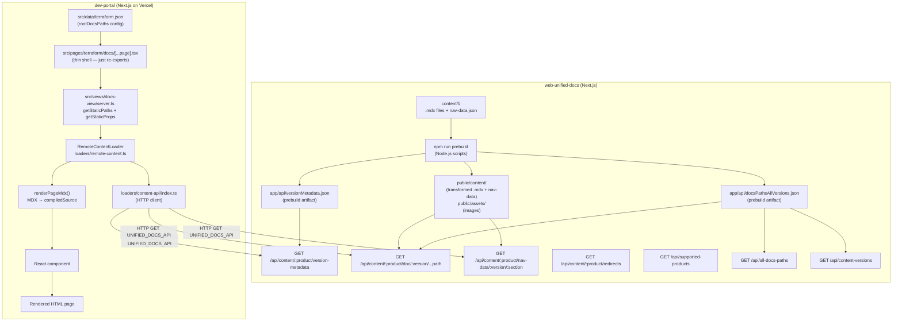
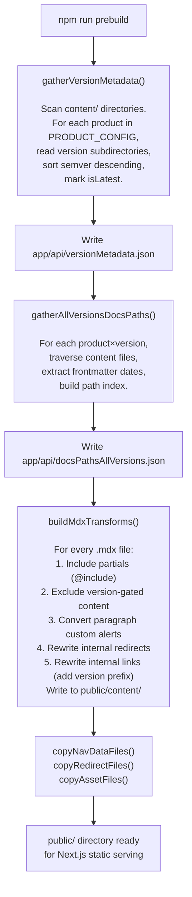
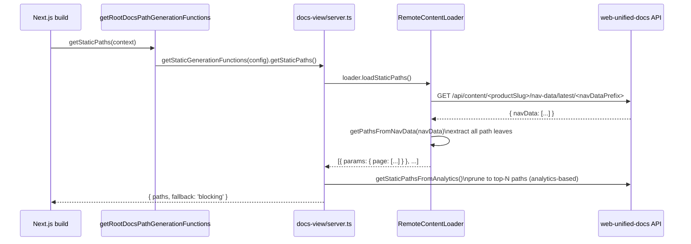
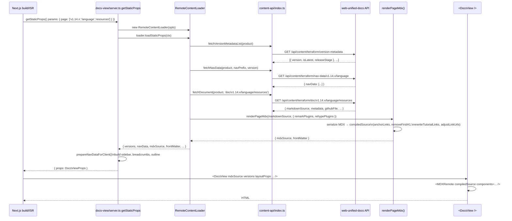
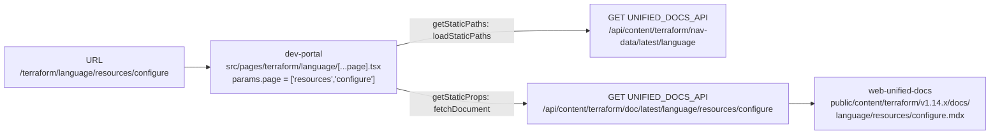
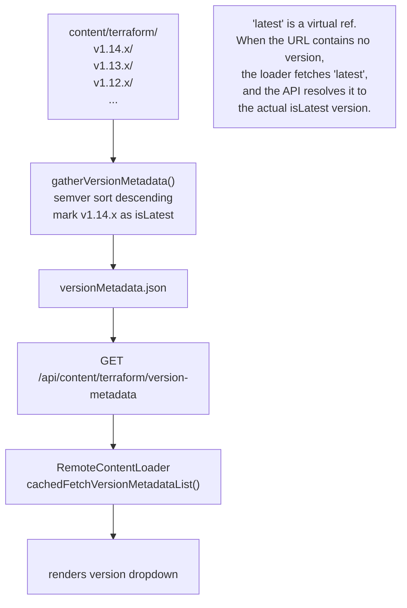
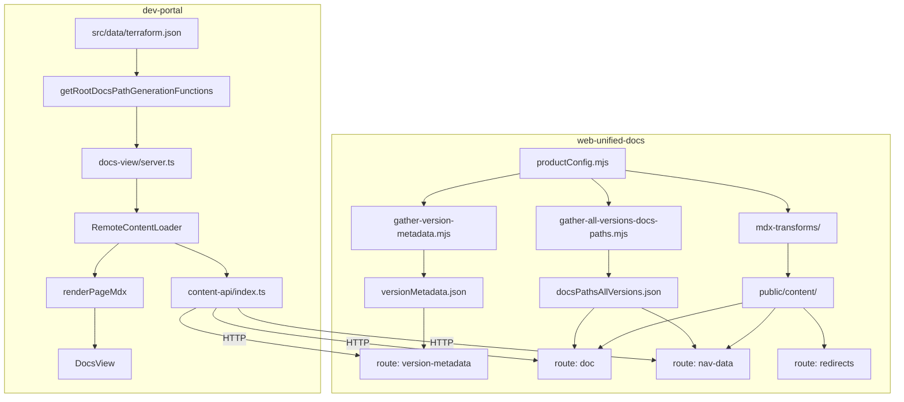

# Terraform docs rendering architecture

> How `web-unified-docs` Terraform content directories become `developer.hashicorp.com/terraform` pages.

## Overview

The Terraform documentation at `developer.hashicorp.com/terraform` is produced by two cooperating Next.js applications:

- `web-unified-docs`: the content store and unified docs API. It holds all versioned MDX content under `content/`, runs a prebuild pipeline to transform that content, and exposes a REST API that the frontend consumes.
- `dev-portal`: the frontend. It calls `web-unified-docs` at build time (SSG) and at request time (ISR) to fetch content, nav trees, and version metadata, then renders them into HTML.

`web-unified-docs` is both a content repository and a running HTTP server. `dev-portal` treats it purely as a remote API (`UNIFIED_DOCS_API`) and never reads files directly.

---

## The 13 Terraform content directories

The `content/` directory in `web-unified-docs` contains 13 subdirectories whose names begin with `terraform`. Each maps to a distinct entry in [`productConfig.mjs`](web-unified-docs/productConfig.mjs). Together they compose all Terraform documentation on the developer portal.

| Content directory | `productSlug` (API key) | URL base path(s) | Versioned? |
|---|---|---|---|
| `content/terraform/` | `terraform` | `cli`, `internals`, `intro`, `language` | ✅ |
| `content/terraform-docs-common/` | `terraform-docs-common` | `cloud-docs`, `docs`, `plugin`, `registry` | ❌ (always `v0.0.x`) |
| `content/terraform-docs-agents/` | `terraform-docs-agents` | `cloud-docs/agents` | ✅ |
| `content/terraform-enterprise/` | `terraform-enterprise` | `enterprise` | ✅ (date-versioned, for example `v202507-1`) |
| `content/terraform-cdk/` | `terraform-cdk` | `cdktf` | ✅ |
| `content/terraform-plugin-framework/` | `terraform-plugin-framework` | `plugin/framework` | ✅ |
| `content/terraform-plugin-sdk/` | `terraform-plugin-sdk` | `plugin/sdkv2` | ✅ |
| `content/terraform-plugin-mux/` | `terraform-plugin-mux` | `plugin/mux` | ✅ |
| `content/terraform-plugin-log/` | `terraform-plugin-log` | `plugin/log` | ✅ |
| `content/terraform-plugin-testing/` | `terraform-plugin-testing` | `plugin/testing` | ✅ |
| `content/terraform-migrate/` | `terraform-migrate` | `migrate` | ✅ |
| `content/terraform-mcp-server/` | `terraform-mcp-server` | `mcp-server` | ✅ |
| `content/terraform-policy/` | `terraform-policy` | `policy` | ✅ |

All 13 content directories use `productSlug: 'terraform'` in
`productConfig.mjs`, so they all end up under the `/terraform/` URL namespace in
`dev-portal`.

The `productSlug` field in `productConfig.mjs` is the API routing key used by
`web-unified-docs`. The `productSlug` in `src/data/terraform.json` inside
`dev-portal` is the frontend product identifier. They are different concepts
that share the value `"terraform"` for the core Terraform repo.

### Contribute to a content directory

To find the source file for a page you want to update, click the **Edit this page on GitHub** button at the bottom of the published page. This navigates directly to the correct `.mdx` file in the repository.

If you prefer to locate files manually or are creating a new page, use the
following table to find the right directory. Each row describes what the
directory contains, which URL paths it drives, and where to open a pull request.

| Content directory | What it contains | Published at |
|---|---|---|
| `content/terraform/` | Terraform language reference, CLI reference, internals, and intro | `/terraform/language`, `/terraform/cli`, `/terraform/internals`, `/terraform/intro` | 
| `content/terraform-docs-common/` | HCP Terraform docs, general Terraform docs, plugin overview pages, and public registry publishing docs | `/terraform/cloud-docs`, `/terraform/docs`, `/terraform/plugin` (overview), `/terraform/registry` |
| `content/terraform-docs-agents/` | HCP Terraform Agents | `/terraform/cloud-docs/agents` |
| `content/terraform-enterprise/` | Terraform Enterprise deployment, administration, upgrade instructions, and release notes | `/terraform/enterprise` |
| `content/terraform-cdk/` | CDK for Terraform (CDKTF, deprecated) | `/terraform/cdktf` |
| `content/terraform-plugin-framework/` | Plugin Framework reference docs | `/terraform/plugin/framework` |
| `content/terraform-plugin-sdk/` | Plugin SDKv2 reference docs | `/terraform/plugin/sdkv2` |
| `content/terraform-plugin-mux/` | Plugin muxing reference docs | `/terraform/plugin/mux` |
| `content/terraform-plugin-log/` | Plugin logging reference docs | `/terraform/plugin/log` |
| `content/terraform-plugin-testing/` | Plugin testing reference docs | `/terraform/plugin/testing` |
| `content/terraform-migrate/` | `tf-migrate` CLI docs | `/terraform/migrate` |
| `content/terraform-mcp-server/` | Terraform MCP Server docs | `/terraform/mcp-server` |
| `content/terraform-policy/` | Terraform Policy docs | `/terraform/policy` |

### Directory layout convention

Versioned products follow this structure:

```
content/<repo-slug>/
  <version>/         # e.g. v1.14.x
    docs/            # MDX content files  (contentDir in productConfig)
    data/            # *-nav-data.json    (dataDir in productConfig)
    img/             # image assets       (assetDir in productConfig)
    partials/        # MDX partials (inlined at build time)
    redirects.jsonc  # URL redirect rules
```

Unversioned products, such as `terraform-docs-common`, omit the version segment.

```
content/terraform-docs-common/
  docs/
  data/
  img/
  redirects.jsonc
```

---

## URL-to-file reference

This section maps every published URL path under `developer.hashicorp.com/terraform/` to its source file location in `web-unified-docs/content/`. The formula for every mapping is:

```
https://developer.hashicorp.com/terraform/<url-path>
    ↓ resolved by dev-portal through productSlugForLoader
content/<repo>/<version>/docs/<file-path>.mdx
    (or <file-path>/index.mdx for directory index pages)
```

> **How to read the table**
> - **URL pattern**: the path segment after `developer.hashicorp.com/terraform/`, with optional version segment shown in `[brackets]`.
> - **Source file path**: relative to the repo root; `<v>` is a placeholder for the current version directory (for example, `v1.14.x`).
> - **Nav-data file**: the JSON file that drives the sidebar for this section.
> - The **latest version** for each product is determined at prebuild by [`gather-version-metadata.mjs`](../scripts/prebuild/gather-version-metadata.mjs) and recorded in [`app/api/versionMetadata.json`](../app/api/versionMetadata.json).

### `content/terraform/`: CLI, language, internals, intro

API slug: `terraform` · Versioned: yes (semver, for example `v1.14.x`)

| URL path | Source file | Nav-data file |
|---|---|---|
| `/terraform/cli[/<v>]/...` | `content/terraform/<v>/docs/cli/...mdx` | `content/terraform/<v>/data/cli-nav-data.json` |
| `/terraform/language[/<v>]/...` | `content/terraform/<v>/docs/language/...mdx` | `content/terraform/<v>/data/language-nav-data.json` |
| `/terraform/internals[/<v>]/...` | `content/terraform/<v>/docs/internals/...mdx` | `content/terraform/<v>/data/internals-nav-data.json` |
| `/terraform/intro[/<v>]/...` | `content/terraform/<v>/docs/intro/...mdx` | `content/terraform/<v>/data/intro-nav-data.json` |

**Example:** `https://developer.hashicorp.com/terraform/language/resources/configure`
→ `content/terraform/v1.14.x/docs/language/resources/configure.mdx`

**Example (versioned):** `https://developer.hashicorp.com/terraform/v1.13.x/language/resources/configure`
→ `content/terraform/v1.13.x/docs/language/resources/configure.mdx`

---

### `content/terraform-docs-common/`: HCP Terraform docs, plugin overview, registry, general docs

API slug: `terraform-docs-common` · Versioned: **no** (always resolves to the single unversioned directory at `content/terraform-docs-common/`)

This directory holds content for four distinct URL sections. The file lives at the path matching the URL segment after the section prefix:

| URL path | Source file | Nav-data file |
|---|---|---|
| `/terraform/cloud-docs/...` | `content/terraform-docs-common/docs/cloud-docs/...mdx` | `content/terraform-docs-common/data/cloud-docs-nav-data.json` |
| `/terraform/docs/...` | `content/terraform-docs-common/docs/docs/...mdx` | `content/terraform-docs-common/data/docs-nav-data.json` |
| `/terraform/plugin/...` *(overview pages only)* | `content/terraform-docs-common/docs/plugin/...mdx` | `content/terraform-docs-common/data/plugin-nav-data.json` |
| `/terraform/registry/...` | `content/terraform-docs-common/docs/registry/...mdx` | `content/terraform-docs-common/data/registry-nav-data.json` |

**Example:** `https://developer.hashicorp.com/terraform/cloud-docs/migrate`
→ `content/terraform-docs-common/docs/cloud-docs/migrate.mdx`

**Example:** `https://developer.hashicorp.com/terraform/docs/glossary`
→ `content/terraform-docs-common/docs/docs/glossary.mdx`

**Example:** `https://developer.hashicorp.com/terraform/plugin`
→ `content/terraform-docs-common/docs/plugin/index.mdx`

> **Note:** The top-level `plugin/` overview pages (index, how-terraform-works,
> debugging, best-practices, and similar pages) live in `terraform-docs-common`.
> The versioned SDK-specific sub-sections (`plugin/framework`, `plugin/sdkv2`,
> `plugin/mux`, `plugin/log`, `plugin/testing`) each come from their own
> dedicated repository.

---

### `content/terraform-docs-agents/`: HCP Terraform Agents

API slug: `terraform-docs-agents` · Versioned: yes (semver, for example `v1.25.x`)

| URL path | Source file | Nav-data file |
|---|---|---|
| `/terraform/cloud-docs/agents[/<v>]/...` | `content/terraform-docs-agents/<v>/docs/cloud-docs/agents/...mdx` | `content/terraform-docs-agents/<v>/data/cloud-docs-agents-nav-data.json` |

**Example:** `https://developer.hashicorp.com/terraform/cloud-docs/agents`
→ `content/terraform-docs-agents/v1.25.x/docs/cloud-docs/agents/index.mdx`

---

### `content/terraform-enterprise/`: Terraform Enterprise

API slug: `terraform-enterprise` · Versioned: yes (date-based, for example `v202507-1`)

| URL path | Source file | Nav-data file |
|---|---|---|
| `/terraform/enterprise[/<v>]/...` | `content/terraform-enterprise/<v>/docs/enterprise/...mdx` | `content/terraform-enterprise/<v>/data/enterprise-nav-data.json` |

**Example:** `https://developer.hashicorp.com/terraform/enterprise`
→ `content/terraform-enterprise/v202507-1/docs/enterprise/index.mdx`

**Example (versioned):** `https://developer.hashicorp.com/terraform/enterprise/v202504-1/deploy`
→ `content/terraform-enterprise/v202504-1/docs/enterprise/deploy/index.mdx`

> Terraform Enterprise uses calendar-date versions (`v202507-1`) rather than semver. See [Terraform Enterprise: Special Versioning](#terraform-enterprise-special-versioning) for the custom sort logic.

---

### `content/terraform-cdk/`: CDK for Terraform

API slug: `terraform-cdk` · Versioned: yes (semver, for example `v0.21.x`)

| URL path | Source file | Nav-data file |
|---|---|---|
| `/terraform/cdktf[/<v>]/...` | `content/terraform-cdk/<v>/docs/cdktf/...mdx` | `content/terraform-cdk/<v>/data/cdktf-nav-data.json` |

**Example:** `https://developer.hashicorp.com/terraform/cdktf/concepts`
→ `content/terraform-cdk/v0.21.x/docs/cdktf/concepts/index.mdx`

---

### `content/terraform-plugin-framework/`: Plugin Framework

API slug: `terraform-plugin-framework` · Versioned: yes (semver, for example `v1.16.x`)

| URL path | Source file | Nav-data file |
|---|---|---|
| `/terraform/plugin/framework[/<v>]/...` | `content/terraform-plugin-framework/<v>/docs/plugin/framework/...mdx` | `content/terraform-plugin-framework/<v>/data/plugin-framework-nav-data.json` |

**Example:** `https://developer.hashicorp.com/terraform/plugin/framework`
→ `content/terraform-plugin-framework/v1.16.x/docs/plugin/framework/index.mdx`

---

### `content/terraform-plugin-sdk/`: Plugin SDKv2

API slug: `terraform-plugin-sdk` · Versioned: yes (semver, for example `v2.38.x`)

| URL path | Source file | Nav-data file |
|---|---|---|
| `/terraform/plugin/sdkv2[/<v>]/...` | `content/terraform-plugin-sdk/<v>/docs/plugin/sdkv2/...mdx` | `content/terraform-plugin-sdk/<v>/data/plugin-sdkv2-nav-data.json` |

**Example:** `https://developer.hashicorp.com/terraform/plugin/sdkv2`
→ `content/terraform-plugin-sdk/v2.38.x/docs/plugin/sdkv2/index.mdx`

---

### `content/terraform-plugin-mux/`: Plugin Mux (combining and translating)

API slug: `terraform-plugin-mux` · Versioned: yes (semver, for example `v0.21.x`)

| URL path | Source file | Nav-data file |
|---|---|---|
| `/terraform/plugin/mux[/<v>]/...` | `content/terraform-plugin-mux/<v>/docs/plugin/mux/...mdx` | `content/terraform-plugin-mux/<v>/data/plugin-mux-nav-data.json` |

**Example:** `https://developer.hashicorp.com/terraform/plugin/mux`
→ `content/terraform-plugin-mux/v0.21.x/docs/plugin/mux/index.mdx`

---

### `content/terraform-plugin-log/`: Plugin Logging

API slug: `terraform-plugin-log` · Versioned: yes (semver, for example `v0.9.x`)

| URL path | Source file | Nav-data file |
|---|---|---|
| `/terraform/plugin/log[/<v>]/...` | `content/terraform-plugin-log/<v>/docs/plugin/log/...mdx` | `content/terraform-plugin-log/<v>/data/plugin-log-nav-data.json` |

**Example:** `https://developer.hashicorp.com/terraform/plugin/log`
→ `content/terraform-plugin-log/v0.9.x/docs/plugin/log/index.mdx`

---

### `content/terraform-plugin-testing/`: Plugin Testing

API slug: `terraform-plugin-testing` · Versioned: yes (semver, for example `v1.13.x`)

| URL path | Source file | Nav-data file |
|---|---|---|
| `/terraform/plugin/testing[/<v>]/...` | `content/terraform-plugin-testing/<v>/docs/plugin/testing/...mdx` | `content/terraform-plugin-testing/<v>/data/plugin-testing-nav-data.json` |

**Example:** `https://developer.hashicorp.com/terraform/plugin/testing`
→ `content/terraform-plugin-testing/v1.13.x/docs/plugin/testing/index.mdx`

---

### `content/terraform-migrate/`: Terraform Migrate

API slug: `terraform-migrate` · Versioned: yes (semver, for example `v2.0.x`)

| URL path | Source file | Nav-data file |
|---|---|---|
| `/terraform/migrate[/<v>]/...` | `content/terraform-migrate/<v>/docs/migrate/...mdx` | `content/terraform-migrate/<v>/data/migrate-nav-data.json` |

**Example:** `https://developer.hashicorp.com/terraform/migrate`
→ `content/terraform-migrate/v2.0.x/docs/migrate/index.mdx`

---

### `content/terraform-mcp-server/`: Terraform MCP Server

API slug: `terraform-mcp-server` · Versioned: yes (semver, for example `v0.3.x`)

| URL path | Source file | Nav-data file |
|---|---|---|
| `/terraform/mcp-server[/<v>]/...` | `content/terraform-mcp-server/<v>/docs/mcp-server/...mdx` | `content/terraform-mcp-server/<v>/data/mcp-server-nav-data.json` |

**Example:** `https://developer.hashicorp.com/terraform/mcp-server/deploy`
→ `content/terraform-mcp-server/v0.3.x/docs/mcp-server/deploy.mdx`

---

### `content/terraform-policy/`: Terraform Policy

API slug: `terraform-policy` · Versioned: yes (semver, `v0.1.x` (beta))

| URL path | Source file | Nav-data file |
|---|---|---|
| `/terraform/policy[/<v>]/...` | `content/terraform-policy/<v>/docs/policy/...mdx` | `content/terraform-policy/<v>/data/policy-nav-data.json` |

**Example:** `https://developer.hashicorp.com/terraform/policy`
→ `content/terraform-policy/v0.1.x (beta)/docs/policy/index.mdx`

> The version directory name `v0.1.x (beta)` includes the release stage in
> parentheses. The prebuild pipeline strips the ` (beta)` suffix when building
> the API version string, but the filesystem path retains it.

---

### Quick-reference: all URL patterns in one place

| URL path prefix | Source `content/` directory | `docs/` sub-path |
|---|---|---|
| `/terraform/cli` | `content/terraform/<v>/` | `docs/cli/` |
| `/terraform/language` | `content/terraform/<v>/` | `docs/language/` |
| `/terraform/internals` | `content/terraform/<v>/` | `docs/internals/` |
| `/terraform/intro` | `content/terraform/<v>/` | `docs/intro/` |
| `/terraform/cloud-docs` | `content/terraform-docs-common/` | `docs/cloud-docs/` |
| `/terraform/cloud-docs/agents` | `content/terraform-docs-agents/<v>/` | `docs/cloud-docs/agents/` |
| `/terraform/docs` | `content/terraform-docs-common/` | `docs/docs/` |
| `/terraform/enterprise` | `content/terraform-enterprise/<v>/` | `docs/enterprise/` |
| `/terraform/cdktf` | `content/terraform-cdk/<v>/` | `docs/cdktf/` |
| `/terraform/plugin` *(overview)* | `content/terraform-docs-common/` | `docs/plugin/` |
| `/terraform/plugin/framework` | `content/terraform-plugin-framework/<v>/` | `docs/plugin/framework/` |
| `/terraform/plugin/sdkv2` | `content/terraform-plugin-sdk/<v>/` | `docs/plugin/sdkv2/` |
| `/terraform/plugin/mux` | `content/terraform-plugin-mux/<v>/` | `docs/plugin/mux/` |
| `/terraform/plugin/log` | `content/terraform-plugin-log/<v>/` | `docs/plugin/log/` |
| `/terraform/plugin/testing` | `content/terraform-plugin-testing/<v>/` | `docs/plugin/testing/` |
| `/terraform/registry` | `content/terraform-docs-common/` | `docs/registry/` |
| `/terraform/migrate` | `content/terraform-migrate/<v>/` | `docs/migrate/` |
| `/terraform/mcp-server` | `content/terraform-mcp-server/<v>/` | `docs/mcp-server/` |
| `/terraform/policy` | `content/terraform-policy/<v>/` | `docs/policy/` |

---

## System architecture



---

## Phase 1: Prebuild pipeline (`web-unified-docs`)

Before the Next.js server starts, `npm run prebuild` runs [`scripts/prebuild/prebuild.mjs`](../scripts/prebuild/prebuild.mjs). This phase transforms raw MDX into the form the API serves.



### MDX transforms in detail

Each `.mdx` file passes through a chain of remark plugins in [`scripts/prebuild/mdx-transforms/build-mdx-transforms.mjs`](../scripts/prebuild/mdx-transforms/build-mdx-transforms.mjs):

| Plugin | Effect |
|---|---|
| `remarkIncludePartialsPlugin` | Inlines `@include 'path/to/partial.mdx'` statements. Supports `@global` alias pointing to `content/global/partials/`. |
| `transformExcludeContent` | Strips blocks tagged with `<!-- BEGIN_TFC_ONLY -->` / `<!-- END_TFC_ONLY -->` based on the product's `supportsExclusionDirectives` flag. |
| `paragraphCustomAlertsPlugin` | Converts `> [!NOTE]` / `> [!WARNING]` paragraph syntax into custom alert MDX components. |
| `rewriteInternalRedirectsPlugin` | Rewrites internal links that have been redirected (according to the product's `redirects.jsonc`) so old URLs aren't dead in rendered content. |
| `rewriteInternalLinksPlugin` | Prepends version prefix to intra-product links so versioned pages link to the correct version. |

The two JSON prebuild artifacts (`versionMetadata.json`, `docsPathsAllVersions.json`) are imported directly by Next.js API route handlers at module load time. They are bundled into the server-side JavaScript, not fetched at request time.

---

## Phase 2: Unified docs API (`web-unified-docs`)

`web-unified-docs` is a Next.js App Router application. Its API routes under `app/api/` serve content to `dev-portal` over HTTP.

### API surface

```
GET /api/supported-products
    → { result: string[] }
    → Lists all product slugs defined in PRODUCT_CONFIG

GET /api/content/:productSlug/version-metadata
    → { result: VersionMetadataItem[] }
    → Returns sorted version list with isLatest/releaseStage fields
    → Reads from bundled versionMetadata.json

GET /api/content/:productSlug/nav-data/:version/:section
    → { result: { navData: NavNode[] } }
    → Returns parsed JSON from public/content/<slug>/<version>/data/<section>-nav-data.json
    → For example, /api/content/terraform/nav-data/v1.14.x/language

GET /api/content/:productSlug/doc/:version/...docsPath
    → { result: { markdownSource, metadata, product, version, githubFile, created_at, ... } }
    → Reads MDX from public/content/<slug>/<version>/<contentDir>/<path>.mdx
    → Falls back to <path>/index.mdx
    → Strips frontmatter and returns body + metadata separately

GET /api/content/:productSlug/redirects
    → Parsed redirects.jsonc for the latest version

GET /api/all-docs-paths?products=terraform&products=...
    → { result: DocPath[] }
    → Returns all doc paths for the latest version of each requested product

GET /api/content-versions?product=terraform&fullPath=doc%23language/index
    → { versions: string[] }
    → Returns which versions contain a given document
```

### File resolution logic (doc route)

For a request to `/api/content/terraform/doc/v1.14.x/language/index`, the route handler in [`app/api/content/[productSlug]/doc/[version]/[...docsPath]/route.ts`](../app/api/content/%5BproductSlug%5D/doc/%5Bversion%5D/%5B...docsPath%5D/route.ts) tries these two locations in order:

```
public/content/terraform/v1.14.x/docs/language/index.mdx   ← named file
public/content/terraform/v1.14.x/docs/language/index/index.mdx  ← directory index
```

The `contentDir` value from `productConfig.mjs` (`docs` for `terraform`) provides the middle path segment. For `terraform-enterprise`, `contentDir` is also `docs` but the version segment looks like `v202507-1`.

---

## Phase 3: `dev-portal` static site generation

`dev-portal` uses Next.js Pages Router with a thin-shell pattern: every `pages/**/*.tsx` file contains only a few lines that wire up `getStaticPaths`/`getStaticProps` and re-export the view component. All real logic lives in `src/views/`.

### Terraform-specific wiring

The entry point for `https://developer.hashicorp.com/terraform/docs/...` is [`src/pages/terraform/docs/[...page].tsx`](../dev-portal/src/pages/terraform/docs/%5B...page%5D.tsx):

```typescript
// src/pages/terraform/docs/[...page].tsx
const { getStaticPaths, getStaticProps } = getRootDocsPathGenerationFunctions(
  'terraform',   // productSlug
  'docs'         // targetRootDocsPath
)
export { getStaticProps, getStaticPaths }
export default DocsView
```

This pattern repeats for every Terraform sub-section. For example:

- `src/pages/terraform/language/[...page].tsx` → `getRootDocsPathGenerationFunctions('terraform', 'language')`
- `src/pages/terraform/enterprise/[...page].tsx` → `getRootDocsPathGenerationFunctions('terraform', 'enterprise')`
- `src/pages/terraform/plugin/framework/[...page].tsx` → `getRootDocsPathGenerationFunctions('terraform', 'plugin/framework')`

### `rootDocsPaths` config

The `src/data/terraform.json` file in `dev-portal` defines all Terraform sub-sections. Each entry in `rootDocsPaths` controls how `getRootDocsPathGenerationFunctions` finds the correct API product slug and nav-data prefix:

```json
{
  "rootDocsPaths": [
    { "path": "docs", "productSlugForLoader": "terraform-docs-common" },
    { "path": "language" },
    { "path": "cli" },
    { "path": "enterprise", "productSlugForLoader": "terraform-enterprise" },
    { "path": "plugin/framework", "productSlugForLoader": "terraform-plugin-framework",
      "navDataPrefix": "plugin-framework" },
    ...
  ]
}
```

When `productSlugForLoader` is absent, it defaults to the parent `slug` (`terraform`). The `navDataPrefix` override handles cases where the nav-data filename doesn't match the URL path (for example, `plugin-framework-nav-data.json` vs path `plugin/framework`).

### `getStaticPaths` flow



### `getStaticProps` flow



---

## Key data structures

### `versionMetadata.json` (prebuild artifact)

```json
{
  "terraform": [
    { "version": "v1.14.x", "releaseStage": "stable", "isLatest": true },
    { "version": "v1.13.x", "releaseStage": "stable", "isLatest": false }
  ],
  "terraform-enterprise": [
    { "version": "v202507-1", "releaseStage": "stable", "isLatest": true }
  ],
  "terraform-docs-common": [
    { "version": "v0.0.x", "releaseStage": "stable", "isLatest": true }
  ]
}
```

### `docsPathsAllVersions.json` (prebuild artifact)

```json
{
  "terraform": {
    "v1.14.x": [
      { "path": "terraform/language/resources", "itemPath": "content/terraform/v1.14.x/docs/language/resources.mdx", "created_at": "2025-06-03T18:02:21+00:00" },
      ...
    ]
  }
}
```

### Nav data (for example, `language-nav-data.json`)

```json
[
  { "title": "Resources", "routes": [
    { "title": "Overview", "path": "resources" },
    { "title": "Configure a resource", "path": "resources/configure" }
  ]},
  ...
]
```

### Doc API response

```json
{
  "result": {
    "fullPath": "language/resources",
    "product": "terraform",
    "version": "v1.14.x",
    "metadata": { "page_title": "Resources", "description": "..." },
    "markdownSource": "## Resources\n...",
    "githubFile": "content/terraform/v1.14.x/docs/language/resources.mdx",
    "created_at": "2025-06-03T18:02:21+00:00"
  }
}
```

---

## URL to file mapping

For a request to `https://developer.hashicorp.com/terraform/language/resources/configure`:



For a versioned URL `https://developer.hashicorp.com/terraform/v1.13.x/language/resources/configure`:

```
params.page = ['v1.13.x', 'resources', 'configure']
```

`RemoteContentLoader.stripVersionFromPathParams()` extracts `v1.13.x`, and the document fetch becomes:

```
GET /api/content/terraform/doc/v1.13.x/language/resources/configure
```

which resolves to:

```
public/content/terraform/v1.13.x/docs/language/resources/configure.mdx
```

---

## Versioning model



Versions in URL paths are optional. When absent, `dev-portal` uses the virtual
ref `latest` when calling the API. When present (for example,
`/terraform/v1.13.x/language/...`), that exact version is passed. The version
switcher uses the `content-versions` API endpoint to determine
which versions contain a given page, so the switcher only shows versions where
the page exists.

---

## Terraform Enterprise: special versioning

`terraform-enterprise` uses calendar-date version strings (`v202507-1`, `v202504-2`, and so on) rather than semver. `productConfig.mjs` provides a custom `semverCoerce` function that converts these to sortable semver for version ordering:

```javascript
semverCoerce: (versionString) => {
  const versionRegex = /v(\d{4})(\d{2})-([\d]+)/
  const [year, month, patch] = versionRegex.exec(versionString).slice(1)
  return semver.coerce(`v${year}.${parseInt(month)}.${patch}`)
}
```

`terraform-enterprise` also has `supportsExclusionDirectives: true`, enabling `<!-- BEGIN_TFC_ONLY -->` / `<!-- END_TFC_ONLY -->` content exclusion markers in MDX.

---

## Incremental builds

In production Vercel builds, the environment variable `INCREMENTAL_BUILD=true` activates a selective build mode:

1. `prebuild.mjs` runs `getChangedContentFiles()` to diff git HEAD against the previous deployed SHA.
2. MDX transforms and file copies only process files in `changedFiles.added | modified`.
3. The API route's `fetchFile()` function reads `changedContentFiles.json` and routes each request to either the current build or `UNIFIED_DOCS_PROD_URL` (the live production instance), depending on whether the file was changed.

A deployment that changes a single doc page skips re-transforming the remaining MDX files.

---

## Component relationships summary



---

## Adding a new Terraform sub-product

To add a new content area (for example, a hypothetical `terraform-stacks` section surfaced at `/terraform/stacks/`):

1. **`web-unified-docs`**: add a directory `content/terraform-stacks/<version>/docs/` with MDX files and `content/terraform-stacks/<version>/data/stacks-nav-data.json`.
2. **`web-unified-docs/productConfig.mjs`**: add an entry:
   ```javascript
   'terraform-stacks': {
     assetDir: 'img',
     basePaths: ['stacks'],
     contentDir: 'docs',
     dataDir: 'data',
     navDataPath: 'stacks',
     productSlug: 'terraform',
     semverCoerce: semver.coerce,
     versionedDocs: true,
     websiteDir: 'website',
   }
   ```
3. **`web-unified-docs`**: run `npm run compile-prebuild` to regenerate the compiled binaries.
4. **`dev-portal/src/data/terraform.json`**: add to `rootDocsPaths`:
   ```json
   { "iconName": "docs", "name": "Stacks", "path": "stacks",
     "productSlugForLoader": "terraform-stacks", "navDataPrefix": "stacks" }
   ```
5. **`dev-portal/src/pages/terraform/stacks/[...page].tsx`**: create the thin-shell page:
   ```typescript
   const { getStaticPaths, getStaticProps } =
     getRootDocsPathGenerationFunctions('terraform', 'stacks')
   export { getStaticProps, getStaticPaths }
   export default DocsView
   ```
