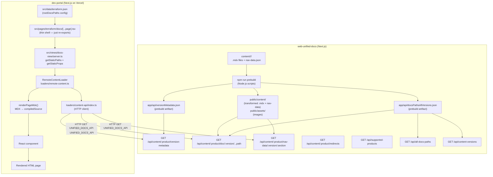
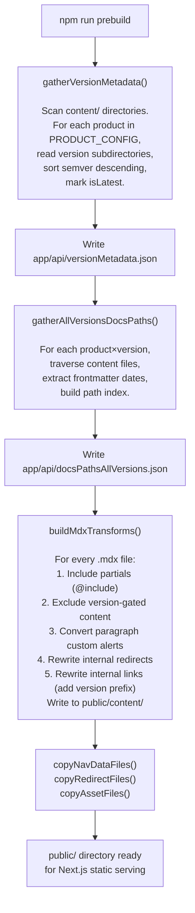
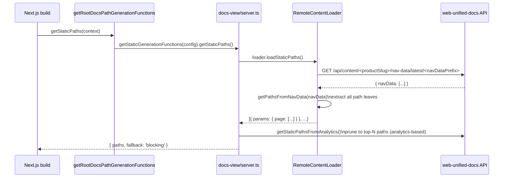
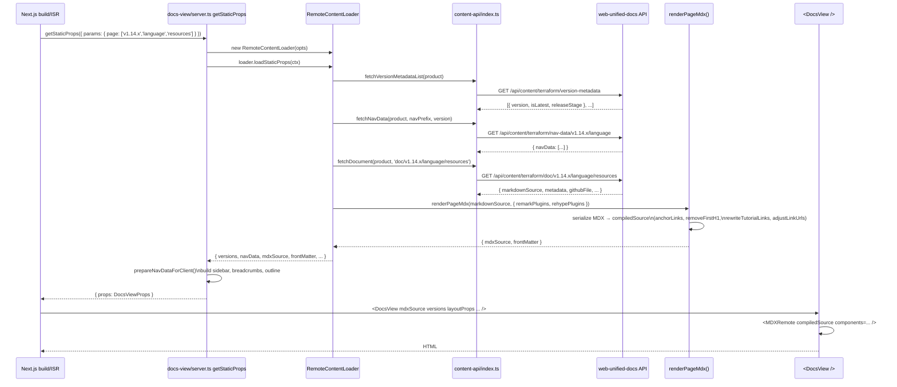
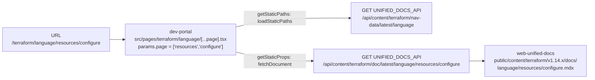
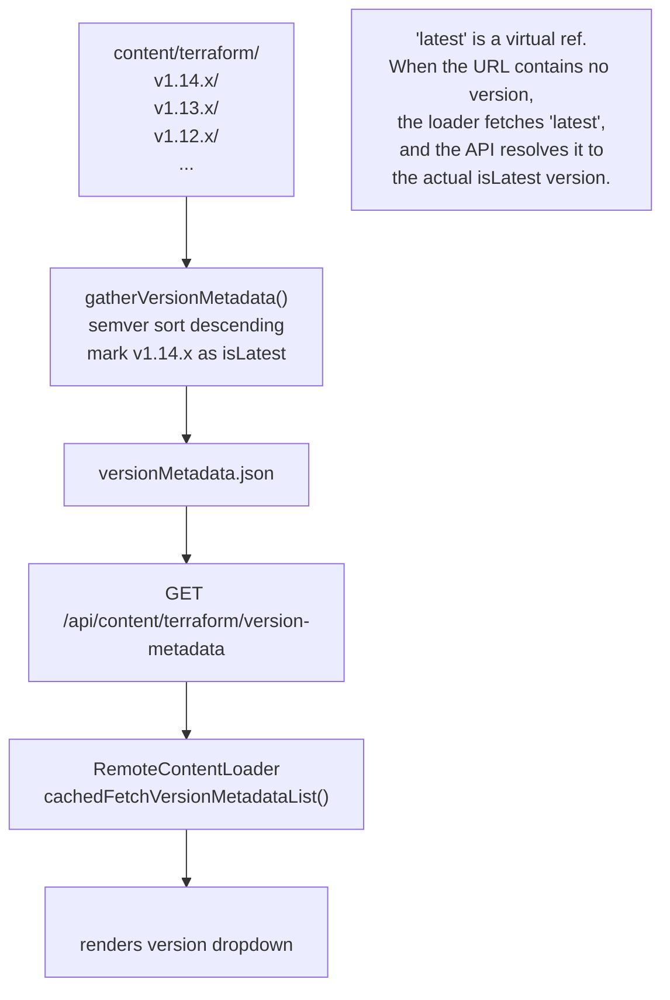
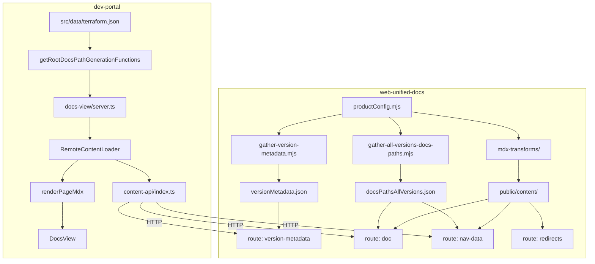

# Terraform docs rendering architecture

How `web-unified-docs` Terraform content directories become `developer.hashicorp.com/terraform` pages.

## System architecture


```mermaid
graph TB
    subgraph "web-unified-docs (Next.js)"
        CONTENT["content/<repo>/<version>/\n.mdx files + nav-data.json"]
        PREBUILD["npm run prebuild\n(Node.js scripts)"]
        PUBLIC["public/content/\n(transformed .mdx + nav-data)\npublic/assets/\n(images)"]
        JSON_VM["app/api/versionMetadata.json\n(prebuild artifact)"]
        JSON_DP["app/api/docsPathsAllVersions.json\n(prebuild artifact)"]
        API_VM["GET /api/content/:product/version-metadata"]
        API_DOC["GET /api/content/:product/doc/:version/...path"]
        API_NAV["GET /api/content/:product/nav-data/:version/:section"]
        API_RED["GET /api/content/:product/redirects"]
        API_SP["GET /api/supported-products"]
        API_ADP["GET /api/all-docs-paths"]
        API_CV["GET /api/content-versions"]
    end

    subgraph "dev-portal (Next.js on Vercel)"
        TF_JSON["src/data/terraform.json\n(rootDocsPaths config)"]
        PAGE["src/pages/terraform/docs/[...page].tsx\n(thin shell — just re-exports)"]
        SERVER["src/views/docs-view/server.ts\ngetStaticPaths + getStaticProps"]
        LOADER["RemoteContentLoader\nloaders/remote-content.ts"]
        CA["loaders/content-api/index.ts\n(HTTP client)"]
        RENDER["renderPageMdx()\nMDX → compiledSource"]
        VIEW["<DocsView />\nReact component"]
        HTML["Rendered HTML page"]
    end

    CONTENT --> PREBUILD
    PREBUILD --> PUBLIC
    PREBUILD --> JSON_VM
    PREBUILD --> JSON_DP

    JSON_VM --> API_VM
    JSON_DP --> API_DOC
    JSON_DP --> API_ADP
    JSON_DP --> API_CV
    PUBLIC --> API_DOC
    PUBLIC --> API_NAV

    TF_JSON --> PAGE
    PAGE --> SERVER
    SERVER --> LOADER
    LOADER --> CA
    CA -->|"HTTP GET UNIFIED_DOCS_API"| API_VM
    CA -->|"HTTP GET UNIFIED_DOCS_API"| API_NAV
    CA -->|"HTTP GET UNIFIED_DOCS_API"| API_DOC
    LOADER --> RENDER
    RENDER --> VIEW
    VIEW --> HTML
```

---

### Phase 1: Prebuild pipeline (`web-unified-docs`)

Before the Next.js server starts, `npm run prebuild` runs [`scripts/prebuild/prebuild.mjs`](../../../scripts/prebuild/prebuild.mjs). This phase transforms raw MDX into the form the API serves.


```mermaid
flowchart TD
    A["npm run prebuild"] --> B["gatherVersionMetadata()\n\nScan content/ directories.\nFor each product in PRODUCT_CONFIG,\nread version subdirectories,\nsort semver descending,\nmark isLatest."]
    B --> C["Write app/api/versionMetadata.json"]
    C --> D["gatherAllVersionsDocsPaths()\n\nFor each product×version,\ntraverse content files,\nextract frontmatter dates,\nbuild path index."]
    D --> E["Write app/api/docsPathsAllVersions.json"]
    E --> F["buildMdxTransforms()\n\nFor every .mdx file:\n1. Include partials (@include)\n2. Exclude version-gated content\n3. Convert paragraph custom alerts\n4. Rewrite internal redirects\n5. Rewrite internal links (add version prefix)\nWrite to public/content/"]
    F --> G["copyNavDataFiles()\ncopyRedirectFiles()\ncopyAssetFiles()"]
    G --> H["public/ directory ready\nfor Next.js static serving"]
```

#### MDX transforms in detail

Each `.mdx` file passes through a chain of remark plugins in [`scripts/prebuild/mdx-transforms/build-mdx-transforms.mjs`](../../../scripts/prebuild/mdx-transforms/build-mdx-transforms.mjs):

| Plugin | Effect |
|---|---|
| `remarkIncludePartialsPlugin` | Inlines `@include 'path/to/partial.mdx'` statements. Supports `@global` alias pointing to `content/global/partials/`. |
| `transformExcludeContent` | Strips blocks tagged with `<!-- BEGIN_TFC_ONLY -->` / `<!-- END_TFC_ONLY -->` based on the product's `supportsExclusionDirectives` flag. |
| `paragraphCustomAlertsPlugin` | Converts `> [!NOTE]` / `> [!WARNING]` paragraph syntax into custom alert MDX components. |
| `rewriteInternalRedirectsPlugin` | Rewrites internal links that have been redirected (according to the product's `redirects.jsonc`) so old URLs aren't dead in rendered content. |
| `rewriteInternalLinksPlugin` | Prepends version prefix to intra-product links so versioned pages link to the correct version. |

The two JSON prebuild artifacts (`versionMetadata.json`, `docsPathsAllVersions.json`) are imported directly by Next.js API route handlers at module load time. They are bundled into the server-side JavaScript, not fetched at request time.

---

### Phase 2: Unified docs API (`web-unified-docs`)

`web-unified-docs` is a Next.js App Router application. Its API routes under `app/api/` serve content to `dev-portal` over HTTP.

#### API surface

```
GET /api/supported-products
    → { result: string[] }
    → Lists all product slugs defined in PRODUCT_CONFIG

GET /api/content/:productSlug/version-metadata
    → { result: VersionMetadataItem[] }
    → Returns sorted version list with isLatest/releaseStage fields
    → Reads from bundled versionMetadata.json

GET /api/content/:productSlug/nav-data/:version/:section
    → { result: { navData: NavNode[] } }
    → Returns parsed JSON from public/content/<slug>/<version>/data/<section>-nav-data.json
    → For example, /api/content/terraform/nav-data/v1.14.x/language

GET /api/content/:productSlug/doc/:version/...docsPath
    → { result: { markdownSource, metadata, product, version, githubFile, created_at, ... } }
    → Reads MDX from public/content/<slug>/<version>/<contentDir>/<path>.mdx
    → Falls back to <path>/index.mdx
    → Strips frontmatter and returns body + metadata separately

GET /api/content/:productSlug/redirects
    → Parsed redirects.jsonc for the latest version

GET /api/all-docs-paths?products=terraform&products=...
    → { result: DocPath[] }
    → Returns all doc paths for the latest version of each requested product

GET /api/content-versions?product=terraform&fullPath=doc%23language/index
    → { versions: string[] }
    → Returns which versions contain a given document
```

#### File resolution logic (doc route)

For a request to `/api/content/terraform/doc/v1.14.x/language/index`, the route handler in [`app/api/content/[productSlug]/doc/[version]/[...docsPath]/route.ts`](../../../app/api/content/%5BproductSlug%5D/doc/%5Bversion%5D/%5B...docsPath%5D/route.ts) tries these two locations in order:

```
public/content/terraform/v1.14.x/docs/language/index.mdx   ← named file
public/content/terraform/v1.14.x/docs/language/index/index.mdx  ← directory index
```

The `contentDir` value from `productConfig.mjs` (`docs` for `terraform`) provides the middle path segment. For `terraform-enterprise`, `contentDir` is also `docs` but the version segment looks like `v202507-1`.

---

### Phase 3: `dev-portal` static site generation

`dev-portal` uses Next.js Pages Router with a thin-shell pattern: every `pages/**/*.tsx` file contains only a few lines that wire up `getStaticPaths`/`getStaticProps` and re-export the view component. All real logic lives in `src/views/`.

#### Terraform-specific wiring

The entry point for `https://developer.hashicorp.com/terraform/docs/...` is
`src/pages/terraform/docs/[...page].tsx` in the `dev-portal` project.

```typescript
// src/pages/terraform/docs/[...page].tsx
const { getStaticPaths, getStaticProps } = getRootDocsPathGenerationFunctions(
  'terraform',   // productSlug
  'docs'         // targetRootDocsPath
)
export { getStaticProps, getStaticPaths }
export default DocsView
```

This pattern repeats for every Terraform sub-section. For example:

- `src/pages/terraform/language/[...page].tsx` → `getRootDocsPathGenerationFunctions('terraform', 'language')`
- `src/pages/terraform/enterprise/[...page].tsx` → `getRootDocsPathGenerationFunctions('terraform', 'enterprise')`
- `src/pages/terraform/plugin/framework/[...page].tsx` → `getRootDocsPathGenerationFunctions('terraform', 'plugin/framework')`

### `rootDocsPaths` config

The `src/data/terraform.json` file in `dev-portal` defines all Terraform sub-sections. Each entry in `rootDocsPaths` controls how `getRootDocsPathGenerationFunctions` finds the correct API product slug and nav-data prefix:

```json
{
  "rootDocsPaths": [
    { "path": "docs", "productSlugForLoader": "terraform-docs-common" },
    { "path": "language" },
    { "path": "cli" },
    { "path": "enterprise", "productSlugForLoader": "terraform-enterprise" },
    { "path": "plugin/framework", "productSlugForLoader": "terraform-plugin-framework",
      "navDataPrefix": "plugin-framework" },
    ...
  ]
}
```

When `productSlugForLoader` is absent, it defaults to the parent `slug` (`terraform`). The `navDataPrefix` override handles cases where the nav-data filename doesn't match the URL path (for example, `plugin-framework-nav-data.json` vs path `plugin/framework`).

#### `getStaticPaths` flow


```mermaid
sequenceDiagram
    participant Next as Next.js build
    participant Wrapper as getRootDocsPathGenerationFunctions
    participant Server as docs-view/server.ts
    participant Loader as RemoteContentLoader
    participant API as web-unified-docs API

    Next->>Wrapper: getStaticPaths(context)
    Wrapper->>Server: getStaticGenerationFunctions(config).getStaticPaths()
    Server->>Loader: loader.loadStaticPaths()
    Loader->>API: GET /api/content/<productSlug>/nav-data/latest/<navDataPrefix>
    API-->>Loader: { navData: [...] }
    Loader->>Loader: getPathsFromNavData(navData)\nextract all path leaves
    Loader-->>Server: [{ params: { page: [...] } }, ...]
    Server->>API: getStaticPathsFromAnalytics()\nprune to top-N paths (analytics-based)
    Server-->>Next: { paths, fallback: 'blocking' }
```

#### `getStaticProps` flow


```mermaid
sequenceDiagram
    participant Next as Next.js build/ISR
    participant Server as docs-view/server.ts getStaticProps
    participant Loader as RemoteContentLoader
    participant CA as content-api/index.ts
    participant API as web-unified-docs API
    participant Render as renderPageMdx()
    participant View as <DocsView />

    Next->>Server: getStaticProps({ params: { page: ['v1.14.x','language','resources'] } })
    Server->>Loader: new RemoteContentLoader(opts)
    Server->>Loader: loader.loadStaticProps(ctx)
    Loader->>CA: fetchVersionMetadataList(product)
    CA->>API: GET /api/content/terraform/version-metadata
    API-->>CA: [{ version, isLatest, releaseStage }, ...]
    Loader->>CA: fetchNavData(product, navPrefix, version)
    CA->>API: GET /api/content/terraform/nav-data/v1.14.x/language
    API-->>CA: { navData: [...] }
    Loader->>CA: fetchDocument(product, 'doc/v1.14.x/language/resources')
    CA->>API: GET /api/content/terraform/doc/v1.14.x/language/resources
    API-->>CA: { markdownSource, metadata, githubFile, ... }
    Loader->>Render: renderPageMdx(markdownSource, { remarkPlugins, rehypePlugins })
    Render->>Render: serialize MDX → compiledSource\n(anchorLinks, removeFirstH1,\nrewriteTutorialLinks, adjustLinkUrls)
    Render-->>Loader: { mdxSource, frontMatter }
    Loader-->>Server: { versions, navData, mdxSource, frontMatter, ... }
    Server->>Server: prepareNavDataForClient()\nbuild sidebar, breadcrumbs, outline
    Server-->>Next: { props: DocsViewProps }
    Next->>View: <DocsView mdxSource versions layoutProps ... />
    View->>View: <MDXRemote compiledSource components=... />
    View-->>Next: HTML
```

---

### Key data structures

#### `versionMetadata.json` (prebuild artifact)

```json
{
  "terraform": [
    { "version": "v1.14.x", "releaseStage": "stable", "isLatest": true },
    { "version": "v1.13.x", "releaseStage": "stable", "isLatest": false }
  ],
  "terraform-enterprise": [
    { "version": "v202507-1", "releaseStage": "stable", "isLatest": true }
  ],
  "terraform-docs-common": [
    { "version": "v0.0.x", "releaseStage": "stable", "isLatest": true }
  ]
}
```

#### `docsPathsAllVersions.json` (prebuild artifact)

```json
{
  "terraform": {
    "v1.14.x": [
      { "path": "terraform/language/resources", "itemPath": "content/terraform/v1.14.x/docs/language/resources.mdx", "created_at": "2025-06-03T18:02:21+00:00" },
      ...
    ]
  }
}
```

#### Nav data (for example, `language-nav-data.json`)

```json
[
  { "title": "Resources", "routes": [
    { "title": "Overview", "path": "resources" },
    { "title": "Configure a resource", "path": "resources/configure" }
  ]},
  ...
]
```

#### Doc API response

```json
{
  "result": {
    "fullPath": "language/resources",
    "product": "terraform",
    "version": "v1.14.x",
    "metadata": { "page_title": "Resources", "description": "..." },
    "markdownSource": "## Resources\n...",
    "githubFile": "content/terraform/v1.14.x/docs/language/resources.mdx",
    "created_at": "2025-06-03T18:02:21+00:00"
  }
}
```

---

### URL to file mapping

For a request to `https://developer.hashicorp.com/terraform/language/resources/configure`:


```mermaid
flowchart LR
    URL["URL\n/terraform/language/resources/configure"]
    PAGE["dev-portal\nsrc/pages/terraform/language/[...page].tsx\nparams.page = ['resources','configure']"]
    API1["GET UNIFIED_DOCS_API\n/api/content/terraform/nav-data/latest/language"]
    API2["GET UNIFIED_DOCS_API\n/api/content/terraform/doc/latest/language/resources/configure"]
    FS["web-unified-docs\npublic/content/terraform/v1.14.x/docs/\nlanguage/resources/configure.mdx"]

    URL --> PAGE
    PAGE -->|"getStaticPaths: loadStaticPaths"| API1
    PAGE -->|"getStaticProps: fetchDocument"| API2
    API2 --> FS
```

For a versioned URL `https://developer.hashicorp.com/terraform/v1.13.x/language/resources/configure`:

```
params.page = ['v1.13.x', 'resources', 'configure']
```

`RemoteContentLoader.stripVersionFromPathParams()` extracts `v1.13.x`, and the document fetch becomes:

```
GET /api/content/terraform/doc/v1.13.x/language/resources/configure
```

which resolves to:

```
public/content/terraform/v1.13.x/docs/language/resources/configure.mdx
```

---

### Versioning model


```mermaid
flowchart TD
    DIRS["content/terraform/\n  v1.14.x/\n  v1.13.x/\n  v1.12.x/\n  ..."]
    PREBUILD["gatherVersionMetadata()\nsemver sort descending\nmark v1.14.x as isLatest"]
    VJ["versionMetadata.json"]
    API_VM["GET /api/content/terraform/version-metadata"]
    LOADER["RemoteContentLoader\ncachedFetchVersionMetadataList()"]
    SELECTOR["<DocsVersionSwitcher>\nrenders version dropdown"]

    DIRS --> PREBUILD --> VJ --> API_VM --> LOADER --> SELECTOR

    NOTE["'latest' is a virtual ref.\nWhen the URL contains no version,\nthe loader fetches 'latest',\nand the API resolves it to\nthe actual isLatest version."]
```

Versions in URL paths are optional. When absent, `dev-portal` uses the virtual
ref `latest` when calling the API. When present (for example,
`/terraform/v1.13.x/language/...`), that exact version is passed. The version
switcher uses the `content-versions` API endpoint to determine
which versions contain a given page, so the switcher only shows versions where
the page exists.

---

### Terraform Enterprise: special versioning

As of the 1.0.0 release in 2025, `terraform-enterprise` uses semantic version strings (`v1.2.x`, `v2.0.x`, and so on). Refer to [Terraform Enterprise quarterly releases](./publish-tfe-docs.md) for the current `MILESTONE.MAJOR.PATCH` scheme and the release process.

Before that switch, `terraform-enterprise` used calendar-date version strings (`v202507-1`, `v202504-2`, and so on). `productConfig.mjs` still carries a custom `semverCoerce` function that converts those legacy date-based versions to sortable semver, purely so older versions continue to sort correctly alongside current semver versions:

```javascript
semverCoerce: (versionString) => {
  const versionRegex = /v(\d{4})(\d{2})-([\d]+)/
  const [year, month, patch] = versionRegex.exec(versionString).slice(1)
  return semver.coerce(`v${year}.${parseInt(month)}.${patch}`)
}
```

This function only matters for content published under the old naming scheme.
Most people working with current Terraform Enterprise docs won't encounter it.

`terraform-enterprise` also has `supportsExclusionDirectives: true`, enabling `<!-- BEGIN_TFC_ONLY -->` / `<!-- END_TFC_ONLY -->` content exclusion markers in MDX.

#### Shared content with HCP Terraform

Most `terraform-enterprise` content is copied from
`content/terraform-docs-common/docs/cloud-docs/`, the same source that HCP
Terraform docs render from. Because of this, a change that should affect both
editions has to be made in two places: `terraform-docs-common/cloud-docs` and
the corresponding `terraform-enterprise/<version>` directory. Editing only one
leaves the two editions out of sync until the next content synchronization
overwrites the un-mirrored change. Refer to [Terraform Enterprise quarterly
releases](./publish-tfe-docs.md) for the synchronization workflow and exclusion
tag syntax used to keep HCP Terraform-only or Terraform Enterprise-only content
from leaking into the other edition.

---

### Incremental builds

In production Vercel builds, the environment variable `INCREMENTAL_BUILD=true` activates a selective build mode:

1. `prebuild.mjs` runs `getChangedContentFiles()` to diff git HEAD against the previous deployed SHA.
2. MDX transforms and file copies only process files in `changedFiles.added | modified`.
3. The API route's `fetchFile()` function reads `changedContentFiles.json` and routes each request to either the current build or `UNIFIED_DOCS_PROD_URL` (the live production instance), depending on whether the file was changed.

A deployment that changes a single doc page skips re-transforming the remaining MDX files.

---

### Component relationships summary


```mermaid
graph TD
    subgraph "web-unified-docs"
        PC[productConfig.mjs]
        GVM[gather-version-metadata.mjs]
        GADP[gather-all-versions-docs-paths.mjs]
        MDX[mdx-transforms/]
        VM[versionMetadata.json]
        DP[docsPathsAllVersions.json]
        PUB[public/content/]
        R_VM[route: version-metadata]
        R_DOC[route: doc]
        R_NAV[route: nav-data]
        R_RED[route: redirects]
    end

    subgraph "dev-portal"
        TFJ[src/data/terraform.json]
        GEN[getRootDocsPathGenerationFunctions]
        SRV[docs-view/server.ts]
        LDR[RemoteContentLoader]
        CAI[content-api/index.ts]
        RPM[renderPageMdx]
        DV[DocsView]
    end

    PC --> GVM
    PC --> GADP
    PC --> MDX
    GVM --> VM
    GADP --> DP
    MDX --> PUB
    VM --> R_VM
    DP --> R_DOC
    DP --> R_NAV
    PUB --> R_DOC
    PUB --> R_NAV
    PUB --> R_RED

    TFJ --> GEN
    GEN --> SRV
    SRV --> LDR
    LDR --> CAI
    CAI -->|HTTP| R_VM
    CAI -->|HTTP| R_DOC
    CAI -->|HTTP| R_NAV
    LDR --> RPM
    RPM --> DV
```
